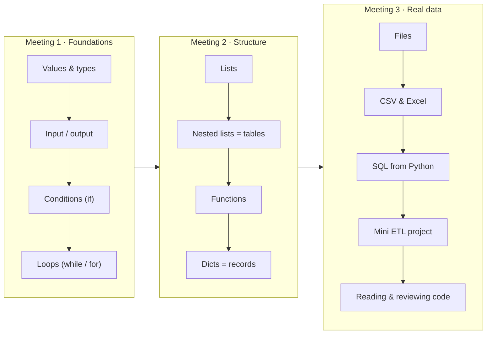
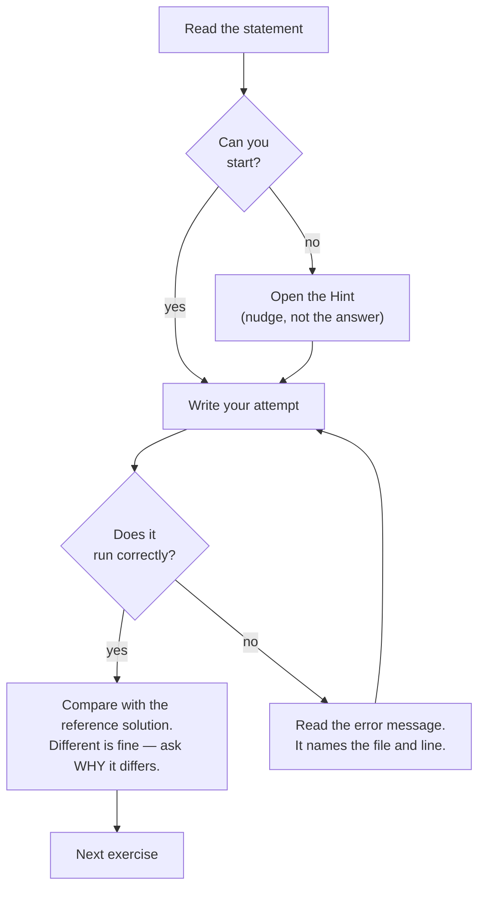

# Python Basics — A Reading-First Course for Data People

A practical, self-contained Python course for colleagues who are **not** programmers yet.

The goal is deliberately narrow and honest:

> Today an AI can write a function for you in five seconds.
> What it cannot do for you is **tell you whether that function is right.**
> This course teaches you to *read* Python, *predict* what it will do, and *review* it — and, along the way, to write it yourself.

Built on top of a real university lab archive (originally in Ukrainian, now fully translated),
restructured into three 2.5-hour meetings and extended with exercises drawn from our actual
work: tables, CSV files, Excel exports and databases.

---

## The three meetings



| # | Meeting | You will be able to... | Time |
|---|---------|------------------------|------|
| 1 | [**Foundations**](course/meeting-1/README.md) | Read any short script and say out loud what it does, line by line | ~2.5 h |
| 2 | [**Structure**](course/meeting-2/README.md) | Work with lists, tables and functions; split a problem into named pieces | ~2.5 h |
| 3 | [**Real data**](course/meeting-3/README.md) | Load a CSV, validate it, query it with SQL, write a report — and review someone else's pipeline | ~3 h |
| + | [*Appendix: classes*](course/APPENDIX-classes.md) | *Optional.* Read a class in someone else's code; an eventual Meeting 4 | ~2 h |

---

## Start here

1. **[SETUP.md](SETUP.md)** — install Python, create a virtual environment, run your first file. *(15 minutes, do this before Meeting 1.)*
2. **[Meeting 1](course/meeting-1/README.md)** — begin the course.
3. **[CHEATSHEET.md](course/CHEATSHEET.md)** — syntax reference: operators and their
   English names, what every symbol is called, and what the abbreviated names stand for.
4. **[GLOSSARY.md](course/GLOSSARY.md)** — every term explained in one sentence, no jargon.

**Presenting this to colleagues?** Start with
**[HOW-TO-TEACH.md](course/HOW-TO-TEACH.md)** — per-lesson timings, what to live-code,
what to cut when you run out of time, and the questions you will be asked.

---

## What is in this repository

```
.
├── SETUP.md                  Install Python and run your first script
├── course/
│   ├── CHEATSHEET.md         Syntax, symbol names, abbreviations decoded
│   ├── GLOSSARY.md           Plain-language dictionary of terms
│   ├── HOW-TO-TEACH.md       Presenter notes: timings, live-coding script, common questions
│   ├── APPENDIX-classes.md   Classes — optional, an eventual Meeting 4
│   ├── meeting-1/            Lessons 01-05  + exercises
│   ├── meeting-2/            Lessons 06-09  + exercises
│   └── meeting-3/            Lessons 10-14  + exercises
├── examples/                 Every code block from the lessons, as a runnable .py file
├── exercise-bank/            52 exercises (statement → hint → solution)
├── data/                     Sample CSV / TXT files used by the lessons
└── archive/original-labs-ua/ The original Ukrainian lab work this course was built from
```

### How each lesson is laid out

Every lesson file follows the same rhythm, so there are no surprises:

| Section | What it is for |
|---------|----------------|
| **Why you care** | One paragraph connecting the topic to real work |
| **The idea** | A block diagram of what the code does |
| **The syntax** | The minimum you must recognise |
| **Worked example** | Real code, annotated line by line |
| **Read this code** | A snippet you must *predict the output of* before running it |
| **Traps** | The 3-4 mistakes everyone makes here |
| **Exercises** | Tasks with a hint, then a solution |

---

## How to use the exercises

Each exercise is written in three layers. **Use them in order — do not skip to the bottom.**



The **"compare with the reference solution"** step is the one that actually teaches you.
Two working solutions to the same problem is normal, and understanding the difference
between them is exactly the skill this course is about.

---

## Reading-first: the habit we are building

Throughout the course you will meet boxes like this:

> **🔍 Read this code**
> ```python
> x = 5
> x = x + x
> print(x)
> ```
> Write down your answer *before* you run it.

Take them seriously. Predicting output is how you learn to review code —
and reviewing code is how you stay in control of a codebase an AI helped you write.

---

## Built on real lab work — bugs included

The exercises come from the author's own Python labs
([`archive/original-labs-ua/`](archive/original-labs-ua/)), translated into English and
reorganised into a teachable sequence. The data-engineering modules in Meeting 3 are new.

Translating them meant running them, and running them turned up **27 real bugs** — all
of which are now worked teaching examples, because they are exactly the mistakes that
recur in production code and in AI-generated code:

- a chained comparison that returns the wrong maximum, silently
- `(x**2 + y**4) ** 1/2` used as a square root (`**` binds tighter than `/`)
- a stock function with no check, letting inventory reach −993 units
- a loop that never terminates for `|x| ≥ 1`
- `for column in a` iterating over rows
- a magic sentinel value that breaks the sort on large data
- `__eq__` implemented as `<`, breaking `in`, `set` and dict keys

**Most of them raise no error at all.** They just produce a plausible number that is
wrong — which is the entire reason this course is reading-first.

➡ [The full list, with the fix and the lesson for each](exercise-bank/README.md#the-bugs-found-in-the-original-archive)
➡ [Translation map: every original file → its English exercise](exercise-bank/README.md#translation-map--original--english)
