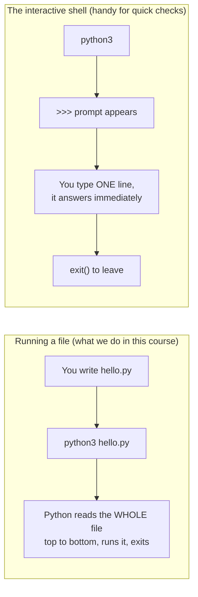
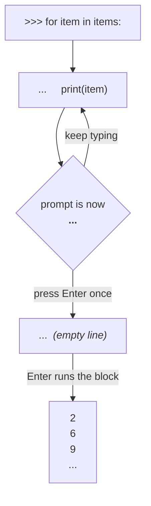

# Setup — 15 minutes, once

You need three things: **Python**, a **place to type code**, and the ability to **run a file**.

---

## 1. Install Python

| Your system | What to do |
|-------------|-----------|
| **Windows** | Download from [python.org/downloads](https://www.python.org/downloads/). ⚠️ On the first installer screen tick **"Add python.exe to PATH"** — this is the single most common setup mistake. |
| **macOS** | `brew install python3` — or download from python.org. |
| **Linux** | Usually already there. Otherwise `sudo apt install python3 python3-venv`. |

Any version **3.10 or newer** is fine. This course was tested on 3.11.

### Check it worked

Open a terminal (Windows: *PowerShell*; macOS: *Terminal*) and type:

```bash
python3 --version
```

On Windows you may need `python --version` instead. You should see something like:

```
Python 3.11.15
```

If you see *"command not found"* or *"not recognized"*, Python is not on your PATH —
re-run the installer and tick the PATH box.

---

## 2. Install an editor

**VS Code** — [code.visualstudio.com](https://code.visualstudio.com/) — free, and the one
we will use in the meetings. After installing it, open the Extensions panel (left sidebar)
and install the extension called **Python** (published by Microsoft).

PyCharm Community Edition works just as well if you prefer it.

---

## 3. Get this course onto your machine

```bash
git clone https://github.com/vasa-hadzheha/Python-basics.git
cd Python-basics
```

No Git? Use the green **Code → Download ZIP** button on GitHub and unzip it.

---

## 4. Create a virtual environment

A *virtual environment* is a private folder of libraries for one project, so that
installing something for this course cannot break anything else on your computer.

```bash
# create it (once)
python3 -m venv .venv

# activate it (every time you open a new terminal)
source .venv/bin/activate        # macOS / Linux
.venv\Scripts\activate           # Windows PowerShell
```

When it is active your prompt shows `(.venv)` at the front. That is the only sign you need.

### Do I need to install any libraries?

**No — and this is deliberate.** Meetings 1, 2 and 3 use only what ships with Python
(`math`, `random`, `csv`, `sqlite3`, `json`). Everything in this course runs on a fresh
Python install with no internet connection.

The *optional* "next step" sections in [Lesson 12](course/meeting-3/12-sql-from-python.md)
mention `polars`, `duckdb` and `openpyxl`. Only if you want to try those:

```bash
pip install polars duckdb openpyxl
```

---

## 5. Run your first file

Create a file called `hello.py` with this content:

```python
print("Hello, Python")
```

Then run it:

```bash
python3 hello.py
```

Expected output:

```
Hello, Python
```

If you see that, you are ready for [Meeting 1](course/meeting-1/README.md).

---

## Two ways to run Python — know the difference

This confuses everyone once, so let us kill it now.



| | Running a file | Interactive shell |
|---|---|---|
| How you start it | `python3 hello.py` | `python3` (no filename) |
| What you see | only what `print()` shows | the value of every line, automatically |
| Good for | real work, anything you want to keep | testing one expression, checking a type |
| How you leave | it ends by itself | `exit()` or Ctrl-D |

**Use the shell whenever you are unsure about something.** It is the fastest teacher in this course:

```bash
$ python3
>>> 7 / 2
3.5
>>> 7 // 2
3
>>> type("5")
<class 'str'>
>>> exit()
```

---

## Loops in the shell — press Enter **twice**

Everything above was one line at a time. A loop is several lines, and the shell handles
those differently in a way that stops everyone at least once.

```bash
>>> items = [2, 6, 9, 34, 787, 33]
>>> for item in items:
...     print(item)
...                      ← press Enter here, on the EMPTY line
2
6
9
34
787
33
>>>
```

Two rules, and they are the whole of it:

### 1. The `:` is not optional

```python
for item in items        # SyntaxError: expected ':'
for item in items:       # correct
```

Miss the colon and you get this the moment you press Enter:

```
  File "<stdin>", line 1
    for item in items
                     ^
SyntaxError: expected ':'
```

Python is telling you exactly what it wants. Same for `if`, `while`, `def` and `class` —
every one of them ends its opening line with a colon.

### 2. `...` means "still listening", not "running"

When the prompt changes from `>>>` to `...`, the shell is **collecting** your block, not
executing it. Type `print(item)`, press Enter, and you get another `...` — nothing runs.

**To run the block, press Enter on an empty `...` line.** That blank line is how you say
"the block is finished".



So the full keystroke sequence is: `print(item)` → **Enter** → **Enter**.

### About the indentation

The body of the loop must be indented. Depending on your Python version:

| Version | After `...` |
|---------|-------------|
| 3.12 and earlier | you type the 4 spaces yourself |
| 3.13 and newer | it indents for you, and colours your code as you type |

Either way, no indent means
`IndentationError: expected an indented block after 'for' statement on line 1`.

### One-liners: what a `;` can and cannot join

Blocks need several lines — so can you use a semicolon to squeeze it onto one?
For `if`, **no**, and the error is worth understanding because it points at the answer.

```python
>>> age = 15; height = 168; if height >= 165: print("ok") else: print("small")
  File "<python-input-39>", line 1
    age = 15; height = 168; if height >= 165: print("ok") else: print("small")
                            ^^
SyntaxError: invalid syntax
```

**The caret points at `if`** — that is Python telling you exactly where it gave up.
There are two separate problems in that line:

**1. A `;` can only join *simple* statements.** Python divides statements in two:

| | Examples | Can follow a `;`? |
|---|---|---|
| **simple** statements | `x = 1`, `print(x)`, `return`, `import math` | ✅ yes |
| **compound** statements | `if`, `for`, `while`, `def`, `class`, `with`, `try` | ❌ **no** |

A compound statement owns an indented block, so it must start its own line.

```python
age = 15; height = 168                    # ✅ both simple
age = 15; height = 168; print(age)        # ✅ three simple
height = 168; if height >= 165: ...       # ❌ SyntaxError at the "if"
```

**2. `else:` cannot share a line with the `if` body.** Even with the semicolons removed:

```python
if height >= 165: print("ok") else: print("small")     # ❌ SyntaxError at "else"
```

A single clause on one line is fine, but each clause header needs its own line:

```python
if height >= 165: print("ok you may go")               # ✅ legal (no else)
```

### So how do you write it on one line?

Use a **conditional expression** — everyone calls it the *ternary*. It chooses between
two **values**, and because it is an expression it can go anywhere a value can:

```python
>>> age = 15; height = 168; print("ok you may go" if height >= 165 else "You are small")
ok you may go
```

Read it in the middle-first order it is written:

```
       "ok you may go"      if height >= 165      else      "You are small"
       └── if true ──┘      └─ the question ─┘              └── if false ──┘
```

| | |
|---|---|
| `if` / `else` **statement** | chooses which **code to run** — needs its own lines |
| `x if cond else y` **expression** | chooses between two **values** — fits on one line |

It is genuinely useful beyond one-liners:

```python
label = "even" if value % 2 == 0 else "odd"
status = "OK " if is_valid(code) else "BAD"
price_text = f"{price:.2f}" if price is not None else "-"
```

> **Use it for two short values, and stop there.** Nesting them
> (`a if p else b if q else c`) is where readability dies — write a normal `if` block,
> or a small function, as in [Lesson 8](course/meeting-2/08-functions.md).

And the honest answer for the original line: **write the block.** The semicolon version
saves one line and costs the next reader ten seconds.

```python
age = 15
height = 168

if height >= 165:
    print("ok you may go")
else:
    print("You are small")
```

Semicolons are legal in Python but essentially never used in real code — they exist for
compatibility, not for style. If you want a one-liner, the ternary is the idiomatic tool.

### When to stop using the shell

**Past about three lines, put it in a file.** You cannot go back and edit a line you have
already submitted, so one typo means retyping the whole block. Create `loop.py`:

```python
items = [2, 6, 9, 34, 787, 33]
for item in items:
    print(item)
```

and run it with `python3 loop.py`. Now you can fix a typo and re-run in two seconds.

> **The division of labour:** the shell is for *questions* — `list(range(5))`,
> `type("5")`, `7 // 2`, "what does `.strip()` do again?". Files are for *work* —
> anything longer than a few lines, and anything you want to keep.

---

---

## Keyboard shortcuts for the Python shell

The shell is much less painful once you stop using only the arrow keys. These are
**readline** bindings — the same ones work in `bash`, `psql`, `sqlite3` and most other
terminal tools, so learning them once pays off everywhere.

### Which shell am I in?

Look at the filename in any error message:

| Error says | You have | What you get |
|------------|----------|--------------|
| `File "<python-input-39>"` | **Python 3.13+**, the new REPL | colours, multi-line editing, F1–F3 |
| `File "<stdin>"` | Python 3.12 or earlier | the classic REPL |

Or just run `python3 --version`.

### The five you will use every day

| Keys | What it does |
|------|--------------|
| **Tab** | complete a name — type `it` + Tab, or `"".` + Tab to list every string method |
| **↑** / **↓** | previous / next thing you typed |
| **Ctrl-C** | stop code that is running, or abandon the line you are typing |
| **Ctrl-L** | clear the screen (your history survives) |
| **Ctrl-D** | leave the shell — faster than typing `exit()` |

**Tab completion is the one people miss.** `math.` + Tab lists everything in the module;
`items.` + Tab lists every list method. It is the fastest way to discover what an object
can do, and no internet needed.

### Moving along the line

Stop holding ← for three seconds.

| Keys | What it does |
|------|--------------|
| **Ctrl-A** | jump to the start of the line |
| **Ctrl-E** | jump to the end of the line |
| **Ctrl-←** / **Ctrl-→** | one word left / right |
| **Alt-B** / **Alt-F** | one word **b**ack / **f**orward (same thing, works everywhere) |
| **Ctrl-B** / **Ctrl-F** | one character back / forward |

### Deleting

| Keys | What it does |
|------|--------------|
| **Ctrl-W** | delete the word before the cursor |
| **Ctrl-U** | delete from the cursor back to the start of the line |
| **Ctrl-K** | delete from the cursor to the end of the line |
| **Ctrl-Y** | paste back whatever you just deleted ("**y**ank") |
| **Ctrl-T** | swap the two characters around the cursor — fixes `pirnt` |

`Ctrl-U` then retyping is usually faster than backspacing a long line. And `Ctrl-U`
followed by `Ctrl-Y` is a handy "park this line while I check something else".

### History

| Keys | What it does |
|------|--------------|
| **↑** / **↓** | step through previous lines |
| **Ctrl-R** | **search** history — start typing, it finds the last match; Ctrl-R again for the one before |
| **Ctrl-P** / **Ctrl-N** | same as ↑ / ↓ |

**Ctrl-R is the big one.** Typed a long loop twenty lines ago? `Ctrl-R` then `for` brings
it straight back instead of forty presses of ↑.

### Python 3.13+ only — the new REPL

These do nothing on 3.12 and earlier.

| Keys | What it does |
|------|--------------|
| **F1** | help browser. Any key to leave |
| **F2** | history **without** the `>>>` prompts and output — so you can select and copy real code |
| **F3** | paste mode, for pasting a whole indented block without the auto-indent fighting you |
| **↑** inside a block | move up through the *lines of the block* you are editing, not through history |
| `exit` / `quit` | work **without** the brackets (older versions need `exit()`) |

**F3 solves a genuine annoyance.** Paste an indented block into the old REPL and its
auto-indent adds to your pasted indentation, so everything ends up wrong. F3 turns that
off for the paste, then you press it again to go back.

**F2 is the one to remember for this course** — when you have worked something out
interactively and want it in a file, F2 gives you clean, copyable code.

### Stopping things

| Keys | What it does |
|------|--------------|
| **Ctrl-C** | interrupt. This is how you kill an infinite loop — see [Lesson 4](course/meeting-1/04-while-loops.md) |
| **Ctrl-C** on an empty prompt | clear the line; it does **not** exit |
| **Ctrl-D** | exit (on an empty line) |
| **Ctrl-Z** | ⚠️ on Linux/macOS this **suspends** Python rather than closing it — type `fg` to bring it back |

### Windows and macOS differences

| | Note |
|---|---|
| **Windows** | exit with **Ctrl-Z** then **Enter**, not Ctrl-D |
| **macOS** | **Alt** is the **Option** key. If `Alt-B` does nothing, either turn on *Use Option as Meta key* in Terminal → Settings → Profiles → Keyboard, or press **Esc** then **B** — `Esc` then a key works wherever `Alt` does |
| **Any terminal** | if a Ctrl shortcut does nothing, your terminal has probably claimed it — check its own keyboard settings |

### Worth knowing

**Your history survives restarts.** It is kept in `~/.python_history`, so `Ctrl-R` still
finds what you typed yesterday.

**`_` holds the last result** — handy for chaining quick checks:

```bash
>>> 7 / 2
3.5
>>> _ * 2
7.0
```

**`help()` and `dir()` are offline documentation:**

```bash
>>> help(str.strip)          # what it does, and its arguments
>>> dir("")                  # every method a string has
>>> "".strip.__doc__         # the docstring alone
```

`help()` opens a pager — press **q** to leave it. That trips everyone up once.

## When something goes wrong

Python error messages are not noise — they are a report, and they are read **bottom-up**:

```
Traceback (most recent call last):
  File "hello.py", line 3, in <module>
    print(nmae)
          ^^^^
NameError: name 'nmae' is not defined
```

Read it as: *"the last line tells me **what** is wrong (`NameError` — no such name),
the line above tells me **where** (`hello.py`, line 3)."*

That is 90% of debugging. We come back to this properly in
[Lesson 14](course/meeting-3/14-how-to-read-code.md).
