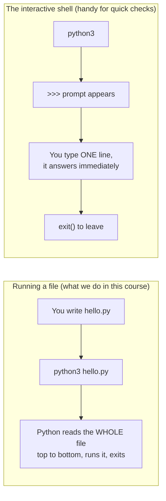
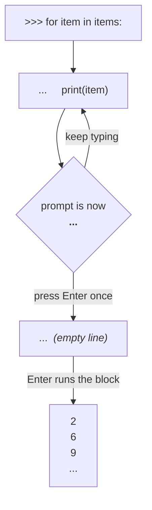

# Setup — 15 minutes, once

You need three things: **Python**, a **place to type code**, and the ability to **run a file**.

---

## 1. Install Python

| Your system | What to do |
|-------------|-----------|
| **Windows** | Download from [python.org/downloads](https://www.python.org/downloads/). ⚠️ On the first installer screen tick **"Add python.exe to PATH"** — this is the single most common setup mistake. |
| **macOS** | `brew install python3` — or download from python.org. |
| **Linux** | Usually already there. Otherwise `sudo apt install python3 python3-venv`. |

Any version **3.10 or newer** is fine. This course was tested on 3.11.

### Check it worked

Open a terminal (Windows: *PowerShell*; macOS: *Terminal*) and type:

```bash
python3 --version
```

On Windows you may need `python --version` instead. You should see something like:

```
Python 3.11.15
```

If you see *"command not found"* or *"not recognized"*, Python is not on your PATH —
re-run the installer and tick the PATH box.

---

## 2. Install an editor

**VS Code** — [code.visualstudio.com](https://code.visualstudio.com/) — free, and the one
we will use in the meetings. After installing it, open the Extensions panel (left sidebar)
and install the extension called **Python** (published by Microsoft).

PyCharm Community Edition works just as well if you prefer it.

---

## 3. Get this course onto your machine

```bash
git clone https://github.com/vasa-hadzheha/Python-basics.git
cd Python-basics
```

No Git? Use the green **Code → Download ZIP** button on GitHub and unzip it.

---

## 4. Create a virtual environment

A *virtual environment* is a private folder of libraries for one project, so that
installing something for this course cannot break anything else on your computer.

```bash
# create it (once)
python3 -m venv .venv

# activate it (every time you open a new terminal)
source .venv/bin/activate        # macOS / Linux
.venv\Scripts\activate           # Windows PowerShell
```

When it is active your prompt shows `(.venv)` at the front. That is the only sign you need.

### Do I need to install any libraries?

**No — and this is deliberate.** Meetings 1, 2 and 3 use only what ships with Python
(`math`, `random`, `csv`, `sqlite3`, `json`). Everything in this course runs on a fresh
Python install with no internet connection.

The *optional* "next step" sections in [Lesson 12](course/meeting-3/12-sql-from-python.md)
mention `polars`, `duckdb` and `openpyxl`. Only if you want to try those:

```bash
pip install polars duckdb openpyxl
```

---

## 5. Run your first file

Create a file called `hello.py` with this content:

```python
print("Hello, Python")
```

Then run it:

```bash
python3 hello.py
```

Expected output:

```
Hello, Python
```

If you see that, you are ready for [Meeting 1](course/meeting-1/README.md).

---

## Two ways to run Python — know the difference

This confuses everyone once, so let us kill it now.



| | Running a file | Interactive shell |
|---|---|---|
| How you start it | `python3 hello.py` | `python3` (no filename) |
| What you see | only what `print()` shows | the value of every line, automatically |
| Good for | real work, anything you want to keep | testing one expression, checking a type |
| How you leave | it ends by itself | `exit()` or Ctrl-D |

**Use the shell whenever you are unsure about something.** It is the fastest teacher in this course:

```bash
$ python3
>>> 7 / 2
3.5
>>> 7 // 2
3
>>> type("5")
<class 'str'>
>>> exit()
```

---

## Loops in the shell — press Enter **twice**

Everything above was one line at a time. A loop is several lines, and the shell handles
those differently in a way that stops everyone at least once.

```bash
>>> items = [2, 6, 9, 34, 787, 33]
>>> for item in items:
...     print(item)
...                      ← press Enter here, on the EMPTY line
2
6
9
34
787
33
>>>
```

Two rules, and they are the whole of it:

### 1. The `:` is not optional

```python
for item in items        # SyntaxError: expected ':'
for item in items:       # correct
```

Miss the colon and you get this the moment you press Enter:

```
  File "<stdin>", line 1
    for item in items
                     ^
SyntaxError: expected ':'
```

Python is telling you exactly what it wants. Same for `if`, `while`, `def` and `class` —
every one of them ends its opening line with a colon.

### 2. `...` means "still listening", not "running"

When the prompt changes from `>>>` to `...`, the shell is **collecting** your block, not
executing it. Type `print(item)`, press Enter, and you get another `...` — nothing runs.

**To run the block, press Enter on an empty `...` line.** That blank line is how you say
"the block is finished".



So the full keystroke sequence is: `print(item)` → **Enter** → **Enter**.

### About the indentation

The body of the loop must be indented. Depending on your Python version:

| Version | After `...` |
|---------|-------------|
| 3.12 and earlier | you type the 4 spaces yourself |
| 3.13 and newer | it indents for you, and colours your code as you type |

Either way, no indent means
`IndentationError: expected an indented block after 'for' statement on line 1`.

### When to stop using the shell

**Past about three lines, put it in a file.** You cannot go back and edit a line you have
already submitted, so one typo means retyping the whole block. Create `loop.py`:

```python
items = [2, 6, 9, 34, 787, 33]
for item in items:
    print(item)
```

and run it with `python3 loop.py`. Now you can fix a typo and re-run in two seconds.

> **The division of labour:** the shell is for *questions* — `list(range(5))`,
> `type("5")`, `7 // 2`, "what does `.strip()` do again?". Files are for *work* —
> anything longer than a few lines, and anything you want to keep.

---

## When something goes wrong

Python error messages are not noise — they are a report, and they are read **bottom-up**:

```
Traceback (most recent call last):
  File "hello.py", line 3, in <module>
    print(nmae)
          ^^^^
NameError: name 'nmae' is not defined
```

Read it as: *"the last line tells me **what** is wrong (`NameError` — no such name),
the line above tells me **where** (`hello.py`, line 3)."*

That is 90% of debugging. We come back to this properly in
[Lesson 14](course/meeting-3/14-how-to-read-code.md).
