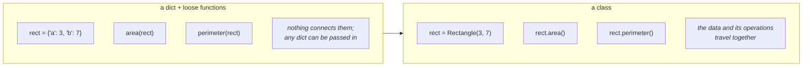
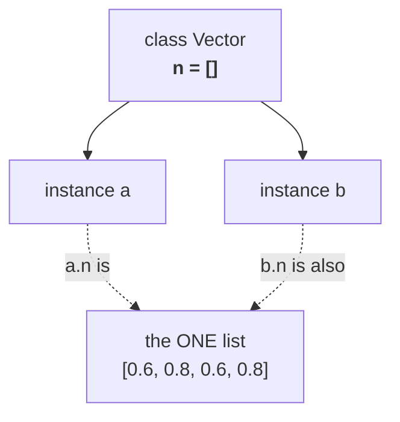
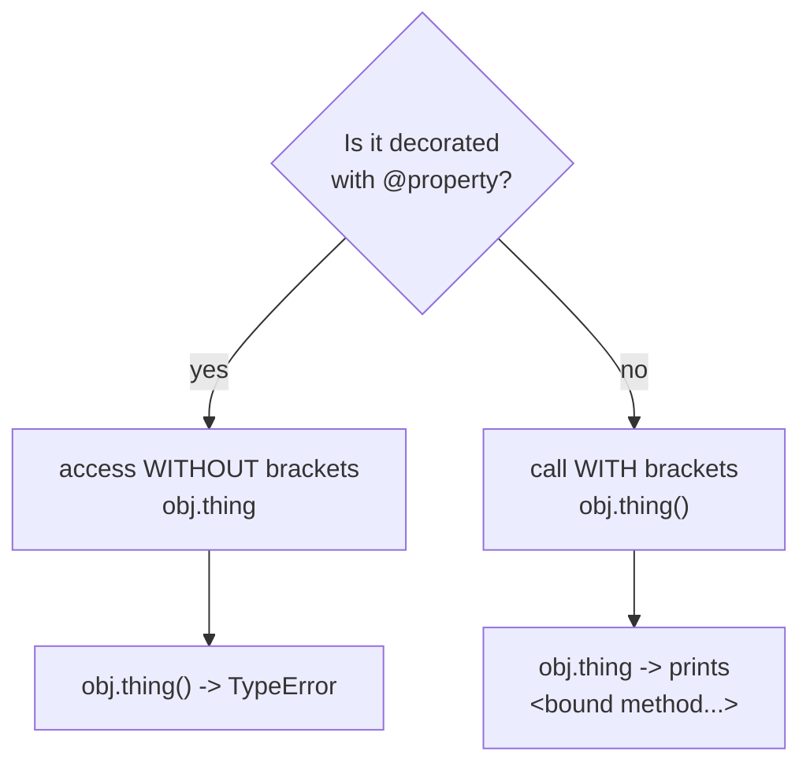

# Appendix — Classes (optional, an eventual Meeting 4)

⬅ [Course home](../README.md)

> **This is not part of the three core meetings.** Classes are not needed to read a data
> pipeline, so they would crowd out more useful material. But the original lab archive
> contains a lot of class work, it is all translated here, and it contains some of the
> most instructive bugs in the whole repository.
>
> **Read this when:** you meet a class in someone else's code, or you are ready for a
> fourth session. Prerequisite: [Meeting 2](meeting-2/README.md), especially
> [functions](meeting-2/08-functions.md) and [dictionaries](meeting-2/09-dicts-and-records.md).

---

## Why classes exist

A dictionary holds data. A function does work. A **class** is the two bound together:
data plus the operations that belong to it.



**When a class is worth it:** you have several things of the same kind, each with its
own state, and a set of operations that only make sense on that state.

**When it is not:** most data-pipeline code. A function taking a list of dicts is
simpler, easier to test and easier to review. Do not reach for a class because it feels
more professional — reach for it when the state genuinely belongs with the behaviour.

---

## The syntax

```python
class Rectangle:
    """A rectangle with sides a and b."""

    def __init__(self, a, b):          # the constructor: runs on Rectangle(3, 7)
        self.a = a                     # self.a belongs to THIS rectangle
        self.b = b

    def area(self):                    # a method: self is always the first parameter
        return self.a * self.b

    def perimeter(self):
        return 2 * (self.a + self.b)

    def __str__(self):                 # what print() shows
        return f"Rectangle({self.a} x {self.b})"


rect = Rectangle(3, 7)                 # create an INSTANCE
print(rect)                            # Rectangle(3 x 7)
print(rect.area())                     # 21
print(rect.a)                          # 3
```

| Piece | Meaning |
|-------|---------|
| `class Rectangle:` | defines a new kind of thing |
| `__init__` | runs when you create one; sets up its state |
| `self` | *this particular instance*. Always the first parameter of a method |
| `self.a = a` | store `a` **on this instance** |
| `rect.area()` | call a method — the brackets matter |

> **`self` is not magic, and it is not optional.** `rect.area()` is Python's shorthand
> for `Rectangle.area(rect)`. That is literally how it works — you can write it the long
> way and it behaves identically. Once you see that, `self` stops being mysterious.

---

## ⚠️ Trap 1 — the class attribute that everyone shares

This is the most important thing in the appendix, because the archive contains it twice
and it is genuinely hard to spot.

```python
class Vector:
    n = []                             # ✗ defined on the CLASS, not the instance

    def __init__(self, coordinates):
        self.coordinates = coordinates

    def normalise(self, length):
        for value in self.coordinates:
            self.n.append(value / length)     # appends to the SHARED list
        return self.n
```

```python
a = Vector([3, 4])
b = Vector([6, 8])
print(a.normalise(5))      # [0.6, 0.8]
print(b.normalise(10))     # [0.6, 0.8, 0.6, 0.8]   ← a's values are still in there!
```



A variable defined in the class body — not inside `__init__` — belongs to the **class**,
so every instance shares the one object. This is exactly the mutable-default-argument
trap from [Lesson 8](meeting-2/08-functions.md), wearing a different hat, and it has the
same fix:

```python
class Vector:
    def __init__(self, coordinates):
        self.coordinates = coordinates
        self.n = []                    # ✓ a fresh list for each instance
```

**The rule: every piece of per-instance state is created in `__init__`.** A class-body
assignment is only for genuine constants shared by all instances:

```python
class Circle:
    PI = 3.14159          # ✓ fine — a number is immutable, and it IS shared
```

The archive has this bug in `Classes/Завд.1` (`n = []` on `Vector`) and
`Classes/Завд.2` (`sum = 0` on `Telephone_tariff`). The second one is subtler: `sum`
is a number, and `self.sum += price` **creates an instance attribute** on first
assignment, so it happens to work — but two tariff objects reading `self.sum` before
either has paid anything both see the class-level `0`, and the intent is invisible.
*Working by accident is not working.*

---

## ⚠️ Trap 2 — `__eq__` that does not test equality

From `Class-Rectangle`:

```python
def __eq__(self, other):
    return self.S() < other.S()        # ✗ this is LESS THAN
```

```python
rect1 = Rectangle(3, 7)                # area 21
rect2 = Rectangle(2, 3)                # area 6

if rect1 == rect2:
    print("equal")
else:
    print("not equal")                 # prints "not equal" — correct by luck
```

Swap the operands and the lie shows:

```python
print(rect1 == rect2)        # False   (21 < 6)
print(rect2 == rect1)        # True    (6 < 21)  ← "equal" one way round only
```

`==` must be **symmetric**: if `a == b` then `b == a`. This version is not, so it also
breaks `in`, `.count()`, `.index()`, dictionary keys and `set()` — everything that uses
`==` internally, which is a lot.

```python
def __eq__(self, other):
    """Two rectangles are equal when their sides match."""
    if not isinstance(other, Rectangle):
        return NotImplemented          # the correct answer for an unrelated type
    return (self.a, self.b) == (other.a, other.b)
```

`NotImplemented` (not `False`!) is what you return for a type you do not know how to
compare with — it lets Python try the other object's `__eq__` before giving up.

> **A dunder method must keep the promise its name makes.** `__eq__` means equal,
> `__add__` means add, `__len__` returns a non-negative integer. Break that and you have
> not written a shortcut, you have written a trap for the next reader.

---

## ⚠️ Trap 3 — `@property` and the missing brackets

From `Class-Rectangle (properties)` and `Module work`:

```python
class Rectangle:
    @property
    def repr(self):
        return self.a, self.b


rect = Rectangle(3, 8)
print(rect.repr)          # (3, 8)   ✓ — a property is accessed WITHOUT brackets
print(rect.repr())        # 💥 TypeError: 'tuple' object is not callable
```

And the reverse, which is the archive's actual bug in `Module work`:

```python
def repr(self):           # a normal method, NOT a property
    return self.radius

print(circle.repr)        # <bound method TCircle.repr of ...>  ← printed the method!
print(circle.repr())      # 60   ✓
```



**If you ever see `<bound method ...>` in your output, you forgot the brackets.**
The archive's `Class-Rectangle (properties)` has the comment *"DOES NOT CALCULATE AREA
OR PERIMETER!!!"* next to `rec1.p` — and that is exactly why. It printed the method
object instead of calling it.

> **Naming advice:** do not name anything `repr` or `str`. Python already uses
> `__repr__` and `__str__` for this, and shadowing the concept confuses everyone.
> Use `__str__` for a human-readable form and `__repr__` for a developer one.

---

## Inheritance

```python
class Rectangle:
    def __init__(self, a, b):
        self.a = a
        self.b = b

    def area(self):
        return self.a * self.b


class Box(Rectangle):                       # Box IS A Rectangle, plus a height
    def __init__(self, a, b, height):
        super().__init__(a, b)              # let Rectangle set up a and b
        self.height = height

    def volume(self):
        return self.area() * self.height    # reuse the inherited method


box = Box(3, 4, 5)
print(box.area())        # 12   — inherited
print(box.volume())      # 60   — its own
```

### ⚠️ Trap 4 — `super().__init__(self, ...)`

The archive's `Module work` contains:

```python
class Cone(TCircle):
    def __init__(self, radius, h):
        super().__init__(self, radius)      # ✗ one argument too many
```

`super()` **already knows** which instance it is working on, so passing `self` again
shifts every argument along by one. Here `TCircle.__init__` receives the `Cone` object
as its `radius`, and `self.radius` becomes a `Cone` — so the next multiplication raises
a `TypeError` with a message that points nowhere useful.

```python
super().__init__(radius)                    # ✓ never pass self to super()
```

The same file then calls `super().s()` when the parent's method is named `S_circle`,
giving `AttributeError`. Both are caught the instant you actually run the code —
which is the real lesson: **the archive's `Cone` class was never executed.**

> **Prefer composition to inheritance when you are unsure.** `Box` holding a
> `Rectangle` is easier to reason about than `Box` inheriting from it, and "is-a" is a
> stronger claim than people realise. Inheritance is the right tool much less often
> than it is used.

---

## The dunder methods worth knowing

| Method | Enables | Note |
|--------|---------|------|
| `__init__` | `Thing(a, b)` | the constructor |
| `__str__` | `print(obj)`, `f"{obj}"` | for humans |
| `__repr__` | the shell, `repr(obj)`, lists | for developers — show how to rebuild it |
| `__eq__` | `a == b`, `in`, `set` | **must be symmetric** |
| `__lt__` | `a < b`, `sorted()` | pair with `functools.total_ordering` |
| `__len__` | `len(obj)` | must return a non-negative `int` |
| `__getitem__` | `obj[key]` | also makes the object iterable |
| `__setitem__` | `obj[key] = v` | |
| `__add__` | `a + b` | |
| `__enter__` / `__exit__` | `with obj:` | how `with open(...)` works |

A properly written `__getitem__`, from the archive's `Classes (Matrix, Angel)` task —
which has `# Error -- does not work` next to its `raise`, because it was never tested:

```python
def __getitem__(self, key):
    """rect[1] is side a, rect[2] is side b."""
    if key == 1:
        return self.a
    if key == 2:
        return self.b
    raise IndexError(f"Rectangle has sides 1 and 2, not {key!r}")


rect = Rectangle(3, 7)
print(rect[1])           # 3
print(rect[2])           # 7
print(rect[99])          # IndexError: Rectangle has sides 1 and 2, not 99
```

Two improvements over the original: `IndexError` rather than a bare `Exception`
(so a caller can catch *this* specific problem), and an early `raise` instead of an
`else`, which reads better.

---

## Worked example — the Vector class, fixed

The archive's `Classes/Завд.1`, corrected and tested:

```python
import math


class Vector:
    """A vector in n-dimensional space."""

    def __init__(self, coordinates):
        """coordinates: a list of numbers."""
        if not coordinates:
            raise ValueError("a vector needs at least one coordinate")
        self.coordinates = list(coordinates)     # list(): copy, so the caller's
                                                 # list cannot be changed under us

    @property
    def dimension(self):
        return len(self.coordinates)

    def length(self):
        """The Euclidean length (magnitude)."""
        return math.sqrt(sum(value**2 for value in self.coordinates))

    def normalised(self):
        """A NEW unit vector in the same direction.

        Raises ValueError for the zero vector, which has no direction.
        """
        magnitude = self.length()
        if magnitude == 0:
            raise ValueError("the zero vector cannot be normalised")
        return Vector([value / magnitude for value in self.coordinates])

    def __eq__(self, other):
        if not isinstance(other, Vector):
            return NotImplemented
        eps = 1e-9
        return self.dimension == other.dimension and all(
            math.fabs(p - q) < eps for p, q in zip(self.coordinates, other.coordinates)
        )

    def __str__(self):
        return f"({', '.join(f'{v:g}' for v in self.coordinates)})"

    def __repr__(self):
        return f"Vector({self.coordinates!r})"
```

Five deliberate differences from the archive version:

1. **No class-level `n = []`.** All state is created in `__init__`, so instances cannot
   contaminate each other.
2. **`normalised()` returns a new `Vector`** rather than mutating `self` and printing.
   Now you can chain it, test it, and use it in an expression.
3. **`list(coordinates)`** copies the input, so the caller cannot alter the vector
   afterwards by changing their own list.
4. **`__eq__` uses an epsilon**, because normalised coordinates are floats and `==`
   on floats is unreliable ([Lesson 1](meeting-1/01-values-and-types.md)).
5. **The zero vector raises**, instead of producing `ZeroDivisionError` from somewhere
   deep inside.

▶ Run it: `python3 examples/appendix-classes/vector.py`

---

## Exercises

Reference solutions: [`exercise-bank/appendix-classes/`](../exercise-bank/appendix-classes/)

| # | Task | From | Practises |
|---|------|------|-----------|
| A.1 | `Vector` — length and normalisation | Lab 10.1 | instance state, returning new objects |
| A.2 | `PhoneTariff` — days left, call cost, running total | Lab 10.2 | the shared-class-attribute bug |
| A.3 | `Rectangle` — area, perimeter, `+ - *`, correct `__eq__` | Lab 12.1 | dunder methods that keep their promise |
| A.4 | `Rectangle` — `__getitem__` / `__setitem__` / `__delitem__` | Lab 12.1b | indexing, raising the right exception |
| A.5 | `Angle` — increase and decrease by radians | Lab 12.2 | units, and not mixing them up |
| A.6 | `Matrix` — show, min, max, indexing | Lab 12.3 | wrapping a nested list in a class |
| A.7 | `Box(Rectangle)` — volume by inheritance | Lab 12 | `super()` without `self` |
| A.8 | `Circle` and `Cone` — the module work, fixed | Module work | the `super().__init__(self, ...)` bug |
| A.9 | `Prism` — finish the unfinished class | Class-Prism | completing a stub from its intent |

Each solution file states what the original did, what was wrong with it, and why the
fix is a fix. **A.2, A.3 and A.8 are the ones to do** — they contain the three bugs
that generalise beyond classes.

---

## Recap

- A class binds data to the operations that belong to it. Most pipeline code does not
  need one.
- `__init__` sets up per-instance state. `self` is just the instance, passed explicitly.
- **Never put a mutable value in the class body** — every instance would share it.
- `@property` is accessed without brackets; a method needs them. `<bound method ...>`
  in your output means you forgot them.
- `__eq__` must be symmetric, and returns `NotImplemented` for unrelated types.
- `super().__init__(...)` — **never pass `self`**.
- Methods should `return` values, not print them. Same rule as
  [Lesson 8](meeting-2/08-functions.md).
- Raise the *specific* exception (`IndexError`, `ValueError`), not a bare `Exception`.
- **Every bug in this appendix was found by running the code.** Several of the archive's
  classes carry comments admitting something "does not work" — because they were written
  and never executed. Run your code.
