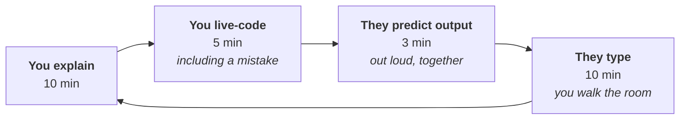

# How to teach this — presenter notes

⬅ [Course home](../README.md)

Written for **you**, not for the learners. Timings, what to do live, what to skip when
you run out of time, and the questions you will be asked.

---

## The one thing that decides whether this works

**Do not lecture for 2.5 hours.** Adults stop absorbing syntax after about 15 minutes
of listening. The rhythm that works is:



Roughly 30 minutes per cycle, one per lesson. The **"they type"** step is
non-negotiable — nobody has ever learned to program by watching.

### Make mistakes on purpose

When you live-code, get it wrong deliberately at least twice per meeting:

- forget `int()` around `input()` and let `"5" * 3` print `555`
- forget the `:` after an `if` and read the `SyntaxError` out loud
- write `b = a` for a list, append to `b`, and show `a` changed

This does more than any slide. It shows that errors are *normal and readable*,
which is the single biggest psychological barrier for a beginner. People who think
errors mean they are stupid stop trying; people who think errors are information
keep going.

---

## Meeting 1 — Foundations (2.5 h)

| Time | What | Notes |
|------|------|-------|
| 0:00 | Welcome + the "why" | 5 min. Use the framing from the [README](../README.md): AI writes it, you must judge it |
| 0:05 | Check everyone's setup | Have them run `python3 --version` **now**. Fix the stragglers while others read [SETUP](../SETUP.md) |
| 0:15 | [L1 Types](meeting-1/01-values-and-types.md) | Live-code in the REPL. The `"10" + "10"` moment is your hook |
| 0:45 | [L2 Input/output](meeting-1/02-input-and-output.md) | The `input()` returns text lesson. Let them hit it |
| 1:05 | [L3 Conditions](meeting-1/03-conditions.md) | Indentation live: move a line 4 spaces and show the meaning change |
| 1:35 | ☕ **break** | 10 min, real break |
| 1:45 | [L4 while](meeting-1/04-while-loops.md) | **Write an infinite loop on purpose** and Ctrl-C it |
| 2:10 | [L5 for](meeting-1/05-for-loops.md) | `list(range(5))` in the REPL settles the "excludes 5" question |
| 2:30 | Set the exercises | Ex 1.1–1.8 in the session; 1.9+ as homework |

**Live-code these:** `01_types.py` and `04_count_zeros.py`. For the second, build the
trace table on the whiteboard for `n = 1020` — that single exercise does more for
their loop model than anything else in the meeting.

**Two ready-made demos, so you are not typing under pressure:**

```bash
python3 examples/meeting-1/04_infinite_loops.py 1 slow   # runaway loop -> Ctrl-C -> shows the fix
python3 examples/meeting-1/01_float_precision.py         # why 0.1 + 0.2 != 0.3, start to finish
```

Run the infinite-loop one at L4 and say the Ctrl-C line out loud — *"every programmer
does this several times a week; it is the fire extinguisher, not a failure."* That
sentence does more for their confidence than anything else you will say.

**Skip if short of time:** L5's recurrence example (worked example 2). Lessons 1–4 are
the load-bearing ones.

**Success test:** they can read a 10-line script aloud and say what it does.

---

## Meeting 2 — Structure (2.5 h)

| Time | What | Notes |
|------|------|-------|
| 0:00 | Recap by reading, not telling | Put a 10-line script up and have *them* narrate it. 10 min |
| 0:10 | [L6 Lists](meeting-2/06-lists.md) | The `b = a` copy trap live. Watch faces |
| 0:45 | [L7 Tables](meeting-2/07-nested-lists-and-matrices.md) | `[[0]*3]*3` live — it always gets a reaction |
| 1:20 | ☕ **break** | |
| 1:30 | [L8 Functions](meeting-2/08-functions.md) | **The most important 40 minutes of the course** |
| 2:10 | [L9 Dicts](meeting-2/09-dicts-and-records.md) | Lead with "a CSV row is a dict" to motivate it |
| 2:35 | Exercises | Ex 2.1–2.5 in session. **Set 2.16 as homework** |

**Spend your time on `return` vs `print`.** If they leave Meeting 2 with only one thing,
this is the one — everything in Meeting 3 assumes it. Do the live demo:

```python
def add(a, b):
    print(a + b)

x = add(2, 3)      # prints 5
print(x)           # None  ← "where did it go?"
```

Then fix it to `return` and show `x * 10` working. The penny drops audibly.

**Live-code these:** `07_print_table.py` (they will reuse it forever) and
`08_validation_functions.py`.

**Skip if short of time:** L7's transposing section, and L9's `Counter`. Both are
"nice to know".

**Success test:** they can write a function that takes a list of dicts and returns a
filtered list.

---

## Meeting 3 — Real data (3 h)

| Time | What | Notes |
|------|------|-------|
| 0:00 | Recap: write a function together | 10 min, on the whiteboard, them dictating |
| 0:10 | [L10 Files](meeting-3/10-files.md) | The `.strip()` demo: `"DE\n" == "DE"` is `False` |
| 0:40 | [L11 CSV](meeting-3/11-csv-and-excel.md) | Open `products.csv` in a text editor first, so they see it is just text |
| 1:20 | ☕ **break** | |
| 1:30 | [L12 SQL](meeting-3/12-sql-from-python.md) | Even if they know SQL, the parameters rule is new to most |
| 2:10 | [L13 ETL project](meeting-3/13-mini-etl-project.md) | **Run it live**, then walk the rejects list |
| 2:50 | [L14 Reading code](meeting-3/14-how-to-read-code.md) | **Do Ex 3.11 together, out loud, as a group** |

**The best 30 minutes of the whole course** is Exercise 3.11 done as a group. Put the
broken script on the screen and let them find the bugs. They will find eight of the
twelve themselves, and finding them is what makes them believe they can review code.

Then show them 3.12 — the AI-generated one — and run it live to prove it returns an
empty dict. That is the moment the course's premise lands.

**Live-code these:** run `13_etl_pipeline.py` and dwell on these two lines:

```
reconciles    : True
net + VAT == gross : True
```

Ask: *"how would you know if a row went missing?"* Let the silence sit. Then show them.

**Skip if short of time:** L12's transactions section, L11's Excel section (say
"ask for CSV" and move on). **Never skip L14.**

**Success test:** they can find at least six problems in Exercise 3.11 unaided.

---

## Alternative shapes

### Two meetings instead of three (4 h each)

- **Meeting A:** Lessons 1–7. Ends with tables.
- **Meeting B:** Lessons 8–14. Ends with the pipeline and the code review.

Works, but 4 hours is a long time to hold attention. Put in two breaks each and make
the typing blocks longer.

### Five short meetings (90 min each)

Better for retention if you can get the diary slots:

| | Lessons |
|---|---------|
| 1 | Setup, L1, L2 |
| 2 | L3, L4, L5 |
| 3 | L6, L7 |
| 4 | L8, L9 |
| 5 | L10, L11 |
| 6 | L12, L13, L14 |

The gaps matter: people consolidate between sessions. If you have the choice, take this.

### Self-study

The material is written to be read alone. Point them at the
[README](../README.md) and tell them to do the exercises in order.
Ask them to bring their Exercise 3.11 review to a 30-minute discussion —
that one conversation is worth more than any amount of reading.

---

## Questions you will be asked

**"Why does counting start at 0?"**
An index is an offset — how far from the start. The first item is 0 steps in. It also
makes `range(len(x))` line up exactly with the valid indexes. Show
`list(range(3))` and move on; do not over-explain.

**"Why do I need `int()` around `input()`?"**
Because a keyboard produces characters. Python cannot know whether `"5"` is a number,
a house number or a password, so it hands you the text and you decide.

**"Which is better, `while` or `for`?"**
`for` unless you genuinely cannot know how many passes you need. Fewer `while` loops
means fewer infinite loops.

**"Why not just use pandas?"**
You should, when the data gets big. But `pd.read_csv()` makes about a hundred silent
decisions about types, delimiters and missing values. Write the loop once and you know
what those decisions *are*. Also: there is a "when your data gets bigger" box at the
end of lessons 10–13 showing exactly that.

**"Why do we care, when AI writes the code?"**
Show them Exercise 3.12 running. Clean, documented, idiomatic code that returns an
empty dictionary after printing one error line nobody will see. Then ask who is
accountable for the report built on it. That is the answer, and it is better
demonstrated than argued.

**"Do I need to memorise all this?"**
No. You need to *recognise* it. That is what the [cheatsheet](CHEATSHEET.md) is for.
The only thing worth memorising is
`open(path, newline="", encoding="utf-8-sig")`.

**"My code works but looks different from the solution."**
Good — that is normal and worth discussing. Ask which handles empty input better.
Usually one of you has found something the other missed.

---

## Practical setup

**Before Meeting 1:**
- Send [SETUP.md](../SETUP.md) a week ahead and ask them to confirm
  `python3 --version` works. Expect a third not to do it — budget 10 minutes.
- Check you can share your screen with a **large** font. 16pt minimum, 20pt better.
- Have a spare laptop ready for whoever's install is broken.

**Every meeting:**
- Repository cloned and `cd`'d into, terminal and editor both visible.
- Ask them to have the [cheatsheet](CHEATSHEET.md) open in a browser tab.
- Type slowly and say what you are typing. Resist the urge to paste.

**The room:**
- Pairs work better than solo for the typing blocks. The person explaining learns most.
- Walk around during exercises. People will not raise a hand but will happily admit
  being stuck when you are standing next to them.

---

## What to cut when you are behind

In order of what to drop first:

1. Excel section in L11 → *"ask for CSV instead"*, 30 seconds
2. Transactions in L12
3. Transposing in L7, `Counter` in L9
4. L5's second worked example
5. The `while` versions of exercises that also have a `for` version

**Never cut:** `return` vs `print` (L8), the `input()` returns text lesson (L2),
the reconciliation lines in L13, or Lesson 14.

---

## After the course

Three things that make it stick:

1. **Give them a real task within two weeks.** A small one from actual work, with the
   pipeline in Lesson 13 as the template. Skills unused for a month are gone.
2. **Review each other's code once.** Twenty minutes, in pairs, using the
   [checklist](meeting-3/14-how-to-read-code.md#part-4--the-review-checklist).
   This is where the course's value actually gets realised.
3. **Re-do Exercise 3.11 in a month.** They will spot more, notice they spot more,
   and that is what turns a course into a capability.
