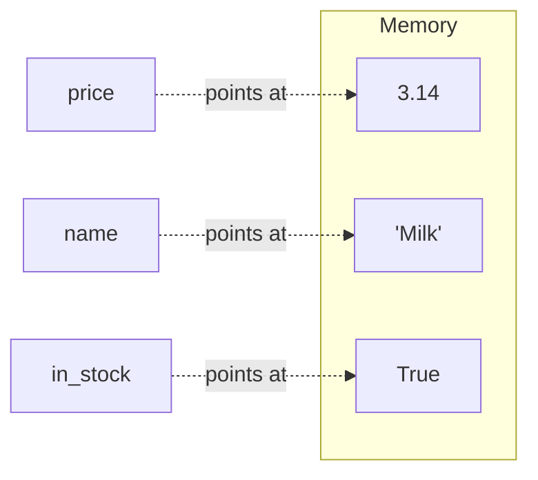

# Lesson 1 — Values and types

⬅ [Meeting 1](README.md) · ➡ [Next: Input and output](02-input-and-output.md)

---

## Why you care

Almost every bug a beginner hits — and a surprising share of bugs in production data
pipelines — is a **type** bug. A number that is secretly text. A price that got rounded to
an integer. A product code `007` that became `7` and stopped matching anything.

If you learn to ask *"what type is this value?"* reflexively, you have skipped past
the most expensive class of mistake in data work.

---

## The idea

A **variable** is a label you stick on a value. Not a box — a *label*.



```python
price = 3.14
name = "Milk"
in_stock = True
```

Read `=` as **"gets"**, never as "equals". `price = 3.14` means *"the label `price` now
points at the value 3.14"*. This matters because of lines like `x = x + 1`,
which is nonsense as mathematics but perfectly clear as an instruction:
*"make `x` point at whatever `x` is now, plus one."*

---

## The four types you need today

| Type | Name in Python | Looks like | Use it for |
|------|----------------|-----------|------------|
| Whole number | `int` | `42`, `-7`, `0` | counts, indexes, years |
| Decimal number | `float` | `3.14`, `-0.5`, `2.0` | money, measurements, averages |
| Text | `str` | `"Milk"`, `'A'`, `""` | names, codes, anything you read |
| Yes/no | `bool` | `True`, `False` | the answer to a question |

```python
quantity  = 10          # int
price     = 13.50       # float
product   = "Bread"     # str
available = True        # bool
```

### Asking Python what something is

`type()` is your best friend. Use it constantly.

```python
print(type(10))         # <class 'int'>
print(type(13.50))      # <class 'float'>
print(type("Bread"))    # <class 'str'>
print(type(True))       # <class 'bool'>
print(type("10"))       # <class 'str'>   ← LOOKS like a number. Is not.
```

That last line is the whole lesson. `10` and `"10"` are different things:

```python
print(10 + 10)          # 20    ← arithmetic
print("10" + "10")      # 1010  ← gluing text together
```

Neither is wrong. They are different operations, because `+` means
"add" for numbers and "join" for text.

---

## The syntax: operators

### Arithmetic

| Operator | Meaning | Example | Result |
|----------|---------|---------|--------|
| `+` `-` `*` | add, subtract, multiply | `7 * 3` | `21` |
| `/` | divide — **always gives a float** | `7 / 2` | `3.5` |
| `//` | floor divide — throws away the remainder | `7 // 2` | `3` |
| `%` | modulo — **keeps only** the remainder | `7 % 2` | `1` |
| `**` | power | `2 ** 10` | `1024` |

`//` and `%` look exotic but they are two of the most useful operators in the language,
because together they let you **take a number apart digit by digit**:

```python
n = 407
print(n % 10)    # 7   ← the last digit
print(n // 10)   # 40  ← everything except the last digit
```

Do that in a loop and you can examine every digit of any number.
(That is exactly [Exercise 1.11](exercises.md#exercise-111--count-the-zeros), straight
from the original lab archive.)

And `%` is how you test for even/odd, which you will use in *dozens* of exercises:

```python
print(10 % 2)    # 0  ← no remainder, so 10 is even
print(7 % 2)     # 1  ← remainder of 1, so 7 is odd
```

### Converting between types

```python
int("42")        # 42      text → whole number
float("3.14")    # 3.14    text → decimal
str(42)          # "42"    number → text
int(3.99)        # 3       ← CHOPS the decimal off. Does not round!
round(3.99)      # 4       ← this rounds
```

> **⚠️ `int()` truncates, it does not round.** `int(3.99)` is `3`.
> If you meant to round, say `round(3.99)`.

---

## Worked example — a triangle's area

This is Task 1 from the original Lab 4 archive, rewritten. Read the annotations.

```python
import math                      # 1. load the maths toolbox

a = 3.0                          # 2. three side lengths, as floats
b = 4.0
c = 5.0

p = (a + b + c) / 2              # 3. the semi-perimeter: half the way round
                                 #    "/" gives a float — good, we want 6.0 not 6

area = math.sqrt(p * (p - a) * (p - b) * (p - c))   # 4. Heron's formula

print("Semi-perimeter:", p)      # 5. show the intermediate value too —
print("Area:", area)             #    it makes the program explainable
```

Output:

```
Semi-perimeter: 6.0
Area: 6.0
```

Four things worth noticing, because they recur everywhere:

1. **`import math` goes at the top.** It gives you `math.sqrt`, `math.pi`, `math.fabs`
   (absolute value), `math.log`, `math.sin`. Without the import, `math.sqrt` is a `NameError`.
2. **Brackets control order.** `(a + b + c) / 2` is not `a + b + c / 2`.
   Python follows normal precedence rules, so when in doubt, add brackets. They are free.
3. **Intermediate variables are documentation.** Writing `p` on its own line and printing it
   is better than one monster expression, both for you and for whoever reviews this.
4. **`math.sqrt(x)` and `x ** 0.5` are the same thing.** Either is fine.

▶ Run it: `python3 examples/meeting-1/01_triangle_area.py`

---

## 🔍 Read this code

Write your answer down **before** you run anything.

**(a)**
```python
x = 5
x = x + x
x = x * 2
print(x)
```

**(b)**
```python
a = "7"
b = 3
print(a * b)
```

**(c)**
```python
print(9 / 3)
print(type(9 / 3))
```

**(d)**
```python
print(int("12") + int("30"))
print("12" + "30")
```

<details>
<summary><b>Answers</b></summary>

**(a)** `20`.
`x` starts at 5 → `5 + 5` = 10 → `10 * 2` = 20. Trace it one line at a time;
each line replaces the label's target.

**(b)** `777`.
`a` is **text**, not the number 7. Text times an integer means "repeat the text that many
times". This is a real Python feature (`"-" * 40` draws a separator line), and also a real
source of confusion when your data arrived as strings.

**(c)** `3.0` then `<class 'float'>`.
This surprises people: `9 / 3` is mathematically 3, but `/` in Python *always* returns a
float, even when the division is exact. If you need the int, use `9 // 3` or `int(9 / 3)`.

**(d)** `42` then `1230`.
Same characters, two completely different operations, decided purely by type.

</details>

---

## Traps

| Trap | What happens | Fix |
|------|--------------|-----|
| `x = "5" + 5` | `TypeError: can only concatenate str (not "int") to str` | Convert first: `int("5") + 5` |
| `int(3.99)` expecting 4 | you get `3` | use `round(3.99)` |
| `0.1 + 0.2 == 0.3` | `False` (!) | floats are approximate — see the box below |
| `Print("hi")` | `NameError` | Python is **case-sensitive**: `print`, not `Print` |
| naming a variable `list` or `sum` | you break the built-in function | pick another name: `my_list`, `total` |

### The float box — read this once, remember it forever

```python
print(0.1 + 0.2)              # 0.30000000000000004
print(0.1 + 0.2 == 0.3)       # False
```

#### First: why you cannot see the problem

The natural reaction is *"let me print more digits and look"* — and the natural attempt
does not work:

```python
print(f"{0.1:20f}")      #             0.100000   ← looks perfectly clean
print(f"{0.1:100f}")     # the same 0.100000, just padded further right
```

**The number before the dot is the WIDTH. The number after it is the PRECISION.**
`:20f` asks for 20 *characters*, not 20 decimals — and `f` defaults to 6 decimals, which
rounds the error away before you ever see it.

Add the dot and the truth appears:

```python
print(f"{0.1:.20f}")     # 0.10000000000000000555
print(f"{0.1:.55f}")     # 0.1000000000000000055511151231257827021181583404541015625
```

| Spec | Means |
|------|-------|
| `:10f` | width 10, **6 decimals** (the default) |
| `:.10f` | **10 decimals**, no minimum width |
| `:20.10f` | width 20 **and** 10 decimals |
| `:.2f` | 2 decimals — what money needs |

`0.1` was never exactly `0.1`. It only looked that way because the default formatting
hid the difference.

#### Why it happens

Computers store numbers in base 2 — halves, quarters, eighths. Some decimals fit exactly
and some never do:

| | |
|---|---|
| `1/10` in **decimal** | `0.1` — exact |
| `1/3` in **decimal** | `0.333…` — never ends |
| `1/10` in **binary** | `0.00011001100110011…` — never ends |

`0.1` in binary is `0011` repeating forever. A float has room for 53 binary digits, so
the pattern gets **cut off**, and the stored value is very slightly wrong. It is exactly
why you cannot write `1/3` exactly on paper.

So the two sums really are different numbers:

```
0.1 + 0.2 produces  0.3000000000000000444089209850062616169452667236328125
0.3       is        0.2999999999999999888977697537484345957636833190917968750
```

They are *adjacent* floats — one step apart, nothing in between:

```python
(0.1 + 0.2).hex()    # '0x1.3333333333334p-2'
(0.3).hex()          # '0x1.3333333333333p-2'   ← 3 instead of 4, one digit
```

Some decimals **are** exact, though — the powers of two: `0.5`, `0.25`, `0.125`, `0.75`.

#### What to do about it

**1. Never compare floats with `==`.** Compare against a tolerance — conventionally
called *epsilon*. This is what the original Lab 4 archive does, and it is genuinely good
practice:

```python
import math

eps = 0.000001                                   # "close enough" threshold
print(math.fabs((0.1 + 0.2) - 0.3) < eps)        # True
print(math.isclose(0.1 + 0.2, 0.3))              # True — built in, does the same job
```

Read it as: *"is the distance between the two values smaller than my tolerance?"*
You will meet this pattern again in [Lesson 3](03-conditions.md) when we check whether a
triangle has a right angle, and in [Lesson 13](../meeting-3/13-mini-etl-project.md) when
a pipeline checks its own arithmetic.

**2. For display, pin the decimals:** `f"{value:.2f}"`. Always, for money.

**3. For money that must be exact to the cent, use `Decimal`:**

```python
from decimal import Decimal

Decimal("0.1") + Decimal("0.2") == Decimal("0.3")     # True
```

⚠️ Note the **quotes**. `Decimal("0.1")` is exact; `Decimal(0.1)` is handed the already-broken
float and keeps the error.

**4. Or store money as whole cents in an `int`**, and divide only when printing. Banks do this.

> **This is not a Python bug.** Every language using IEEE 754 doubles behaves identically —
> C, Java, JavaScript, Excel, SQL. It is how the hardware works.

▶ See all of it run: `python3 examples/meeting-1/01_float_precision.py`

---

## Naming things

Python does not care what you call your variables. Your colleagues do, and so will
you in three weeks' time.

```python
# ✗ what the original labs often look like
r = 3
e = 4
s = 0

# ✓ what a reviewer can actually read
row_count    = 3
column_count = 4
total        = 0
```

The convention is `snake_case`: lowercase words joined by underscores.
Use it for variables and functions. The rule of thumb: **the name should say
what the value means, not what type it is.**

---

## Recap

- `=` means "gets", not "equals".
- Four types today: `int`, `float`, `str`, `bool`. Use `type()` whenever unsure.
- `"10"` is not `10`, and `+` behaves differently for each.
- `/` always gives a float; `//` and `%` split a number into quotient and remainder.
- `x % 2 == 0` tests "is even".
- Never compare floats with `==` — compare the difference against an epsilon.
- `import math` at the top gives you `sqrt`, `fabs`, `log`, `sin`, `pi`.

➡ [Next: Input and output](02-input-and-output.md)
