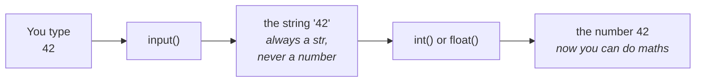

# Lesson 2 — Input and output

⬅ [Previous: Values and types](01-values-and-types.md) · [Meeting 1](README.md) · ➡ [Next: Conditions](03-conditions.md)

---

## Why you care

A program that cannot take data in and cannot report results out is a program nobody
can use. And there is one specific fact about `input()` that causes more beginner bugs
than anything else in Python. Let us deal with it immediately.

---

## `input()` always gives you text. Always.



```python
age = input("How old are you? ")
print(type(age))            # <class 'str'>  ← even if you typed 30
print(age + 10)             # 💥 TypeError
```

The fix is to convert at the moment you read:

```python
age = int(input("How old are you? "))       # int() wraps input()
print(age + 10)                             # ✓ works
```

Read that nesting from the **inside out**, which is how all nested calls are read:

1. `input("How old are you? ")` — print the prompt, wait, hand back what was typed as text
2. `int(...)` — turn that text into a whole number
3. `age = ...` — label the result `age`

| You need | Write |
|----------|-------|
| a whole number | `n = int(input("n = "))` |
| a decimal number | `x = float(input("x = "))` |
| text | `name = input("name: ")` — no conversion needed |

> **Rule of thumb:** counts and indexes → `int()`. Measurements, prices, coordinates → `float()`.
> The original lab archive follows exactly this: `float(input(...))` for side lengths and
> coordinates, `int(input(...))` for "how many elements".

---

## `print()` — four ways, one recommendation

```python
name = "Bread"
qty = 6
price = 13.5
```

### 1. Commas — quick and fine for debugging

```python
print("Product:", name, "Qty:", qty)
# Product: Bread Qty: 6
```

`print` inserts a space between comma-separated items automatically.

### 2. f-strings — **use this one**

Put an `f` before the quote, then write `{variable}` inside the text:

```python
print(f"Product: {name}, quantity: {qty}, price: {price}")
# Product: Bread, quantity: 6, price: 13.5
```

f-strings can hold any expression, and they can format numbers:

```python
print(f"Total: {qty * price:.2f} EUR")     # Total: 81.00 EUR
print(f"{qty} x {name} @ {price:.2f}")     # 6 x Bread @ 13.50
```

`:.2f` means *"show as a decimal with exactly 2 places"*. For money this is not optional —
`81.0` in a report looks like an error, `81.00` looks like a number.

### 3. `.format()` — you will see it in older code

```python
print("Product: {0}, qty: {1}".format(name, qty))
```

This is what the whole original lab archive uses, and what most pre-2017 Python code and
plenty of AI-generated code uses. **You must be able to read it** — `{0}` is the first
argument, `{1}` the second — but write f-strings in new code.

### 4. `%` — very old, read-only

```python
print("Product: %s, qty: %d" % (name, qty))
```

You do not need to write this. Recognise it and move on.

---

## Formatting numbers — the bits that matter for reports

```python
value = 1234.5678

print(f"{value:.2f}")       # 1234.57      2 decimal places
print(f"{value:.0f}")       # 1235         no decimals, rounded
print(f"{value:10.2f}")     #    1234.57   width 10, right-aligned
print(f"{value:,.2f}")      # 1,234.57     thousands separator
```

### The grammar

```
{value : [fill][align] [sign] [width] [,] [.precision] [type]}
            *     < > ^    +     20     ,      .10        f
```

Everything after the colon is optional, which is why `:.2f`, `:<12`, `:>8.2f` and
`:,.0f` all work. Read `:20.10f` as *"at least 20 characters wide, 10 digits after the
point, fixed-point"*.

### ⚠️ Width is a *minimum* — this is the one that confuses everyone

`3.1415926536` already needs **12 characters**, so any width below 12 does nothing at all:

```python
value = 3.14159265358979

f"{value:.10f}"      # '3.1415926536'                    12 characters
f"{value:5.10f}"     # '3.1415926536'                    width 5  → IGNORED
f"{value:12.10f}"    # '3.1415926536'                    width 12 → exact fit
f"{value:20.10f}"    # '        3.1415926536'            width 20 → 8 spaces added
f"{value:30.10f}"    # '                  3.1415926536'  width 30 → 18 spaces
```

**Width never truncates a number — it only pads.** If you experiment with a small width
and see no change, that is why.

And there is a second reason it seems to do nothing: **the padding is spaces, and
`print()` shows them against the background.** In the shell, leave `print()` off and
the quotes reveal it:

```python
>>> f"{value:20.10f}"           # the quotes show you exactly where the padding is
'        3.1415926536'
>>> print(f"{value:20.10f}")    # same string, but now the padding is invisible
        3.1415926536
```

### What width is *for*: columns

A single value looks pointless. Stack them and the purpose appears:

```text
:.2f  (no width)        :10.2f  (width 10)
--------------------    --------------------
7.50                          7.50
1234.50                    1234.50
89.12                        89.12
0.75                          0.75
45678.90                  45678.90
```

**The decimal points line up.** That is the entire point, and it only shows up across
several lines — which is why testing one number tells you nothing.

### Alignment inside the width

```python
value = 3.5
```

| Code | Result | Meaning |
|------|--------|---------|
| `:10.2f` | `'      3.50'` | numbers default to **right** |
| `:>10.2f` | `'      3.50'` | right, said explicitly |
| `:<10.2f` | `'3.50      '` | left |
| `:^10.2f` | `'   3.50   '` | centre |
| `:010.2f` | `'0000003.50'` | zero-filled |
| `:+10.2f` | `'     +3.50'` | always show the sign |
| `:*>10.2f` | `'******3.50'` | any fill character |
| `:10` on `"abc"` | `'abc       '` | **text defaults to LEFT** |

That asymmetry is deliberate: text reads better left-aligned, numbers compare better
right-aligned. It is why the table below uses `:<20` for names and `:>10.2f` for money.

### Putting it together — a report

```python
rows = [
    ("Bread 500g", "pcs", 6, 1.35),
    ("Sparkling water 1L", "bottle", 48, 0.65),
    ("Coffee 500g", "pack", 3, 7.99),
]

print(f"{'Product':<20}{'Unit':<8}{'Qty':>5}{'Price':>10}{'Total':>12}")
print("-" * 55)
for name, unit, quantity, price in rows:
    print(f"{name:<20}{unit:<8}{quantity:>5}{price:>10.2f}{quantity * price:>12.2f}")
```

```
Product             Unit      Qty     Price       Total
-------------------------------------------------------
Bread 500g          pcs         6      1.35        8.10
Sparkling water 1L  bottle     48      0.65       31.20
Coffee 500g         pack        3      7.99       23.97
```

Every column is a width. Remove them and it is unreadable. We build a full one in
[Lesson 7](../meeting-2/07-nested-lists-and-matrices.md) and use it for real in
[Lesson 13](../meeting-3/13-mini-etl-project.md).

### Long text breaks a table — unless you cap it

```python
name = "Sparkling mineral water 1 litre glass bottle"    # 44 characters

f"{name:<20}"        # the whole 44 characters — the column is ruined
f"{name:<20.20}"     # 'Sparkling mineral wa' — capped at 20
```

**For text, precision is a maximum length**, not a number of decimals. `:<20.20` means
*"at least 20 wide, at most 20 characters"*, which is how you stop one long product name
destroying an entire report.

### Width from a variable

```python
names = ["Bread", "Sparkling water 1L", "Coffee"]
needed = max(len(n) for n in names)        # 18

for name in names:
    print(f"|{name:<{needed}}|")           # nested braces: the width is computed
```

```
|Bread             |
|Sparkling water 1L|
|Coffee            |
```

Handy when the column width depends on your data rather than a guess.

### The other type letters

| Code | `1234.5678` becomes | Use for |
|------|--------------------|---------|
| `:.2f` | `1234.57` | **money, almost always** |
| `:,.2f` | `1,234.57` | large amounts |
| `:.2e` | `1.23e+03` | very large or very small numbers |
| `:.4g` | `1235` | shortest sensible form |
| `:.1%` | `123456.8%` | percentages — ⚠️ it **multiplies by 100** |

For integers: `:,d` → `1,234,567`, `:b` → binary, `:08b` → zero-padded binary,
`:x` → hex, `:#x` → `0xff`.

### ⚠️ A rounding gotcha

```python
f"{0.125:.2f}"     # '0.12'   ← down
f"{0.135:.2f}"     # '0.14'   ← up
f"{2.675:.2f}"     # '2.67'   ← down
```

Python rounds **half to even**, and float storage nudges some values either way
([Lesson 1's float box](01-values-and-types.md#the-float-box--read-this-once-remember-it-forever)).
Fine for display. **Not** fine when a total must match an invoice — for that, `Decimal`
with an explicit mode:

```python
from decimal import Decimal, ROUND_HALF_UP

Decimal("0.125").quantize(Decimal("0.01"), rounding=ROUND_HALF_UP)    # 0.13
```

▶ Run all of this, and experiment: `python3 examples/meeting-1/02_formatting.py`

---

## Worked example — a piecewise function

Task 4 from the original Lab 4: compute

```
y = ln|x| − n    if x ≤ n
y = cos(x·n)     if x > n
```

```python
import math

x = float(input("Enter x: "))          # float: could be 2.5
n = float(input("Enter n: "))

if x <= n:
    y = math.log(math.fabs(x)) - n     # math.fabs = absolute value
else:                                  # log of a negative number is an error,
    y = math.cos(x * n)                # so fabs protects us

print(f"y = {y:.6f}")
```

```
Enter x: 2
Enter n: 5
y = -4.306853
```

Note **why** `math.fabs` is there: `math.log(-3)` raises `ValueError`. Wrapping the
argument in `fabs` makes the domain safe. That is defensive programming, and spotting it
is the kind of thing a code review should catch.

▶ Run it: `python3 examples/meeting-1/02_piecewise.py`

---

## 🔍 Read this code

**(a)** The user types `5`. What is printed?
```python
n = input("n = ")
print(n * 3)
```

**(b)** The user types `5`. What is printed?
```python
n = int(input("n = "))
print(n * 3)
```

**(c)**
```python
total = 7
count = 2
print(f"Average: {total / count}")
print(f"Average: {total / count:.1f}")
```

<details>
<summary><b>Answers</b></summary>

**(a)** `555`. No `int()`, so `n` is the string `"5"`, and `"5" * 3` repeats the text.
This is the single most common beginner bug in Python, and it never raises an error —
it just silently gives you nonsense. That is what makes it dangerous.

**(b)** `15`. With `int()` you get real multiplication.

**(c)**
```
Average: 3.5
Average: 3.5
```
Both print `3.5` — but for a different reason. The first prints the full float; the second
formats it to one decimal. Change `total` to `22` and the difference shows:
`11.0` vs `11.0`… change `count` to `3` and you get `7.333333333333333` vs `7.3`.
**In any report, always pin the decimals.**

</details>

---

## Traps

| Trap | Symptom | Fix |
|------|---------|-----|
| forgot `int()`/`float()` | `"5" * 3 == "555"`, or `TypeError` on `+` | convert at read time |
| `int(input())` but user typed `3.5` | `ValueError: invalid literal for int()` | use `float()` when decimals are possible |
| forgot the `f` prefix | prints the literal text `{name}` | `f"...{name}..."` |
| prompt with no trailing space | `Enter x:5` — ugly | `input("Enter x: ")` — note the space |
| using `input()` in a script run by a scheduler | it hangs forever waiting | read from a file or arguments instead |

That last one is worth dwelling on. `input()` is excellent for *learning* and for small
tools a human runs by hand. It is the **wrong** way to feed a real pipeline, because an
automated job has no human to type. In Meeting 3 we replace `input()` with
[reading files](../meeting-3/10-files.md), which is how production code gets its data.

---

## Recap

- `input()` returns a **string**, always. Wrap it: `int(input(...))` / `float(input(...))`.
- Read nested calls inside-out.
- Write f-strings: `f"text {value}"`. Read `.format()` — the old labs are full of it.
- `:.2f` for money, `:<12` / `:>8` for aligned columns.
- `input()` is for humans at a keyboard, not for automated jobs.

➡ [Next: Conditions](03-conditions.md)
