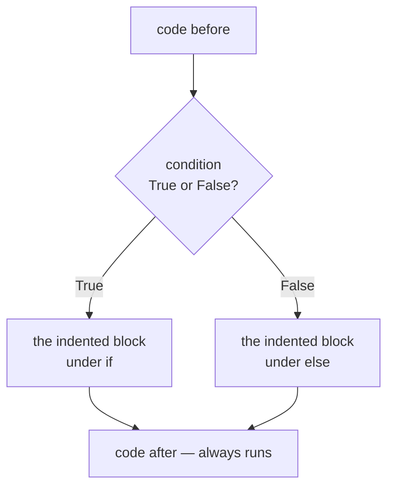
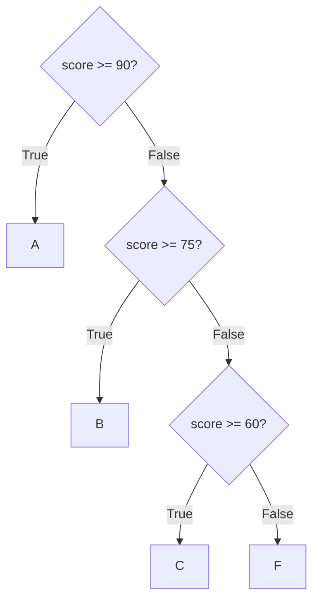
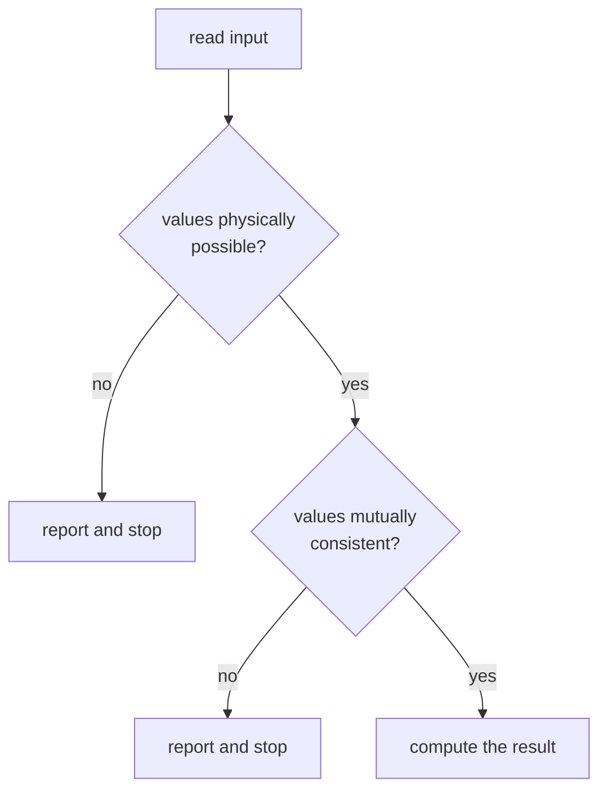

# Lesson 3 — Conditions

⬅ [Previous: Input and output](02-input-and-output.md) · [Meeting 1](README.md) · ➡ [Next: while loops](04-while-loops.md)

---

## Why you care

A condition is where a program stops being a calculator and starts being a *decision*.
In data work, conditions are your **validation layer**: is this EAN 13 characters?
is this price positive? does this date make sense? Every guard rail you will ever build
is an `if`.

---

## The idea



Exactly one of the two branches runs. Never both, never neither.

---

## The syntax

```python
temperature = 15

if temperature > 20:
    print("Warm")
else:
    print("Cold")
```

Three pieces of syntax carry all the meaning:

| Piece | Rule |
|-------|------|
| the condition | must evaluate to `True` or `False` |
| the **colon** `:` | ends every `if` / `elif` / `else` line. Forgetting it is a `SyntaxError` |
| the **indentation** | 4 spaces. This is what says "these lines belong to the `if`" |

### Indentation is not decoration

Most languages use `{ }` to group lines. Python uses **whitespace**, and it is
part of the language, not a style choice:

```python
x = 10

if x > 5:
    print("big")            # inside the if — only when x > 5
    print("still inside")   # also inside
print("outside")            # NOT inside — runs always
```

```
big
still inside
outside
```

Move that last line four spaces right and its meaning changes completely. This is why
Python code looks tidy: it has no choice.

> **Set your editor to insert 4 spaces when you press Tab.** In VS Code this is the
> default for Python. Mixing tabs and spaces produces `TabError`, and it is invisible
> on screen, which makes it maddening.

---

## Comparison operators

| Operator | Means | Example (`x = 5`) |
|----------|-------|-------------------|
| `==` | equal to | `x == 5` → `True` |
| `!=` | not equal to | `x != 3` → `True` |
| `<` `>` | less / greater than | `x > 10` → `False` |
| `<=` `>=` | less/greater or equal | `x >= 5` → `True` |

> **`=` vs `==` is the classic.** `=` assigns ("gets"), `==` asks a question.
> `if x = 5:` is a `SyntaxError`; Python catches this one for you, thankfully.

### Chained comparisons — a Python gift

Most languages force you to write `1 <= x and x <= 2`. Python lets you write what
you would write on paper:

```python
x = 1.5
print(1 <= x <= 2)          # True — reads exactly like mathematics
```

This is used throughout the original lab archive and it is genuinely nicer:

```python
# Lab 4, Task 2: does a belong to [1;2] ∩ (c;d) ?
if 1 <= a <= 2 and c < a < d:
    print("a is in the interval")
```

Notice the two different bracket styles map onto two different operators:
`[1;2]` is inclusive → `<=`, and `(c;d)` is exclusive → `<`. Getting this
right is exactly the kind of detail a code review should verify.

---

## Combining conditions: `and`, `or`, `not`

| Operator | `True` when |
|----------|-------------|
| `A and B` | **both** are true |
| `A or B` | **at least one** is true |
| `not A` | A is false |

```python
age = 25
has_id = True

if age >= 18 and has_id:
    print("Allowed")
```

Python uses the English words, not `&&` / `||` / `!`. If you see `&&` in Python, someone
pasted it in from another language.

### Truth table — for when you are unsure

| A | B | `A and B` | `A or B` |
|---|---|-----------|----------|
| True | True | True | True |
| True | False | **False** | True |
| False | True | **False** | True |
| False | False | False | False |

**Remember:** `and` is strict (one false ruins it), `or` is generous (one true saves it).

---

## Three or more branches: `elif`

```python
score = 75

if score >= 90:
    grade = "A"
elif score >= 75:
    grade = "B"
elif score >= 60:
    grade = "C"
else:
    grade = "F"

print(grade)                # B
```



**Order matters enormously.** Python tests top to bottom and stops at the *first* match.
Flip the branches the wrong way round and everything collapses:

```python
# ✗ BROKEN — every score >= 60 gets a "C"
if score >= 60:
    grade = "C"
elif score >= 90:      # unreachable! 95 already matched the first branch
    grade = "A"
```

This bug never raises an error. It just quietly produces wrong answers —
which is why *reading* conditions in order is a skill worth practising.

---

## Worked example 1 — validating a triangle

Task 1 from the original Lab 4, now with the validation made explicit.
Three lengths only form a triangle if each side is shorter than the sum of the other two.

```python
import math

a = float(input("Side a: "))
b = float(input("Side b: "))
c = float(input("Side c: "))

# Guard first, compute second. If the data is bad, say so and stop.
if a <= 0 or b <= 0 or c <= 0:
    print("A side length must be positive.")
elif a + b <= c or a + c <= b or b + c <= a:
    print("These lengths cannot form a triangle.")
else:
    p = (a + b + c) / 2
    area = math.sqrt(p * (p - a) * (p - b) * (p - c))
    print(f"Area = {area:.4f}")
```

```
Side a: 3
Side b: 4
Side c: 5
Area = 6.0000
```

**The shape of this code is the shape of every validation you will ever write:**



*Reject early, compute late.* Check the cheap, obvious things first (is it positive?),
then the relationships between values (is it consistent?), and only then do the work.
When we build the ETL pipeline in [Lesson 13](../meeting-3/13-mini-etl-project.md),
it has exactly this skeleton — just with more rows.

▶ Run it: `python3 examples/meeting-1/03_triangle_validated.py`

---

## Worked example 2 — is the triangle right-angled?

Task 3 from the original Lab 4, and a nice demonstration of the epsilon idea from
[Lesson 1](01-values-and-types.md). A triangle has a right angle when two of its sides
are perpendicular, i.e. when their vectors' **dot product is zero**.

```python
import math

x1, y1 = 0.0, 0.0            # ← assigning several variables on one line
x2, y2 = 4.0, 0.0
x3, y3 = 0.0, 3.0

# Vectors along the sides, written as (dx, dy)
ab = (x2 - x1, y2 - y1)
ac = (x3 - x1, y3 - y1)
bc = (x3 - x2, y3 - y2)

# Dot product: multiply matching components, add them up.
# Zero means the two vectors are perpendicular.
dot_at_a = ab[0] * ac[0] + ab[1] * ac[1]
dot_at_b = -ab[0] * bc[0] + -ab[1] * bc[1]
dot_at_c = ac[0] * bc[0] + ac[1] * bc[1]

eps = 1e-9                   # 1e-9 is shorthand for 0.000000001

if (math.fabs(dot_at_a) < eps
        or math.fabs(dot_at_b) < eps
        or math.fabs(dot_at_c) < eps):
    print("Right-angled triangle")
else:
    print("Not right-angled")
```

```
Right-angled triangle
```

Three new things to notice:

1. **`x1, y1 = 0.0, 0.0`** assigns two variables in one line. Convenient and idiomatic.
2. **`ab[0]`** reads the first item out of the pair `ab`. Indexing starts at **0** —
   the whole of [Lesson 6](../meeting-2/06-lists.md) is about this.
3. **A condition split over several lines** needs the brackets around it, as shown.
   That is how you keep a long condition readable instead of running off the screen.

And note we did *not* write `if dot_at_a == 0`. That is the float trap from Lesson 1:
with coordinates like `0.1` and `0.3` the dot product comes out as `1.3877787807814457e-17`
instead of a clean `0`, and `== 0` would say "not right-angled" about a perfectly
right-angled triangle.

▶ Run it: `python3 examples/meeting-1/03_right_triangle.py`

---

## 🔍 Read this code

**(a)** What prints?
```python
x = 10
if x > 5:
    print("A")
if x > 8:
    print("B")
else:
    print("C")
```

**(b)** What prints?
```python
x = 10
if x > 5:
    print("A")
elif x > 8:
    print("B")
else:
    print("C")
```

**(c)**
```python
value = 0
if value:
    print("truthy")
else:
    print("falsy")
```

**(d)**
```python
n = 4
if n % 2 == 0 and n > 10:
    print("even and big")
elif n % 2 == 0:
    print("even")
else:
    print("odd")
```

<details>
<summary><b>Answers</b></summary>

**(a)** `A` then `B`. These are **two separate `if` statements**, so both get tested.
The `else` belongs only to the second one.

**(b)** `A` only. This is **one** statement with three branches, so it stops at the
first match. Compare (a) and (b) carefully — identical-looking code, completely
different behaviour. `elif` vs a new `if` is one of the highest-value things to spot
when reading someone else's code.

**(c)** `falsy`. Python treats some values as false without you writing a comparison:
`0`, `0.0`, `""` (empty text), `[]` (empty list), `None`. Everything else is "truthy".
So `if my_list:` is the idiomatic way to say "if the list is not empty".

**(d)** `even`. `4 % 2 == 0` is True but `4 > 10` is False, so the `and` fails and
the first branch is skipped. The second branch matches.

</details>

---

## Traps

| Trap | Symptom | Fix |
|------|---------|-----|
| missing `:` | `SyntaxError: expected ':'` | `if x > 5:` |
| wrong indentation | `IndentationError`, or lines silently outside the block | 4 spaces, consistently |
| `=` instead of `==` | `SyntaxError` | `==` compares |
| `if x == True:` | works but is noise | just `if x:` |
| comparing floats with `==` | silently False | `math.fabs(a - b) < eps` |
| unreachable `elif` | no error, wrong answers | order branches from most specific to least |
| `if x > 5 and < 10` | `SyntaxError` | `if 5 < x < 10:` or `if x > 5 and x < 10:` |

---

## Recap

- `if` / `elif` / `else`, with a colon and a 4-space indented block.
- Branches are tested top to bottom; the **first** match wins, the rest are skipped.
- Chained comparisons work: `1 <= x <= 2`.
- `and` `or` `not` — English words. `and` is strict, `or` is generous.
- Guard first, compute second: reject bad data before you use it.
- Never `==` on floats. Use an epsilon.

➡ [Next: Loops with while](04-while-loops.md)
