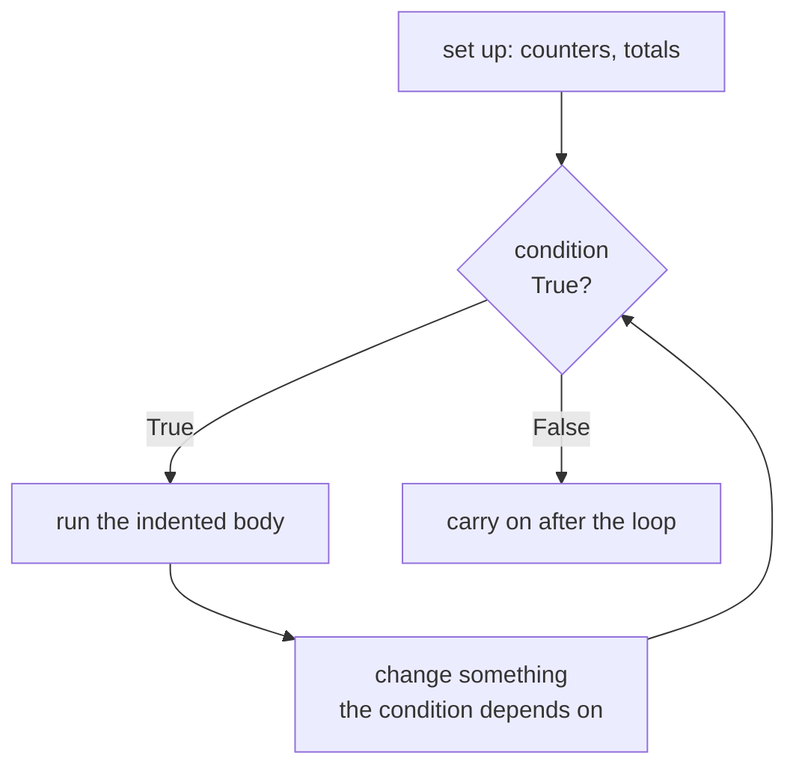
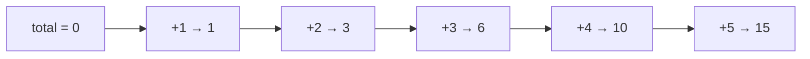

# Lesson 4 — Loops with `while`

⬅ [Previous: Conditions](03-conditions.md) · [Meeting 1](README.md) · ➡ [Next: for loops](05-for-loops.md)

---

## Why you care

Data work is repetition. 40,000 rows, the same three checks on each. You will never
write those checks 40,000 times — you write them **once**, inside a loop.

`while` is the loop for when you do **not know in advance how many times** you need to
repeat. "Keep asking until the input is valid." "Keep refining until the error is small
enough." "Keep dividing until the number runs out of digits."

---

## The idea



The condition is checked **before** each pass, including the very first. So a `while`
loop can run zero times.

---

## The syntax

```python
i = 1                       # 1. SET UP
while i <= 5:               # 2. CHECK
    print(i)                # 3. BODY
    i = i + 1               # 4. UPDATE  ← forget this and it never ends
print("Done")
```

```
1
2
3
4
5
Done
```

**Those four parts are always there.** When you read a `while` loop, find all four.
When you write one, write all four — and write part 4 *first*, before you forget it.

### The shorthand you will see everywhere

```python
i = i + 1        # long form
i += 1           # same thing, and this is what real code uses
```

| Shorthand | Means |
|-----------|-------|
| `x += 1` | `x = x + 1` |
| `x -= 1` | `x = x - 1` |
| `x *= 2` | `x = x * 2` |
| `total += price` | `total = total + price` |

---

## The infinite loop — and how to stop it

```python
i = 1
while i <= 5:
    print(i)            # ← no i += 1 anywhere!
```

This prints `1` forever. The condition never becomes False because nothing changes `i`.

> **Press `Ctrl-C` in the terminal to kill a runaway program.** Every programmer does
> this several times a week. It is not a failure, it is the fire extinguisher.

An infinite loop is almost always one of two mistakes:
1. You forgot to update the variable in the condition.
2. You update it in the wrong direction (`i -= 1` when the condition is `i <= 5`).

---

## The accumulator pattern

This is the most important pattern in the lesson, and you will use it constantly.

> **Start with an empty answer, then add to it on every pass.**

```python
total = 0                   # the "accumulator" — starts empty
i = 1
while i <= 5:
    total += i              # grow it
    i += 1
print(f"Sum 1..5 = {total}")        # 15
```



**The starting value must match the operation:**

| You are computing | Start at | Why |
|-------------------|----------|-----|
| a **sum** | `0` | adding 0 changes nothing |
| a **product** | `1` | multiplying by 1 changes nothing |
| a **count** | `0` | you have counted nothing yet |
| a **maximum** | the first item | (never start at 0 — all-negative data would break it) |

> **⚠️ Starting a product at `0` is a classic.** `0 * anything == 0`, so your answer is
> always zero and nothing errors. The original Lab 6 gets this right — `d = 1` before
> the product loop — and it is worth noticing *why*.

---

## `break` and `continue`

```python
n = 0
while True:                 # deliberately infinite...
    n += 1
    if n > 3:
        break               # ...with an exit door
    print(n)
```

```
1
2
3
```

| Keyword | Effect |
|---------|--------|
| `break` | leave the loop **immediately** |
| `continue` | skip the rest of this pass, go back to the condition |

`while True:` + `break` is a legitimate, common style when the natural exit point is in
the middle of the body rather than at the top. The original Lab 5 uses it to stop
digit-splitting once the number is exhausted.

> **⚠️ `continue` before your update line = infinite loop.**
> ```python
> i = 0
> while i < 5:
>     if i == 2:
>         continue      # 💥 jumps back with i still 2, forever
>     i += 1
> ```

---

## Worked example 1 — count the zeros in a number

Task 2 from the original Lab 5. This is where `%` and `//` from
[Lesson 1](01-values-and-types.md) pay off.

```python
n = int(input("Enter a whole number: "))
n = abs(n)                   # handle negatives: -104 has the same digits as 104

zero_count = 0

if n == 0:                   # edge case: the number 0 has one digit, and it is a zero
    zero_count = 1
else:
    while n > 0:
        last_digit = n % 10          # peel off the rightmost digit
        if last_digit == 0:
            zero_count += 1
        n = n // 10                  # drop that digit and carry on

print(f"Number of zeros: {zero_count}")
```

Trace it for `n = 1020`:

| pass | `n` at the top | `n % 10` | zero? | `n // 10` |
|------|---------------|----------|-------|-----------|
| 1 | 1020 | 0 | ✓ count=1 | 102 |
| 2 | 102 | 2 | – | 10 |
| 3 | 10 | 0 | ✓ count=2 | 1 |
| 4 | 1 | 1 | – | 0 |
| — | 0 | condition `0 > 0` is False → exit | | |

Answer: **2**. Building a table like this by hand is the single best debugging technique
there is, and it costs nothing but a scrap of paper.

> **Notice the edge case.** The original archive's version loops `while n >= 0` with a
> `break` inside, which works but is convoluted; and neither version handles `n = 0`
> without the special case. Finding the input that breaks a loop — 0, negative, empty —
> is exactly what a code review does.

▶ Run it: `python3 examples/meeting-1/04_count_zeros.py`

---

## Worked example 2 — a series, to a given precision

Task 3 from the original Lab 5. This is the classic case for `while`: you genuinely
cannot know the number of passes in advance, because it depends on how fast the terms shrink.

We compute `ln(1 − x)` using its Taylor series:

```
ln(1 − x) = −(x + x²/2 + x³/3 + x⁴/4 + …)      for |x| < 1
```

and we stop when the next term is smaller than our tolerance.

```python
import math

x = float(input("x (between -1 and 1): "))
eps = float(input("precision, e.g. 0.000001: "))

if math.fabs(x) >= 1:
    print("The series only converges for |x| < 1.")
else:
    total = 0.0
    k = 1
    term = x                             # the first term

    while math.fabs(term) > eps:         # stop when terms stop mattering
        total -= term                    # the series is negated
        k += 1
        term = (x ** k) / k              # build the next term

    print(f"Series result : {total:.8f}")
    print(f"math.log(1-x) : {math.log(1 - x):.8f}")
    print(f"Difference    : {math.fabs(total - math.log(1 - x)):.2e}")
```

```
x (between -1 and 1): 0.5
precision, e.g. 0.000001: 0.000001
Series result : -0.69314093
math.log(1-x) : -0.69314718
Difference    : 6.25e-06
```

Two genuinely important lessons hide in here:

1. **The loop is controlled by *precision*, not by a count.** With `x = 0.5` it runs about
   20 times; with `x = 0.9` it runs about 130. The code does not care — which is the
   entire reason to use `while`.
2. **The guard `if math.fabs(x) >= 1` is not optional.** With `x = 1.5` the terms *grow*
   instead of shrinking, `term` never drops below `eps`, and the loop runs forever
   (until the numbers overflow). The original archive version omits this check —
   a real bug, found by asking *"what input makes this never stop?"*

▶ Run it: `python3 examples/meeting-1/04_series_precision.py`

---

## Worked example 3 — input validation

This is the pattern you will actually reuse at work, so it earns its place:

```python
while True:
    raw = input("Enter a positive number: ")
    if raw.replace(".", "", 1).isdigit():     # digits, with at most one dot
        value = float(raw)
        if value > 0:
            break                             # good input — leave the loop
    print("  ✗ That is not a positive number. Try again.")

print(f"Thank you. You entered {value}")
```

```
Enter a positive number: abc
  ✗ That is not a positive number. Try again.
Enter a positive number: -5
  ✗ That is not a positive number. Try again.
Enter a positive number: 3.5
Thank you. You entered 3.5
```

`while True:` + `break` is the right shape here: you cannot know how many wrong answers
the user will give.

▶ Run it: `python3 examples/meeting-1/04_validated_input.py`

---

## 🔍 Read this code

**(a)** How many lines print?
```python
i = 0
while i < 3:
    print("hello")
    i += 1
```

**(b)** How many lines print?
```python
i = 5
while i < 3:
    print("hello")
    i += 1
```

**(c)** What is `total`?
```python
total = 1
i = 1
while i <= 4:
    total *= i
    i += 1
print(total)
```

**(d)** What is wrong here?
```python
n = 10
while n > 0:
    print(n)
    n += 1
```

<details>
<summary><b>Answers</b></summary>

**(a)** 3 — for `i` = 0, 1, 2. At `i = 3` the condition fails.

**(b)** **Zero.** `5 < 3` is False on the very first check, so the body never runs at all.
A `while` loop running zero times is normal and often correct — but if you assumed it
always runs once, you have a bug waiting.

**(c)** `24`. It is 1×1×2×3×4 = 4 factorial. Note `total` starts at **1**, not 0 —
this is the product accumulator.

**(d)** Infinite loop. The condition wants `n` to shrink towards 0, but `n += 1` grows it.
Should be `n -= 1`. Ctrl-C is your friend.

</details>

---

## Traps

| Trap | Symptom | Fix |
|------|---------|-----|
| no update line | runs forever | put `i += 1` in the body, write it first |
| update in the wrong direction | runs forever | match the direction to the condition |
| `continue` before the update | runs forever | update before `continue`, or use `for` |
| product accumulator starting at 0 | result is always 0 | start products at `1` |
| max starting at 0 | wrong for all-negative data | start from the first element |
| `<` where you meant `<=` | off-by-one, last item skipped | trace the last pass on paper |

---

## Recap

- `while condition:` repeats **while** the condition stays True; it is checked before every pass.
- Four parts, always: **set up · check · body · update.**
- Accumulator: start empty (`0` for sums and counts, `1` for products), grow each pass.
- `break` leaves now; `continue` skips to the next check.
- `while True:` + `break` is fine when the exit is naturally mid-body.
- Ask of every loop: **"what input makes this never stop?"**

➡ [Next: Loops with for](05-for-loops.md)
