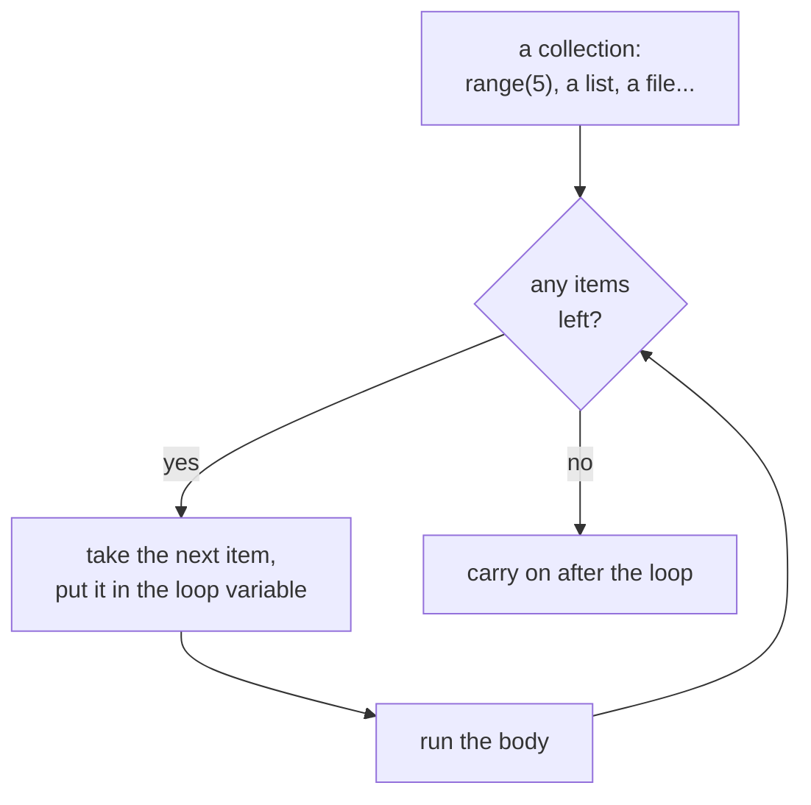
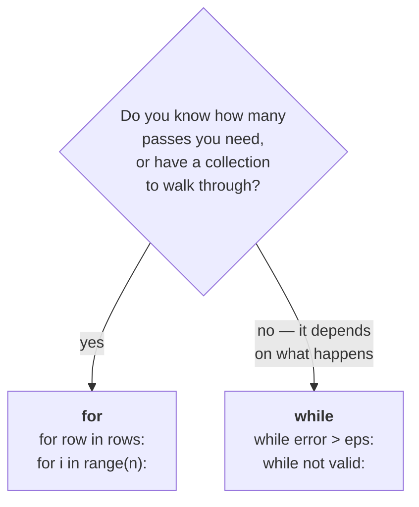

# Lesson 5 — Loops with `for`

⬅ [Previous: while loops](04-while-loops.md) · [Meeting 1](README.md) · ➡ [Exercises](exercises.md)

---

## Why you care

`for` is the loop you will write 90% of the time, because 90% of real repetition is
*"do this once for every item I already have"* — every row in the file, every column in
the table, every product in the list.

---

## The idea

`while` asks a question before each pass. `for` does not ask anything — it walks
through a collection of things and stops when it runs out.



The crucial difference: **you cannot forget the update.** `for` advances by itself,
so `for` loops cannot run forever. That alone makes them the safer choice.

---

## The syntax

```python
for i in range(5):
    print(i)
```

```
0
1
2
3
4
```

Read it as: *"for each value `i` taken from `range(5)`, do the body."*

`i` is the **loop variable**. You choose the name; it gets a fresh value each pass.

---

## `range()` — the three forms

`range` produces a sequence of whole numbers. It is not a list — it generates the
numbers as needed — but for our purposes it behaves like one.

| Form | Produces | Notes |
|------|----------|-------|
| `range(5)` | 0 1 2 3 4 | starts at 0, **5 is excluded** |
| `range(1, 6)` | 1 2 3 4 5 | from 1 up to but not including 6 |
| `range(0, 10, 2)` | 0 2 4 6 8 | the third number is the step |
| `range(10, 0, -1)` | 10 9 8 … 1 | negative step counts down |

> **The single most important fact: `range(n)` stops *before* `n`.**
> `range(5)` gives you five numbers — 0, 1, 2, 3, 4 — and never 5.
>
> It feels arbitrary until you meet lists in
> [Lesson 6](../meeting-2/06-lists.md): a list of 5 items has valid positions 0–4,
> so `range(len(my_list))` lines up exactly. The two conventions are designed to fit.

To see a `range` as a list, wrap it:

```python
print(list(range(1, 6)))          # [1, 2, 3, 4, 5]
print(list(range(0, 10, 2)))      # [0, 2, 4, 6, 8]
print(list(range(5, 0, -1)))      # [5, 4, 3, 2, 1]
```

Do this in the interactive shell whenever a `range` confuses you. It takes two seconds
and removes all doubt.

### Every-other-item: the step

The step argument is how the original lab archive picks out even and odd positions,
and you will use it a lot:

```python
for i in range(0, 10, 2):        # positions 0, 2, 4, 6, 8 — the EVEN indexes
    ...

for i in range(1, 10, 2):        # positions 1, 3, 5, 7, 9 — the ODD indexes
    ...
```

---

## Looping over things that are not numbers

```python
products = ["Bread", "Milk", "Salt"]

for product in products:          # the item itself, not its position
    print(product)
```

```
Bread
Milk
Salt
```

This is the form you should reach for by default: it says exactly what it means and
there is no index to get wrong. You can loop over text too:

```python
for character in "abc":
    print(character)              # a, then b, then c
```

### When you need the position as well: `enumerate()`

```python
products = ["Bread", "Milk", "Salt"]

for index, product in enumerate(products):
    print(f"{index}: {product}")
```

```
0: Bread
1: Milk
2: Salt
```

Counting from 1 for humans:

```python
for number, product in enumerate(products, start=1):
    print(f"{number}. {product}")
```

```
1. Bread
2. Milk
3. Salt
```

`enumerate` appears in the original archive's `Checker/` script (`enumerate(f, 1)` to
number the lines of a file), and it is the right tool whenever an error message needs to
say *which* row went wrong. You will be grateful for it in
[Lesson 13](../meeting-3/13-mini-etl-project.md).

---

## `while` or `for`? A decision you can make mechanically



| Use `for` when | Use `while` when |
|----------------|------------------|
| you have a list, a file, a range | you are repeating until a *condition* changes |
| the number of passes is known up front | the number of passes is unknowable |
| *"for every row in the file…"* | *"until the user types something valid…"* |
| *"repeat 10 times"* | *"until the error is small enough"* |

**Default to `for`.** Reach for `while` only when you genuinely cannot express the job
as "for each of these". Fewer `while` loops in a codebase means fewer infinite loops.

---

## Worked example 1 — a sum of logarithms

Task 1 from the original Lab 5: compute `ln(aⁿ) + ln(aⁿ⁻¹) + … + ln(a¹)`.

The archive version uses `while` with a manual counter. Here it is with `for`, which
removes the counter entirely:

```python
import math

a = float(input("Enter a non-zero real number a: "))
n = int(input("Enter a natural number n: "))

if a == 0:
    print("a must not be zero: ln(0) is undefined.")
elif n < 1:
    print("n must be at least 1.")
else:
    total = 0.0
    for power in range(n, 0, -1):            # n, n-1, ..., 1  (counting down)
        total += math.log(math.fabs(a ** power))
    print(f"Sum = {total:.6f}")
```

```
Enter a non-zero real number a: 2
Enter a natural number n: 3
Sum = 4.158883
```

Compare the two loop styles side by side — this is the point of the example:

```python
# the archive version — while, with a hand-rolled counter
S = 0
while n >= 1:
    S += math.log(math.fabs(a ** n))
    n -= 1                      # ← destroys n; it is 0 after the loop

# the for version — no counter to maintain
total = 0.0
for power in range(n, 0, -1):
    total += math.log(math.fabs(a ** power))
                                # ← n is untouched and still usable
```

The `while` version *works*, but it silently consumes `n`. If you later wanted to print
`f"the sum of {n} terms"`, you would print `0`. The `for` version leaves your inputs
intact. **Loops that mutate their inputs are a recurring source of surprise**, and
noticing it is exactly the reading skill this course is for.

▶ Run it: `python3 examples/meeting-1/05_sum_of_logs.py`

---

## Worked example 2 — a recurrence relation

Task 4 from the original Lab 5: `x₀ = x₁ = 1`, and `xᵢ = xᵢ₋₁ + 2·xᵢ₋₂`. Find `xₙ`.

The archive contains two solutions to this, and comparing them is instructive.

**Version A — keep only what you need (3 variables):**

```python
n = int(input("Which element? n = "))

if n <= 1:
    result = 1                       # x0 and x1 are both 1 by definition
else:
    previous2 = 1                    # x(i-2)
    previous1 = 1                    # x(i-1)
    for i in range(2, n + 1):
        current = previous1 + 2 * previous2
        previous2 = previous1        # ← shuffle the window forward
        previous1 = current
    result = current

print(f"x{n} = {result}")
```

**Version B — keep the whole history (a list):**

```python
n = int(input("Which element? n = "))

x = [1, 1]                           # x[0] and x[1]
for i in range(2, n + 1):
    x.append(x[i - 1] + 2 * x[i - 2])

print(f"Full sequence: {x[:n + 1]}")
print(f"x{n} = {x[n]}")
```

```
Which element? n = 6
Full sequence: [1, 1, 3, 5, 11, 21, 43]
x6 = 43
```

| | Version A (3 variables) | Version B (list) |
|---|---|---|
| Memory | constant — 3 numbers, whatever `n` is | grows with `n` |
| Gives you | only `xₙ` | the whole sequence |
| `n = 1,000,000` | fine | ~8 MB and rising |
| Easier to read | arguably B | |

**Neither is "the right answer".** That is the lesson. Version B is clearer and lets you
show the sequence; Version A scales. You pick based on what you need — and *that* is what
a code review is deciding when it says "why are you holding all of this in memory?".

The same trade-off, at a larger scale, is the reason [Lesson 12](../meeting-3/12-sql-from-python.md)
pushes work into the database instead of loading every row into Python.

▶ Run it: `python3 examples/meeting-1/05_recurrence.py`

---

## 🔍 Read this code

**(a)** What prints?
```python
for i in range(3):
    print(i)
```

**(b)** What prints?
```python
for i in range(1, 4):
    print(i)
```

**(c)** How many lines?
```python
for i in range(0, 10, 3):
    print(i)
```

**(d)** What is `total`?
```python
total = 0
for i in range(1, 5):
    total += i
print(total)
```

**(e)** Trickier — what prints after the loop?
```python
for i in range(3):
    pass
print(i)
```

<details>
<summary><b>Answers</b></summary>

**(a)** `0 1 2` — three lines. `range(3)` starts at 0 and stops before 3.

**(b)** `1 2 3` — three lines. Starting at 1 shifts everything but keeps the count.

**(c)** Four lines: `0 3 6 9`. The next would be 12, which is past the limit of 10.

**(d)** `10` — that is 1+2+3+4. `range(1, 5)` excludes 5.

**(e)** `2`. The loop variable **survives after the loop ends**, holding its last value.
This is occasionally handy and occasionally the cause of a very confusing bug —
especially if the loop ran zero times, in which case `i` does not exist at all and
you get a `NameError`. (`pass` means "do nothing"; it is a placeholder where Python's
syntax requires a body.)

</details>

---

## Traps

| Trap | Symptom | Fix |
|------|---------|-----|
| expecting `range(5)` to include 5 | last item missing | use `range(1, 6)` or `range(n + 1)` |
| `for i in range(len(x)): print(x[i])` | works, but noisy | `for item in x: print(item)` |
| modifying a list while looping over it | items skipped, no error | loop over a copy: `for x in items[:]` |
| using `i` after a zero-pass loop | `NameError` | initialise before the loop |
| `for i in range(3.5)` | `TypeError` | `range` only takes whole numbers |

---

## Recap

- `for item in collection:` — walks through, cannot run forever.
- `range(n)` gives `0 … n-1`; `range(a, b)` gives `a … b-1`; a third argument is the step.
- Wrap a range in `list()` to see it.
- `enumerate()` when you need the position too; `start=1` to count for humans.
- Loop over the items, not the indexes, unless you need the index.
- **Default to `for`**; use `while` only when the pass count is genuinely unknown.

---

🎉 **That is all the syntax you need for Meeting 1.** Four verbs — store, decide, repeat,
output — and you can now read a very large fraction of the Python you will ever meet.

➡ **[Now do the exercises](exercises.md)** — 14 tasks, hints before solutions.
