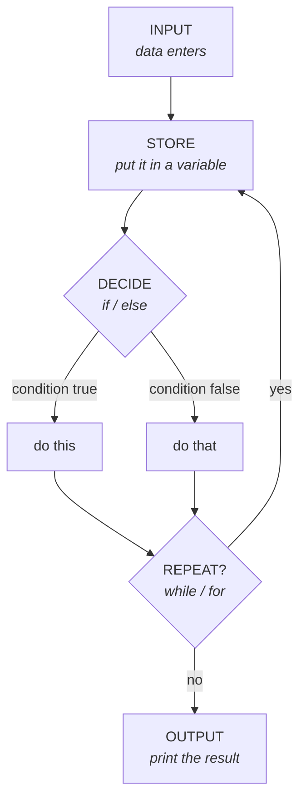

# Meeting 1 — Foundations

**Goal of this meeting:** by the end you can take any 10-line Python script,
read it line by line, and say out loud what it does — without running it.

⏱ ~2.5 hours including a break. ⬅ [Back to course home](../../README.md)

---

## Agenda

| | Lesson | Minutes | What we cover |
|---|--------|---------|---------------|
| 1 | [Values and types](01-values-and-types.md) | 30 | Numbers, text, True/False, variables, `type()`, conversion |
| 2 | [Input and output](02-input-and-output.md) | 20 | `input()`, `print()`, f-strings, why `input()` always lies to you |
| 3 | [Conditions](03-conditions.md) | 30 | `if` / `elif` / `else`, comparisons, `and` / `or` / `not` |
| — | ☕ break | 10 | |
| 4 | [Loops with `while`](04-while-loops.md) | 30 | Repeat-until, accumulators, `break`, infinite loops |
| 5 | [Loops with `for`](05-for-loops.md) | 30 | `range()`, iterating, which loop to choose |
| — | [Exercises](exercises.md) | rest | 14 tasks, hint-first |

---

## The mental model for the whole meeting

Everything in Meeting 1 is this one picture:



Four verbs: **store, decide, repeat, output.** Every program you will ever read is
made of these four things nested inside each other. That is genuinely all there is.

---

## Before you start

- Finished [SETUP.md](../../SETUP.md)? You need `python3 --version` to work.
- Open a terminal in the repository folder. You will run files like:
  ```bash
  python3 examples/meeting-1/01_types.py
  ```
- Keep the [cheatsheet](../CHEATSHEET.md) open in a second tab.

---

## A promise about the exercises

Every exercise in this course has a **hint** before it has a **solution**.
When you get stuck — and you will, that is the job — open the hint, not the solution.
The hint is written to unstick you while leaving the thinking to you.

➡ **Start with [Lesson 1: Values and types](01-values-and-types.md)**
