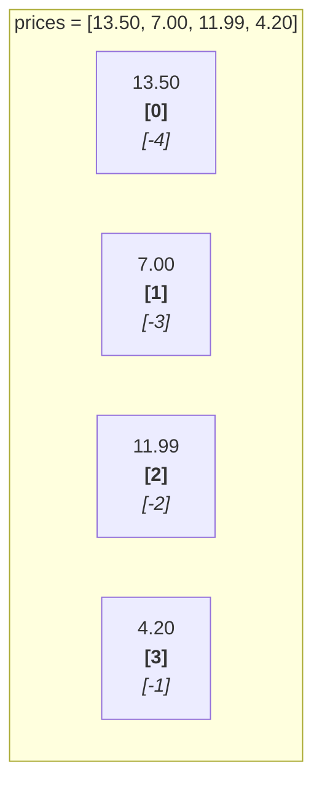
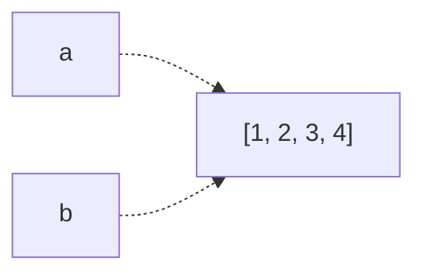
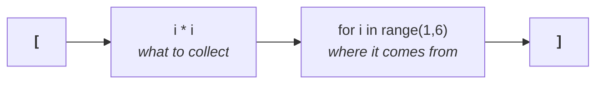

# Lesson 6 — Lists

⬅ [Meeting 2](README.md) · ➡ [Next: Nested lists and matrices](07-nested-lists-and-matrices.md)

---

## Why you care

A column of a spreadsheet is a list. A file's lines are a list. Every query result you
will ever get back is a list. If you are comfortable with lists, you are comfortable
with data.

---

## The idea

A list is an **ordered** collection. Each item has a **position** — its *index* —
and positions start at **0**.



> **Why start at 0?** Because an index is really an *offset* — "how far from the start".
> The first item is 0 steps from the start. It feels wrong for about a week and then
> feels obvious. And it makes `range(len(items))` line up exactly.

```python
prices = [13.50, 7.00, 11.99, 4.20]

print(prices[0])      # 13.50   the FIRST item
print(prices[3])      # 4.20    the FOURTH item
print(prices[-1])     # 4.20    the LAST item — no need to know the length
print(prices[-2])     # 11.99   second from the end
print(len(prices))    # 4       how many items
```

`prices[-1]` for "the last one" is idiomatic Python and much better than
`prices[len(prices) - 1]`.

> **⚠️ The last valid index is `len(x) - 1`.** A list of 4 items has indexes 0, 1, 2, 3.
> `prices[4]` raises `IndexError: list index out of range` — the single most common
> list error, and it is always an off-by-one.

---

## Making lists

```python
empty = []                                   # start empty and fill it later
numbers = [1, 2, 3, 4, 5]                    # literal
mixed = ["Bread", 6, 13.50, True]            # types can be mixed (but usually should not)
zeros = [0] * 5                              # [0, 0, 0, 0, 0]  — handy for counters
from_range = list(range(1, 6))               # [1, 2, 3, 4, 5]
from_text = "a,b,c".split(",")               # ['a', 'b', 'c']  — you will use this a LOT
```

That last one is how a line of a CSV file becomes a list. It is the foundation of
[Lesson 11](../meeting-3/11-csv-and-excel.md).

---

## Changing a list

Lists are **mutable** — you can change them after creating them.

```python
products = ["Bread", "Milk"]

products.append("Salt")            # add one to the end    → ['Bread','Milk','Salt']
products.insert(0, "Cola")         # add at a position     → ['Cola','Bread','Milk','Salt']
products[1] = "Rye bread"          # replace by index      → ['Cola','Rye bread','Milk','Salt']
products.remove("Milk")            # remove by VALUE       → ['Cola','Rye bread','Salt']
last = products.pop()              # remove and return the last → 'Salt'
del products[0]                    # remove by INDEX       → ['Rye bread']
products.extend(["A", "B"])        # add several           → ['Rye bread','A','B']
```

| Method | Removes by | Returns |
|--------|-----------|---------|
| `.remove(value)` | **value** — the first match | nothing |
| `.pop(index)` | **index** (default: last) | the removed item |
| `del x[index]` | **index** | nothing |

`.append()` is the one you will use most, and it is the partner of the accumulator
pattern from [Lesson 4](../meeting-1/04-while-loops.md):

```python
squares = []                      # start empty
for i in range(1, 6):
    squares.append(i * i)         # grow it
print(squares)                    # [1, 4, 9, 16, 25]
```

---

## Slicing — taking a piece

```python
numbers = [10, 20, 30, 40, 50, 60]

print(numbers[1:4])      # [20, 30, 40]   from 1, stopping BEFORE 4
print(numbers[:3])       # [10, 20, 30]   from the start
print(numbers[3:])       # [40, 50, 60]   to the end
print(numbers[-2:])      # [50, 60]       the last two
print(numbers[::2])      # [10, 30, 50]   every second item
print(numbers[::-1])     # [60,50,40,30,20,10]  reversed
print(numbers[:])        # a full COPY — see the warning below
```

`[start:stop]` **excludes** `stop`, exactly like `range`. Same convention, same reason:
`numbers[0:3]` and `numbers[3:6]` fit together with no gap and no overlap.

### ⚠️ The copy trap — this one bites everyone once

```python
a = [1, 2, 3]
b = a                # NOT a copy! Two labels, ONE list.
b.append(4)
print(a)             # [1, 2, 3, 4]   ← a changed too!
```

Remember from [Lesson 1](../meeting-1/01-values-and-types.md): a variable is a *label*.
`b = a` sticks a second label on the same list.



To get a genuine copy:

```python
b = a[:]              # slice copy
b = list(a)           # same thing
b = a.copy()          # same thing, most explicit
```

The original archive has this exact bug in `Arr/Завд.2 Варіант2.py`:

```python
B = b        # looks like "save a copy of b as B"; is not a copy at all
```

It is harmless there because nothing modifies `B` afterwards — but it is a landmine
waiting for the next person to edit the file. **This is precisely the kind of thing a
code review catches**, and it is invisible unless you know to look.

---

## Useful built-in functions

```python
values = [3, 1, 4, 1, 5, 9, 2, 6]

print(len(values))            # 8      how many
print(sum(values))            # 31     total
print(min(values))            # 1      smallest
print(max(values))            # 9      largest
print(sum(values) / len(values))   # 3.875   the average
print(sorted(values))         # [1, 1, 2, 3, 4, 5, 6, 9]  → a NEW list
print(values.count(1))        # 2      how many times 1 appears
print(values.index(4))        # 2      the position of the first 4
print(4 in values)            # True   membership test
```

> **⚠️ `len()` on an empty list is 0, and `sum([]) / len([])` is `ZeroDivisionError`.**
> Any average you compute on real data needs `if len(values) > 0:` in front of it.
> Empty input is the most under-tested case in all of data work.

### `sorted()` vs `.sort()` — an important distinction

```python
values = [3, 1, 2]

new = sorted(values)        # returns a NEW sorted list; values unchanged
print(values, new)          # [3, 1, 2] [1, 2, 3]

values.sort()               # sorts IN PLACE; returns None
print(values)               # [1, 2, 3]

x = values.sort()           # ⚠️ a classic mistake
print(x)                    # None — .sort() returns nothing!
```

| | Changes the original? | Gives you back |
|---|---|---|
| `sorted(x)` | no | a new sorted list |
| `x.sort()` | **yes** | `None` |

Descending, either way:

```python
sorted(values, reverse=True)      # [3, 2, 1]
values.sort(reverse=True)
```

The same `reverse=True` / in-place split applies to `reversed(x)` vs `x.reverse()`.

---

## List comprehensions — the Python idiom

This is one of the most distinctive features of the language. You will see it constantly,
including in the original archive and in almost all AI-generated Python, so you must be
able to **read** it.

Start with the loop you already know:

```python
squares = []
for i in range(1, 6):
    squares.append(i * i)
```

The comprehension is the same thing on one line:

```python
squares = [i * i for i in range(1, 6)]
```



Read it **right to left**: *"for each `i` in 1…5, collect `i * i`."*

### With a filter

```python
numbers = [1, 2, 3, 4, 5, 6, 7, 8, 9, 10]

evens = [n for n in numbers if n % 2 == 0]        # [2, 4, 6, 8, 10]
big_squares = [n * n for n in numbers if n > 7]   # [64, 81, 100]
```

The `if` at the end **selects which items to include**. Equivalent long form:

```python
evens = []
for n in numbers:
    if n % 2 == 0:
        evens.append(n)
```

### The reading-input idiom from the archive

```python
n = int(input("How many numbers? "))
x = [float(input(f"x{i + 1}: ")) for i in range(n)]
```

This is used throughout the original labs and it is genuinely elegant: read `n` values
into a list in one line. Read it as *"for each `i` from 0 to n−1, collect one float
typed by the user."*

### When NOT to use a comprehension

```python
# ✗ unreadable — nobody can review this
result = [x * 2 if x > 0 else x / 2 for row in table for x in row if x != 0]

# ✓ a plain loop, which anyone can follow
result = []
for row in table:
    for x in row:
        if x == 0:
            continue
        result.append(x * 2 if x > 0 else x / 2)
```

**The rule: if you cannot read it aloud in one breath, use a loop.** Cleverness that
costs the reader time is not a saving.

---

## Worked example 1 — geometric mean

Task 1 from the original Lab 6. Note the guard, which is the interesting part.

```python
n = int(input("How many numbers? "))
x = [float(input(f"x{i + 1}: ")) for i in range(n)]

print(f"Sequence: {x}")

product = 1.0                      # products start at 1, NOT 0
for value in x:
    product *= value
print(f"Product = {product}")

if product > 0:
    geometric_mean = product ** (1 / n)
    print(f"Geometric mean = {geometric_mean:.6f}")
else:
    print("No real geometric mean: the product is not positive.")
```

```
How many numbers? 3
x1: 2
x2: 4
x3: 8
Sequence: [2.0, 4.0, 8.0]
Product = 64.0
Geometric mean = 4.000000
```

Three things worth pulling out:

1. **`product = 1.0`, not `0`.** Start products at 1. (Lesson 4's accumulator table.)
2. **The `if product > 0` guard is real mathematics, not paranoia.** `(-8) ** (1/3)`
   has no real value, and Python returns a *complex number* rather than raising —
   so without the guard you would silently get `(1.0+1.73j)` in a report.
3. **`n` is used as the root.** If the user enters `0` for `n`, then `1/n` is a
   `ZeroDivisionError`. Try it. Then decide whether to add another guard —
   this is the habit we are building.

▶ Run it: `python3 examples/meeting-2/06_geometric_mean.py`

---

## Worked example 2 — generate, then filter

Task 2 from the original Lab 6: build array `B` where even positions get one formula
and odd positions another, then multiply the odd-indexed elements together.

```python
import math

n = int(input("How many elements? "))

b = []
for i in range(1, n + 1):
    if i % 2 == 0:
        b.append(1 + 0.5 + 1 / i)          # even i
    else:
        b.append(math.factorial(i) / 2 + 3)  # odd i

print("Array B:")
for index, value in enumerate(b):
    print(f"  b[{index}] = {value:.4f}")

# The product of the elements at ODD INDEXES (1, 3, 5, ...)
product = 1.0
for index in range(1, len(b), 2):          # start at 1, step 2
    product *= b[index]

print(f"Product of odd-indexed elements = {product:.6f}")
```

The original lab asks "the product of elements with odd numbers", and this is a genuine
ambiguity worth pausing on:

| Interpretation | Code | For `n=5` picks |
|----------------|------|-----------------|
| odd **index** (0-based) | `range(1, len(b), 2)` | b[1], b[3] |
| odd **position** (1-based, as a human counts) | `range(0, len(b), 2)` | b[0], b[2], b[4] |

The archive's own comment admits the confusion. **Both readings are defensible, so the
code must say which it means** — and that is why the comment in the code above
spells out "odd INDEXES". Ambiguous requirements are the most expensive bugs there are,
because the code is not wrong, it is just answering a different question.

▶ Run it: `python3 examples/meeting-2/06_generate_and_filter.py`

---

## 🔍 Read this code

**(a)**
```python
x = [10, 20, 30]
print(x[1])
print(x[-1])
print(len(x))
```

**(b)**
```python
x = [1, 2, 3]
y = x
y.append(4)
print(x)
```

**(c)**
```python
x = [5, 3, 1]
y = x.sort()
print(y)
```

**(d)**
```python
print([n * 2 for n in range(4)])
print([n for n in range(10) if n % 3 == 0])
```

**(e)**
```python
x = [1, 2, 3, 4, 5]
print(x[1:3])
print(x[:2] + x[3:])
```

<details>
<summary><b>Answers</b></summary>

**(a)** `20`, `30`, `3`. Index 1 is the *second* item; `-1` is the last.

**(b)** `[1, 2, 3, 4]`. `y = x` is not a copy — one list, two labels. The copy trap.

**(c)** `None`. `.sort()` sorts in place and returns nothing. You wanted `sorted(x)`.
`x` itself is now `[1, 3, 5]`, so the sort did happen — it just was not handed back.

**(d)** `[0, 2, 4, 6]` and `[0, 3, 6, 9]`.

**(e)** `[2, 3]` and `[1, 2, 4, 5]`. The second one removes the middle item by
sticking the two surrounding slices together — a neat trick worth knowing.

</details>

---

## Traps

| Trap | Symptom | Fix |
|------|---------|-----|
| `x[len(x)]` | `IndexError` | last index is `len(x) - 1`, or use `x[-1]` |
| `b = a` expecting a copy | both change together | `b = a[:]` or `a.copy()` |
| `y = x.sort()` | `y` is `None` | `y = sorted(x)` |
| `sum(x) / len(x)` on empty | `ZeroDivisionError` | guard `if x:` first |
| `max(x)` on empty | `ValueError` | guard `if x:` first |
| `.remove(v)` when `v` is absent | `ValueError` | check `if v in x:` first |
| naming a variable `list` | breaks `list()` everywhere after | `items`, `values`, `rows` |
| appending inside the loop you are looping over | never ends | build a new list instead |

---

## Recap

- Lists are ordered and indexed from **0**; the last index is `len(x) - 1`, or just `x[-1]`.
- `.append()` to grow; `[start:stop]` to slice, `stop` excluded.
- `b = a` shares the list. `b = a[:]` copies it.
- `sorted(x)` returns a new list; `x.sort()` changes `x` and returns `None`.
- `len`, `sum`, `min`, `max`, `sorted`, `in`, `.count`, `.index` cover most needs.
- Comprehensions `[expr for item in source if condition]` — read them right to left,
  and drop back to a loop the moment one gets hard to read.
- **Always ask: what does this do when the list is empty?**

➡ [Next: Nested lists and matrices](07-nested-lists-and-matrices.md)
