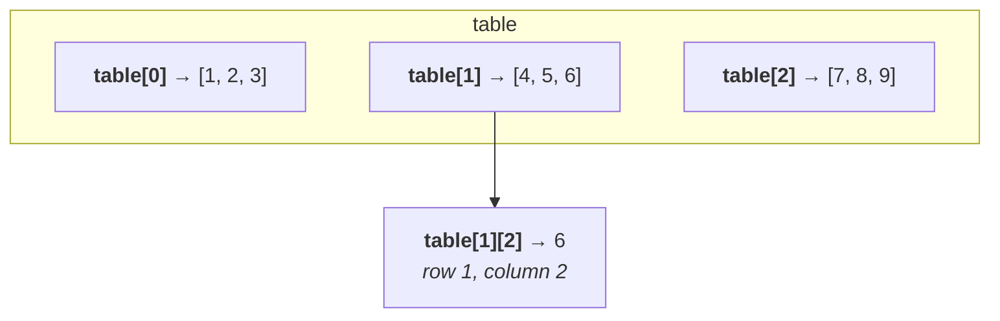
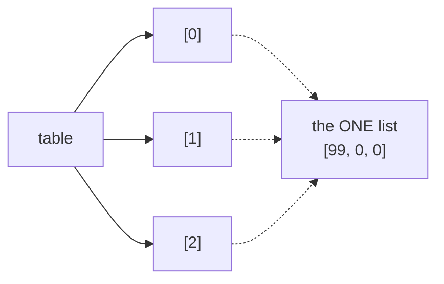
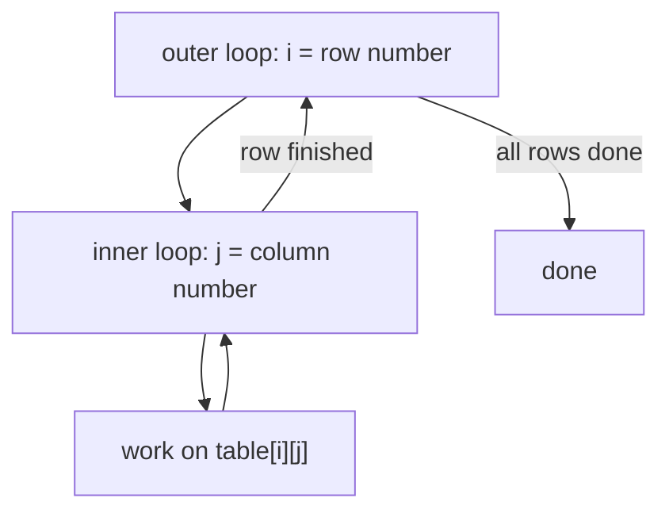

# Lesson 7 — Nested lists = tables

⬅ [Previous: Lists](06-lists.md) · [Meeting 2](README.md) · ➡ [Next: Functions](08-functions.md)

---

## Why you care

A spreadsheet is a list of rows, and each row is a list of cells. That is a **nested
list**, and once you can navigate one you can navigate any table — a CSV, an Excel
sheet, a query result. The mathematicians call it a matrix; we call it a table; it is
the same object.

---

## The idea

```python
table = [
    [1, 2, 3],        # row 0
    [4, 5, 6],        # row 1
    [7, 8, 9],        # row 2
]
```



**`table[row][column]` — row first, then column. Always.**

```python
print(table[1])          # [4, 5, 6]   a whole ROW (which is itself a list)
print(table[1][2])       # 6           one CELL
print(len(table))        # 3           number of ROWS
print(len(table[0]))     # 3           number of COLUMNS (in row 0)
```

> **Row first, column second** is the convention everywhere: `A[i][j]` in maths,
> `df.iloc[row, col]` in pandas, `(row, column)` in Excel's `INDEX()`.
> Say "row, column" out loud each time until it sticks.

---

## Building a table

### The wrong way — and it is a spectacular failure

```python
row = [0, 0, 0]
table = [row, row, row]       # 💥 three labels on ONE list
table[0][0] = 99
print(table)                  # [[99,0,0], [99,0,0], [99,0,0]]  ← all three changed!
```

This is the copy trap from [Lesson 6](06-lists.md) with real consequences. You made
*one* row and pointed at it three times.



`[[0] * 3] * 3` fails in exactly the same way, and it looks completely innocent.

### The right way — a comprehension per row

```python
rows, cols = 3, 3
table = [[0 for j in range(cols)] for i in range(rows)]
table[0][0] = 99
print(table)                  # [[99,0,0], [0,0,0], [0,0,0]]   ✓ correct
```

The nested comprehension **runs the inner part once per row**, so each row is a fresh
list. Read it outside-in:

```python
[ [0 for j in range(cols)]   for i in range(rows) ]
#  └── build one row ─────┘   └── that many times ┘
```

### With random values, and by typing them in

```python
import random

# random integers — great for testing without typing
table = [[random.randint(-10, 20) for j in range(cols)] for i in range(rows)]

# typed in by the user — this is the archive's idiom
table = [[float(input(f"a[{i}][{j}] = ")) for j in range(cols)] for i in range(rows)]
```

`random` is genuinely useful when learning: it lets you test a 5×5 matrix without
typing 25 numbers. Two functions cover nearly everything:

| Call | Gives |
|------|-------|
| `random.randint(1, 6)` | a whole number from 1 to 6, **both ends included** |
| `random.random()` | a float from 0.0 up to (not including) 1.0 |
| `random.choice(["a","b"])` | one random item from a list |
| `random.seed(42)` | makes the "random" numbers **repeatable** — see below |

> **`random.seed(42)` is a testing tool, not a toy.** With a fixed seed you get the
> same sequence every run, so a bug you found is a bug you can find again. Sprinkle it
> into any example you want to be reproducible.

---

## Walking a table: the double loop

```python
for i in range(len(table)):              # for each row...
    for j in range(len(table[i])):       # ...for each column in that row
        print(table[i][j], end=" ")
    print()                              # newline at the end of each row
```



The inner loop runs **completely** for each single pass of the outer loop.
3 rows × 3 columns = 9 visits. **This is the core idea of the lesson:** the inner loop
finishes before the outer loop advances.

If you do not need the indexes, this is cleaner:

```python
for row in table:
    for cell in row:
        print(cell, end=" ")
    print()
```

Use the index version when the position itself matters — "sum the even-indexed
rows", "swap columns 2 and 5". Use the plain version otherwise.

---

## Printing a table so a human can read it

`print(table)` gives you `[[1, 2, 3], [4, 5, 6]]`, which is fine for debugging and
useless in a report. Here is the pattern, using the width formatting from
[Lesson 2](../meeting-1/02-input-and-output.md):

```python
table = [[1, -25, 300], [4000, 5, -6], [7, 88, 9]]

for row in table:
    for cell in row:
        print(f"{cell:>7}", end="")     # each cell right-aligned in 7 characters
    print()
```

```
      1    -25    300
   4000      5     -6
      7     88      9
```

Numbers **right-align** so their digits line up; text **left-aligns**. That single rule
is the difference between a table someone reads and a table someone complains about.

The one-liner version, which is what the original archive uses:

```python
print(*["".join(f"{cell:>7}" for cell in row) for row in table], sep="\n")
```

You should be able to *read* that — `"".join(...)` glues the formatted cells into one
string per row, and `print(*list, sep="\n")` prints each on its own line — but the
explicit double loop above is better code, because the next person can modify it.

### With headers — a proper report

```python
headers = ["Product", "Unit", "Qty", "Price"]
rows = [
    ["Bread", "pcs", 6, 13.50],
    ["Milk", "pack", 10, 14.00],
    ["Cola", "can", 15, 11.99],
]

print(f"{headers[0]:<10}{headers[1]:<6}{headers[2]:>5}{headers[3]:>9}")
print("-" * 30)
for row in rows:
    print(f"{row[0]:<10}{row[1]:<6}{row[2]:>5}{row[3]:>9.2f}")
```

```
Product   Unit    Qty    Price
------------------------------
Bread     pcs       6    13.50
Milk      pack     10    14.00
Cola      can      15    11.99
```

▶ Run it: `python3 examples/meeting-2/07_print_table.py`

Keep this snippet. You will paste it into real scripts for years —
and in [Lesson 13](../meeting-3/13-mini-etl-project.md) we do exactly that.

---

## Worked example 1 — selective sum by index parity

Task 1 from the original Lab 7: *sum the positive elements whose first index is even
and second index is odd.*

```python
import random

random.seed(7)                        # reproducible for the course

rows, cols = 4, 5
table = [[random.randint(-10, 20) for j in range(cols)] for i in range(rows)]

# show it, with column and row numbers so you can check by eye
print("      " + "".join(f"{j:>7}" for j in range(cols)))
for i, row in enumerate(table):
    print(f"row {i} " + "".join(f"{cell:>7}" for cell in row))

total = 0
for i in range(0, rows, 2):          # even row indexes:    0, 2, 4, ...
    for j in range(1, cols, 2):      # odd column indexes:  1, 3, 5, ...
        if table[i][j] > 0:          # positive only
            total += table[i][j]
            print(f"  + table[{i}][{j}] = {table[i][j]}")

print(f"Sum = {total}")
```

```
            0      1      2      3      4
row 0       0     20     -6      2     10
row 1      -9     -8     16      7     -7
row 2       1      8     -9     19      6
row 3      -4     -9     -8      3      3
  + table[0][1] = 20
  + table[0][3] = 2
  + table[2][1] = 8
  + table[2][3] = 19
Sum = 49
```

The whole technique is in those two `range` calls:

- `range(0, rows, 2)` → even indexes, because it starts at 0 and steps by 2
- `range(1, cols, 2)` → odd indexes, because it starts at 1 and steps by 2

**And printing each contribution as it is added is not decoration — it is how you
verify the answer.** Without those lines you have a number you must trust; with them
you have a number you can check against the printed table. Do this while developing,
then delete the lines (or keep them behind a `DEBUG = True` flag).

▶ Run it: `python3 examples/meeting-2/07_selective_sum.py`

---

## Worked example 2 — columns with no zeros

Task 5 from the original Lab 7: *count the columns that contain no zero at all.*
This one is worth studying because iterating by **column** means the loops swap round.

```python
import random

random.seed(3)
rows, cols = 4, 6
table = [[random.randint(0, 4) for j in range(cols)] for i in range(rows)]

for row in table:
    print("".join(f"{cell:>4}" for cell in row))

clean_columns = 0
for j in range(cols):                    # ← COLUMN is the outer loop now
    has_zero = False
    for i in range(rows):                # ← walk down the column
        if table[i][j] == 0:
            has_zero = True
            break                        # one zero is enough; stop looking
    if not has_zero:
        clean_columns += 1
        print(f"  column {j} has no zeros")

print(f"Columns without a zero: {clean_columns}")
```

Two ideas here that generalise well beyond matrices:

1. **`table[i][j]` with `j` fixed walks down a column.** Swapping which loop is outer
   is how you switch from row-wise to column-wise. Nothing else changes.
2. **The `break` is a real optimisation**, not a nicety. Once you have found one zero
   the answer for that column is settled, and checking the rest is wasted work. In a
   40,000-row table that difference is the whole runtime.

### The same thing, the Pythonic way

```python
clean_columns = sum(1 for j in range(cols) if all(table[i][j] != 0 for i in range(rows)))
```

`all(...)` is True when every item is True; `any(...)` is True when at least one is.
Both **short-circuit** — they stop at the first decisive item, exactly like the `break`
above. This one-liner is what an experienced Python programmer (or an AI) would write,
so you need to read it; the explicit loop is what you should write while learning,
because you can put a `print` inside it.

The original archive contains an *attempt* at this shortcut that quietly does the
wrong thing:

```python
f = [0 if 0 in column else 1 for column in a]      # ✗
```

Looping `for column in a` iterates over **rows**, not columns — `a` is a list of rows,
so `column` is a row. The variable name says "column" and the code delivers a row.
The file is even marked "unfinished" in the original. **A misleading variable name is
a bug in waiting**, and this is a perfect example of why a reviewer reads what the code
*does*, not what the names *claim*.

▶ Run it: `python3 examples/meeting-2/07_columns_without_zero.py`

---

## Transposing: turning rows into columns

Occasionally you genuinely want the columns as lists. `zip(*table)` does it:

```python
table = [[1, 2, 3], [4, 5, 6]]
columns = [list(col) for col in zip(*table)]
print(columns)          # [[1, 4], [2, 5], [3, 6]]
```

`zip(*table)` is dense but extremely common, so it earns a place in your reading
vocabulary: the `*` spreads the rows out as separate arguments, and `zip` takes one
item from each in turn. Once transposed, a "column problem" becomes a "row problem"
and you can reuse everything from [Lesson 6](06-lists.md):

```python
for j, column in enumerate(zip(*table)):
    print(f"column {j}: sum={sum(column)}, max={max(column)}")
```

---

## 🔍 Read this code

**(a)**
```python
t = [[1, 2], [3, 4], [5, 6]]
print(t[2][0])
print(len(t))
print(len(t[0]))
```

**(b)**
```python
t = [[0] * 2] * 2
t[0][0] = 9
print(t)
```

**(c)** How many times does `print` run?
```python
for i in range(3):
    for j in range(4):
        print(i, j)
```

**(d)**
```python
t = [[1, 2, 3], [4, 5, 6]]
total = 0
for row in t:
    total += sum(row)
print(total)
```

<details>
<summary><b>Answers</b></summary>

**(a)** `5`, `3`, `2`. Row 2 is `[5, 6]`, its item 0 is `5`. Three rows, two columns.

**(b)** `[[9, 0], [9, 0]]` — the shared-row trap. `* 2` duplicated the *reference*,
not the list. Use `[[0] * 2 for _ in range(2)]`.

**(c)** 12 times. 3 × 4 — the inner loop completes fully for each pass of the outer one.

**(d)** `21`. `sum(row)` totals each row; the accumulator totals those. Summing a table
in two stages like this is usually clearer than one flat double loop.

</details>

---

## Traps

| Trap | Symptom | Fix |
|------|---------|-----|
| `[[0]*3]*3` | all rows change together | `[[0]*3 for _ in range(3)]` |
| `table[j][i]` | works, wrong answers | row **first**: `table[i][j]` |
| `len(table)` for column count | wrong for non-square tables | `len(table[0])` |
| `for column in table` | gives you rows | `for column in zip(*table)` |
| assuming all rows are the same length | `IndexError` on ragged data | check `len(row)` per row |
| `range(len(table[0]))` on an empty table | `IndexError` | guard `if table:` first |

That "ragged data" row matters more than it looks. Real CSV files have short rows.
Validating that every row has the expected number of fields is the first thing our
pipeline does in [Lesson 13](../meeting-3/13-mini-etl-project.md).

---

## Recap

- `table[row][column]` — row first, always.
- `len(table)` = rows, `len(table[0])` = columns.
- Build with `[[0 for j in range(cols)] for i in range(rows)]`, **never** `[[0]*c]*r`.
- Double loop: the inner one finishes before the outer one advances.
- Swap which loop is outer to go column-wise instead of row-wise.
- `break` out of a search as soon as the answer is settled.
- `all()` / `any()` for "every"/"at least one"; `zip(*table)` to transpose.
- Right-align numbers, left-align text, and keep that table-printing snippet.

➡ [Next: Functions](08-functions.md)
