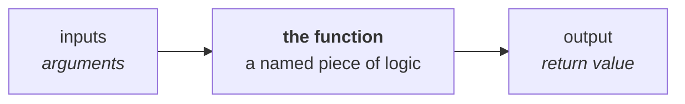
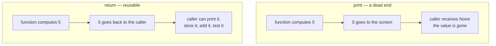
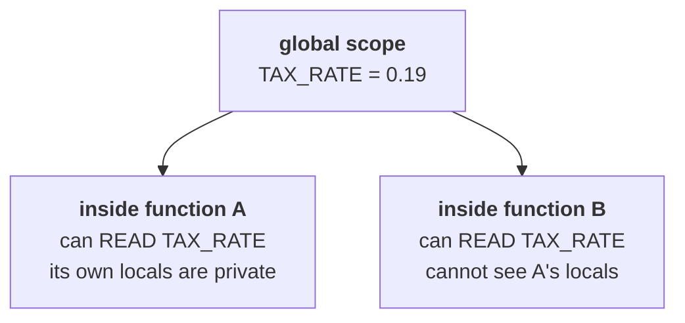

# Lesson 8 — Functions

⬅ [Previous: Nested lists](07-nested-lists-and-matrices.md) · [Meeting 2](README.md) · ➡ [Next: Dictionaries](09-dicts-and-records.md)

---

## Why you care

This is the most important lesson in the course, for one specific reason:

> **A function is the unit of code review.**

You cannot meaningfully review a 300-line script. You *can* review a 12-line function
called `validate_ean13(code)` — because its name tells you what it should do, and you
can check whether it does that. Every technique for understanding code that you will
ever use depends on the code being cut into named, testable pieces.

That is also why AI-generated code is usually handed to you as functions. Learning to
read one, decide what it promises, and check that it keeps that promise is exactly the
skill you came here for.

---

## The idea

A function is a named block of code that takes **inputs** and gives back an **output**.



```python
def rectangle_area(width, height):     # def, name, parameters, colon
    """Return the area of a rectangle."""   # docstring: what it promises
    return width * height              # hand the answer back


print(rectangle_area(3, 4))            # 12  ← calling it
print(rectangle_area(10, 2.5))         # 25.0 ← reuse, different inputs
```

| Piece | Name | Purpose |
|-------|------|---------|
| `def` | keyword | "I am defining a function" |
| `rectangle_area` | name | what it does — a **verb phrase**, ideally |
| `(width, height)` | parameters | the inputs, named for use inside |
| `:` + indent | body | the code that runs |
| `return` | keyword | the answer to hand back |
| `"""..."""` | docstring | the promise, in words |

---

## Define once, call many times

```python
def celsius_to_fahrenheit(celsius):
    return celsius * 9 / 5 + 32


for temp in [0, 20, 37, 100]:
    print(f"{temp}°C = {celsius_to_fahrenheit(temp)}°F")
```

```
0°C = 32.0°F
20°C = 68.0°F
37°C = 98.6°F
100°C = 212.0°F
```

The conversion formula now exists in **exactly one place**. When someone points out a
mistake in it, there is one line to fix rather than eleven copies to find. That is
not a style preference; it is the entire reason functions exist.

---

## `return` vs `print` — get this right and everything else follows

This is the number one conceptual mistake beginners make, and it is worth five minutes.

```python
def add_printing(a, b):
    print(a + b)             # shows it on screen, hands back nothing


def add_returning(a, b):
    return a + b             # hands the value back to the caller
```

```python
x = add_printing(2, 3)       # prints 5
print(x)                     # None        ← nothing came back!

y = add_returning(2, 3)      # prints nothing
print(y)                     # 5           ← the value came back
print(y * 10)                # 50          ← and you can keep using it
```



**The rule: functions `return`, and the caller decides whether to `print`.**
A function that only prints cannot be tested, cannot be combined, and cannot be reused.

The original archive mixes these constantly:

```python
# archive, Class-Rectangle
def S(self):
    s = self.a * self.b
    print("Площа=", s)      # prints...
    return s                # ...and returns. Belt and braces.
```

Returning *and* printing is a compromise that mostly works but makes the function noisy
— you cannot use it inside a loop without spamming the terminal. Other archive
functions only print, and those genuinely cannot be reused.

### `return` exits the function immediately

```python
def classify(n):
    if n < 0:
        return "negative"        # leaves right here
    if n == 0:
        return "zero"
    return "positive"            # no else needed
```

Code after a `return` never runs. This "early return" style is usually clearer than
deeply nested `if`/`else`, and you will see it everywhere.

### Returning several values

```python
def stats(values):
    """Return the count, total and average of a list of numbers."""
    if not values:                          # guard the empty case!
        return 0, 0.0, 0.0
    return len(values), sum(values), sum(values) / len(values)


count, total, average = stats([1, 2, 3, 4])     # unpack into three names
print(count, total, average)                    # 4 10 2.5
```

Technically this returns one tuple, `(4, 10, 2.5)`, which Python then unpacks.
It reads beautifully and you should use it — beyond three or four values, return a
dictionary instead so the names travel with the data.

---

## Arguments: positional, keyword, default

```python
def invoice_line(product, quantity, price, vat_rate=19):
    """Return the gross amount for one invoice line."""
    net = quantity * price
    return net * (1 + vat_rate / 100)


print(invoice_line("Bread", 6, 13.50))              # positional; vat_rate defaults to 19
print(invoice_line("Bread", 6, 13.50, 7))           # positional, VAT overridden
print(invoice_line("Bread", 6, 13.50, vat_rate=7))  # keyword — clearest of the three
print(invoice_line(product="Bread", quantity=6, price=13.50))   # all keyword
```

| Style | When to use |
|-------|-------------|
| positional | 1–2 obvious arguments: `area(3, 4)` |
| **keyword** | 3+ arguments, or any boolean — `sort(reverse=True)` |
| default | a sensible common value the caller usually wants |

> **Any function taking a bare `True`/`False` should use a keyword.**
> `export(data, True, False)` is unreadable; `export(data, include_header=True,
> compress=False)` explains itself. This is a real review comment you will make.

### ⚠️ The mutable default argument trap

This is the classic Python gotcha and it catches experienced people:

```python
def add_item(item, basket=[]):        # ✗ NEVER do this
    basket.append(item)
    return basket


print(add_item("a"))       # ['a']
print(add_item("b"))       # ['a', 'b']   ← 'a' is still there!
```

The default `[]` is created **once**, when the function is defined, and then shared by
every call that does not pass its own. The fix:

```python
def add_item(item, basket=None):      # ✓
    if basket is None:
        basket = []                   # a fresh list per call
    basket.append(item)
    return basket
```

**Default arguments must be immutable** — numbers, strings, `True`/`False`, `None`,
tuples. Never `[]` or `{}`.

---

## Scope: what a function can and cannot see

```python
def compute():
    inside = 10          # a LOCAL variable
    print(inside)        # ✓ visible here


compute()
print(inside)            # 💥 NameError: name 'inside' is not defined
```

Variables created inside a function live and die with the call. This is a feature:
it means a function cannot accidentally break the rest of your program.



A function can *read* a global but cannot *reassign* one without saying `global`
explicitly — and you should essentially never do that:

```python
counter = 0

def bad():
    global counter       # ✗ avoid: makes the function unpredictable
    counter += 1

def good(counter):
    return counter + 1   # ✓ take it in, hand it back
```

Globals are the enemy of review: to know what `bad()` does you have to read the whole
program. `good()` you can read in isolation, which is the whole point.

### ⚠️ But lists passed in *can* be modified

```python
def add_zero(values):
    values.append(0)         # modifies the caller's list!


my_list = [1, 2]
add_zero(my_list)
print(my_list)               # [1, 2, 0]   ← changed
```

Numbers and strings behave as if copied; lists and dicts do not. Same label/value idea
from [Lesson 1](../meeting-1/01-values-and-types.md). If you do not intend to modify
the caller's data, copy it first (`values = values[:]`) — and if you *do* intend to,
say so in the docstring, because a reviewer will want to know.

---

## Worked example 1 — a piecewise function, properly wrapped

Task 1 from the original Lab 8: compute f(x, y) with three cases, then evaluate an
expression using it several times.

```python
import math


def f(x, y):
    """Return f(x, y) as defined in Lab 8, Task 1.

    x > 0 and y > 0  ->  x^3 + sqrt(x^2 + y^4)
    x > 0 and y < 0  ->  (x^2 - 2x + sqrt(x)) / x^(3/5)
    otherwise        ->  sin(x * y)
    """
    if x > 0 and y > 0:
        return x**3 + math.sqrt(x**2 + y**4)
    elif x > 0 and y < 0:
        return (x**2 - 2 * x + math.sqrt(x)) / x ** (3 / 5)
    else:
        return math.sin(x * y)


a = float(input("a = "))
b = float(input("b = "))

print(f"f(a, b) = {f(a, b):.6f}")
print(f"f(2, a) = {f(2, a):.6f}")

u = f(a, b) + f(2, a) + 2                 # called three times, defined once
print(f"U = {u:.6f}")
```

**Compare with the archive version**, which is instructive:

```python
def f(x,y):
    if x>0 and y>0:
        g=x**3+(x**2+y**4)**1/2      # ← BUG
        return(g)
```

`(x**2 + y**4) ** 1/2` is **not** a square root. `**` binds tighter than `/`, so Python
computes `((x**2 + y**4) ** 1) / 2` — the expression divided by two. For `x=1, y=1`
that gives 1.0 where the square root is 1.414.

The fix is `** 0.5`, or better `math.sqrt(...)` which cannot be misread.

> **This is a perfect code-review find**, and worth dwelling on: it produces no error,
> the result is a plausible-looking number, and the only way to catch it is to
> *read the expression and check the operator precedence*. An AI will happily generate
> this. A reviewer who knows `**` beats `/` catches it in two seconds.

▶ Run it: `python3 examples/meeting-2/08_piecewise_function.py`

---

## Worked example 2 — one function, many callers

Task 3 from the original Lab 8 — a recurrence wrapped in a function so it can be
evaluated at several points.

```python
import math


def g(n):
    """Return the nth term of a[i] = sin(a[i-1] + cos(a[i-2])), a[0]=9, a[1]=35."""
    if n < 0:
        raise ValueError("n must be 0 or more")

    a = [9.0, 35.0]
    if n <= 1:
        return a[n]

    for i in range(2, n + 1):
        a.append(math.sin(a[i - 1] + math.cos(a[i - 2])))
    return a[n]


print(f"g(7)  = {g(7):.6f}")
print(f"g(9)  = {g(9):.6f}")
print(f"S = g(7) + g(9) = {g(7) + g(9):.6f}")
```

Note `raise ValueError(...)` for an input the function cannot honour. That is how a
function **refuses** rather than returning nonsense — and the archive's version of this
function silently returns whatever `el` happened to be left over from the last call,
which is worse than crashing.

Also note: the archive version returns `el`, the loop's last value, which does not exist
at all if the loop never runs (`n <= 1`), giving `UnboundLocalError`. Returning `a[n]`
is both correct and clearer about intent.

▶ Run it: `python3 examples/meeting-2/08_recurrence_function.py`

---

## Worked example 3 — validation functions you will actually reuse 💼

This is the real payoff of the lesson. Small, single-purpose, testable functions:

```python
def is_valid_ean13(code):
    """True if code is exactly 13 digits. Expects a string."""
    return isinstance(code, str) and len(code) == 13 and code.isdigit()


def parse_price(raw):
    """Turn '13,50' or ' 13.50 ' into 13.5. Return None if it is not a price."""
    if raw is None:
        return None
    cleaned = str(raw).strip().replace(",", ".")
    try:
        value = float(cleaned)
    except ValueError:
        return None
    return value if value >= 0 else None


def describe(code, raw_price):
    """One-line human summary of a product row."""
    code_ok = "OK " if is_valid_ean13(code) else "BAD"
    price = parse_price(raw_price)
    price_text = f"{price:8.2f}" if price is not None else "       -"
    return f"[{code_ok}] {code:<15}{price_text}"


for code, price in [
    ("4006381333931", "13,50"),
    ("40063813339", "7.00"),          # too short
    ("4006381333931", "abc"),         # unparseable price
    ("4006381333931", "-5"),          # negative price
]:
    print(describe(code, price))
```

```
[OK ] 4006381333931      13.50
[BAD] 40063813339         7.00
[OK ] 4006381333931          -
[OK ] 4006381333931          -
```

Why this shape is right, and why a reviewer will like it:

- **Each function answers exactly one question.** You can look at `is_valid_ean13`
  and decide in five seconds whether it is correct.
- **`parse_price` returns `None` rather than crashing or guessing.** The caller decides
  what a bad price means — skip the row, log it, use zero. That is not the parser's job.
- **They are trivially testable.** `assert is_valid_ean13("4006381333931")` is a
  complete test. Try writing a test for a 300-line script and you will feel the difference.
- **The docstrings state the promise**, including what happens on bad input.

▶ Run it: `python3 examples/meeting-2/08_validation_functions.py`

---

## Testing a function with `assert`

`assert` does nothing when the condition is true and crashes loudly when it is false.
That is all a basic test is.

```python
assert is_valid_ean13("4006381333931") is True
assert is_valid_ean13("123") is False
assert is_valid_ean13(4006381333931) is False        # an int, not a string
assert parse_price("13,50") == 13.5
assert parse_price("abc") is None
print("All tests passed ✓")
```

Run it. Silence (plus the final message) means everything passed. Change one expected
value and you get an `AssertionError` naming the line.

> **Put five `assert` lines at the bottom of any function you write during this course.**
> It takes a minute and it is the difference between "I think it works" and "it works
> on these five cases". Real projects use `pytest` for this, which is the same idea
> with better reporting.

---

## 🔍 Read this code

**(a)**
```python
def double(x):
    print(x * 2)

result = double(5)
print(result)
```

**(b)**
```python
def double(x):
    return x * 2

print(double(double(3)))
```

**(c)**
```python
def f(a, b=10):
    return a + b

print(f(1))
print(f(1, 2))
print(f(b=1, a=2))
```

**(d)**
```python
def grow(items=[]):
    items.append("x")
    return items

print(grow())
print(grow())
```

**(e)**
```python
def check(n):
    if n > 0:
        return "positive"
    print("this line")

print(check(5))
print(check(-5))
```

<details>
<summary><b>Answers</b></summary>

**(a)** Prints `10`, then `None`. The function prints but returns nothing, so
`result` is `None`.

**(b)** `12`. Inner call gives 6, outer doubles it. Nested calls read inside-out —
same rule as `int(input(...))` from [Lesson 2](../meeting-1/02-input-and-output.md).

**(c)** `11`, `3`, `3`. The default fills in for the missing `b`; keyword arguments
can appear in any order.

**(d)** `['x']` then `['x', 'x']` — the mutable default trap. The list is created once
and shared across calls.

**(e)** `positive`, then `this line` followed by `None`. When `n > 0` the `return` exits
before the `print`. Otherwise the `print` runs and the function falls off the end, which
returns `None` implicitly. **A function with no `return` on some path returns `None` on
that path** — a real source of `TypeError: unsupported operand` later on, and something
to check for whenever you read a branchy function.

</details>

---

## Traps

| Trap | Symptom | Fix |
|------|---------|-----|
| `print` instead of `return` | caller gets `None` | `return` the value |
| forgot to call it: `double` not `double(5)` | prints `<function double at 0x...>` | add the brackets |
| `def f(x=[])` | state leaks between calls | `def f(x=None)` then `if x is None: x = []` |
| a branch with no `return` | `None` leaks out silently | return on every path |
| using a global instead of a parameter | unreviewable, breaks in odd ways | pass it in |
| function modifies the list it was given | caller's data changes unexpectedly | copy, or document it |
| shadowing a built-in: `def max(...)`, `def sum(...)` | the real one stops working | pick another name |

That last one is in the archive twice (`def max(...)` in `new.py`, and `sum = 0` in the
additional exercises). It works right up until you need the real `max()` in the same file.

---

## Recap

- `def name(params):` … `return value`. The docstring states the promise.
- **`return` hands the value back; `print` throws it away.** Functions return; callers print.
- `return` exits immediately — early returns beat deep nesting.
- Keyword arguments for anything non-obvious; defaults must be immutable.
- Locals are private; reading globals is tolerable, writing them is not.
- Lists and dicts passed in **can** be modified by the function — copy or document.
- One function, one job, one sentence of documentation.
- `assert` a few cases at the bottom of the file. It costs a minute.
- **A function is the unit of code review.** Small and named beats clever and long.

➡ [Next: Dictionaries and records](09-dicts-and-records.md)
