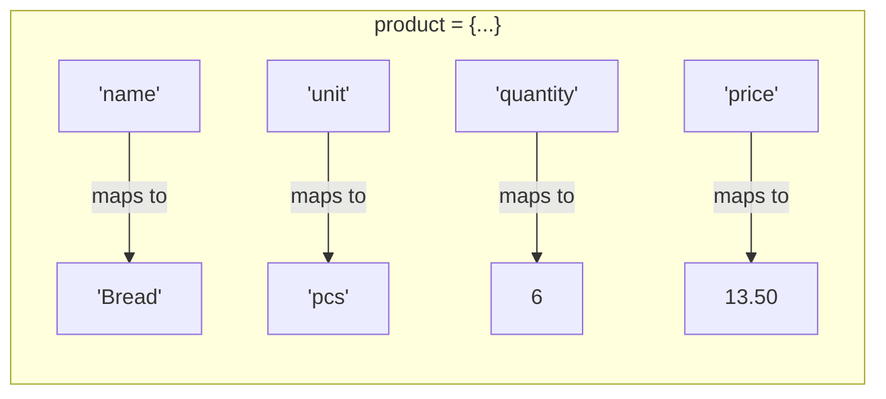
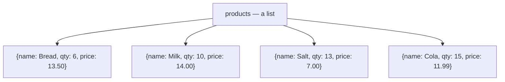

# Lesson 9 — Dictionaries = records

⬅ [Previous: Functions](08-functions.md) · [Meeting 2](README.md) · ➡ [Exercises](exercises.md)

---

## Why you care

A list finds things **by position**. A dictionary finds things **by name** — and real
data is named. `row["unit_price"]` says what it means; `row[3]` requires you to go and
count columns, and silently breaks when someone inserts a column.

A CSV row, a JSON object, a database record, an API response: all of these are
dictionaries in Python. This lesson is the bridge to Meeting 3.

---

## The idea

A dictionary maps **keys** to **values**.



```python
product = {
    "name": "Bread",
    "unit": "pcs",
    "quantity": 6,
    "price": 13.50,
}

print(product["name"])          # Bread
print(product["price"])         # 13.5
print(len(product))             # 4   — number of key/value pairs
```

| | List | Dictionary |
|---|------|-----------|
| Look up by | position: `x[0]` | key: `x["name"]` |
| Order | the order you built it | insertion order (Python 3.7+) |
| Written with | `[ ]` | `{ }` and `key: value` |
| Good for | a sequence of similar things | one thing with several named attributes |

---

## Reading values safely

```python
print(product["name"])              # Bread
print(product["colour"])            # 💥 KeyError: 'colour'
```

A missing key raises `KeyError`. Real data is full of missing keys, so:

```python
print(product.get("colour"))                # None — no crash
print(product.get("colour", "unknown"))     # unknown — your own default
print("colour" in product)                  # False — just ask
```

| Form | Missing key gives | Use when |
|------|-------------------|----------|
| `d["k"]` | `KeyError` | the key **must** be there — you want the crash |
| `d.get("k")` | `None` | the key is optional |
| `d.get("k", default)` | your default | the key is optional and you have a fallback |
| `"k" in d` | `False` | you want to branch on it |

> **Choose deliberately.** `d["k"]` crashing is *good* when a required field is absent —
> it stops a bad pipeline immediately instead of writing rubbish into a report.
> `.get()` everywhere looks safe and is often how silent data loss happens.
> This is a genuine design decision, and one worth arguing about in a review.

---

## Changing a dictionary

```python
product = {"name": "Bread", "quantity": 6}

product["price"] = 13.50          # add a new key
product["quantity"] += 4          # update: now 10
del product["name"]               # remove a key
removed = product.pop("price")    # remove and return the value
product.update({"unit": "pcs", "quantity": 12})   # add/overwrite several

print(product)                    # {'quantity': 12, 'unit': 'pcs'}
```

There is **no `.append()`** — you add by assigning to a new key. Assigning to an
existing key overwrites it, with no warning. That is the behaviour you want when
updating a record, and a hazard when you meant to add.

---

## Looping over a dictionary

```python
product = {"name": "Bread", "unit": "pcs", "quantity": 6, "price": 13.50}

for key in product:                      # keys by default
    print(key)

for value in product.values():           # just the values
    print(value)

for key, value in product.items():       # both — the one you will use most
    print(f"{key:<10} {value}")
```

```
name       Bread
unit       pcs
quantity   6
price      13.5
```

`.items()` hands you a `(key, value)` pair each pass, which you unpack into two names —
exactly like `enumerate()` in [Lesson 5](../meeting-1/05-for-loops.md).

---

## The shape that matters: a list of dictionaries

**This is how tabular data lives in Python**, and it is the single most useful data
shape in this course:

```python
products = [
    {"name": "Bread", "unit": "pcs",  "quantity": 6,  "price": 13.50},
    {"name": "Milk",  "unit": "pack", "quantity": 10, "price": 14.00},
    {"name": "Salt",  "unit": "pack", "quantity": 13, "price": 7.00},
    {"name": "Cola",  "unit": "can",  "quantity": 15, "price": 11.99},
]
```



Compare with the nested list from [Lesson 7](07-nested-lists-and-matrices.md):

```python
row = ["Bread", "pcs", 6, 13.50]        # what is row[2]? go and count.
row = {"name": "Bread", "quantity": 6}  # row["quantity"]. Obvious.
```

Both hold the same data. The dict version survives someone inserting a column;
the list version silently shifts every index by one. **In real pipelines, use dicts
for rows.**

### Everything you need to do with it

```python
# total stock value
total = sum(p["quantity"] * p["price"] for p in products)
print(f"Total value: {total:.2f}")                       # 491.85

# filter
cheap = [p for p in products if p["price"] < 12]
print([p["name"] for p in cheap])                        # ['Salt', 'Cola']

# sort by a field — "key=" says which field to sort on
by_price = sorted(products, key=lambda p: p["price"])
print([p["name"] for p in by_price])                     # ['Salt', 'Cola', 'Bread', 'Milk']

# the most expensive
dearest = max(products, key=lambda p: p["price"])
print(dearest["name"])                                   # Milk

# group into a lookup table, name -> record
by_name = {p["name"]: p for p in products}               # a dict comprehension
print(by_name["Salt"]["quantity"])                      # 13
```

### `lambda` — read it, use it only here

`lambda p: p["price"]` is a one-line, nameless function. It is exactly:

```python
def get_price(p):
    return p["price"]

by_price = sorted(products, key=get_price)     # identical result
```

`key=lambda p: p["field"]` is the idiom for sorting records, and you will meet it
constantly. **Learn to read it; do not go looking for other places to use it.**
A named function is almost always clearer.

### Sorting by several fields, or descending

```python
sorted(products, key=lambda p: p["price"], reverse=True)          # dearest first
sorted(products, key=lambda p: (p["unit"], -p["price"]))          # unit A-Z, then price high→low
```

A tuple in the `key` sorts by the first element, then the second as a tie-breaker.
The `-` reverses one numeric field without reversing the others — a trick worth
remembering.

---

## Worked example — a warehouse, from the original Lab 9

Task 1 from Lab 9: *a warehouse product database — name, unit, quantity. Register goods
arriving and being shipped out.* The archive solves this with nested dicts, which is a
good choice. Here it is with the functions from [Lesson 8](08-functions.md) applied.

```python
def receive_goods(stock, name, unit, quantity):
    """Add quantity to stock[name], creating the product if it is new.

    Returns (stock, message). Does not print — the caller decides that.
    """
    if quantity <= 0:
        return stock, f"x Quantity must be positive, got {quantity}"

    if name in stock:
        stock[name]["quantity"] += quantity
        return stock, f"+ Received {quantity} {unit} of {name} (now {stock[name]['quantity']})"

    stock[name] = {"unit": unit, "quantity": quantity}
    return stock, f"+ New product {name}: {quantity} {unit}"


def ship_goods(stock, name, quantity):
    """Remove quantity from stock[name]. Refuses to go negative."""
    if name not in stock:
        return stock, f"x No such product: {name}"

    available = stock[name]["quantity"]
    if quantity > available:
        return stock, f"x Cannot ship {quantity} of {name}: only {available} in stock"

    stock[name]["quantity"] -= quantity
    return stock, f"- Shipped {quantity} of {name} ({stock[name]['quantity']} left)"


def show_stock(stock):
    """Print the stock as an aligned table."""
    print(f"{'Product':<12}{'Unit':<8}{'Qty':>6}")
    print("-" * 26)
    for name, details in sorted(stock.items()):
        print(f"{name:<12}{details['unit']:<8}{details['quantity']:>6}")
    print("-" * 26)
    print(f"{'TOTAL':<20}{sum(d['quantity'] for d in stock.values()):>6}")


stock = {
    "Bread": {"unit": "pcs", "quantity": 6},
    "Milk": {"unit": "pack", "quantity": 10},
    "Salt": {"unit": "pack", "quantity": 13},
}

show_stock(stock)

for action in [
    ("receive", "Bread", "pcs", 24),
    ("receive", "Chocolate", "bar", 50),
    ("ship", "Milk", 4),
    ("ship", "Milk", 999),          # refused
    ("ship", "Caviar", 1),          # refused
    ("receive", "Bread", "pcs", -5),  # refused
]:
    if action[0] == "receive":
        stock, message = receive_goods(stock, action[1], action[2], action[3])
    else:
        stock, message = ship_goods(stock, action[1], action[2])
    print(message)

print()
show_stock(stock)
```

```
Product     Unit       Qty
--------------------------
Bread       pcs          6
Milk        pack        10
Salt        pack        13
--------------------------
TOTAL                   29
+ Received 24 pcs of Bread (now 30)
+ New product Chocolate: 50 bar
- Shipped 4 of Milk (6 left)
x Cannot ship 999 of Milk: only 6 in stock
x No such product: Caviar
x Quantity must be positive, got -5
...
```

**Three deliberate improvements over the archive version**, all of them review comments
you could reasonably make on the original:

1. **`ship_goods` refuses to go negative.** The archive's `del_good` does
   `base_of_goods[name]["кількість"] -= count` with no check, so shipping 999 units of
   which you have 6 leaves you with **−993 units in stock**. No error, no warning,
   just an impossible number that flows into every downstream report.
2. **No `input()` inside the functions.** The archive reads from the keyboard *inside*
   `add_good`, which makes the function impossible to test and impossible to call from
   a scheduled job. Data comes in as arguments; the caller gathers it however it likes.
3. **They return a message instead of printing.** Now the caller can print it, log it,
   or collect the failures into a report — [Lesson 8's](08-functions.md) rule applied.

▶ Run it: `python3 examples/meeting-2/09_warehouse.py`

---

## Counting with a dictionary — the pattern you will reuse most

Counting occurrences is the single most common real use of a dict:

```python
sales = ["Bread", "Milk", "Bread", "Cola", "Bread", "Milk"]

counts = {}
for item in sales:
    counts[item] = counts.get(item, 0) + 1     # ← the whole trick

print(counts)            # {'Bread': 3, 'Milk': 2, 'Cola': 1}
```

`counts.get(item, 0) + 1` means *"whatever it was, or 0 if it is new, plus one"*.
That one line replaces an `if item in counts: ... else: ...`.

And to find the top seller:

```python
best = max(counts, key=counts.get)
print(f"{best}: {counts[best]}")               # Bread: 3
```

Python also ships a purpose-built tool, worth knowing about:

```python
from collections import Counter

counts = Counter(sales)
print(counts.most_common(2))     # [('Bread', 3), ('Milk', 2)]
```

Write the manual version until the pattern is automatic, then use `Counter`.

---

## 🔍 Read this code

**(a)**
```python
d = {"a": 1, "b": 2}
print(d["a"])
print(d.get("c"))
print(d.get("c", 0))
print(len(d))
```

**(b)**
```python
d = {"a": 1}
d["b"] = 2
d["a"] = 9
print(d)
```

**(c)**
```python
d = {"x": 1, "y": 2}
for k, v in d.items():
    print(k, v * 10)
```

**(d)**
```python
rows = [{"n": 3}, {"n": 1}, {"n": 2}]
print([r["n"] for r in sorted(rows, key=lambda r: r["n"])])
```

**(e)**
```python
d = {}
for c in "hello":
    d[c] = d.get(c, 0) + 1
print(d)
```

<details>
<summary><b>Answers</b></summary>

**(a)** `1`, `None`, `0`, `2`. `.get()` never raises; the second argument is your default.

**(b)** `{'a': 9, 'b': 2}`. `"b"` was added, `"a"` was **overwritten** — assignment to
an existing key replaces silently.

**(c)** `x 10` then `y 20`.

**(d)** `[1, 2, 3]`. Sorted by the `"n"` field, then the values pulled out.

**(e)** `{'h': 1, 'e': 1, 'l': 2, 'o': 1}`. The counting pattern applied to characters.
Note `l` is 2.

</details>

---

## Traps

| Trap | Symptom | Fix |
|------|---------|-----|
| `d["missing"]` | `KeyError` | `.get()`, or `in`, or let it crash on purpose |
| `d.append(x)` | `AttributeError` | `d["key"] = x` |
| assigning to an existing key | silently overwrites | check `if k in d` when adding |
| keys must be immutable | `TypeError: unhashable type: 'list'` | use a string or tuple as the key |
| `.get()` everywhere | silent data loss | required fields should crash |
| comparing `d1 == d2` and expecting order to matter | order is ignored in `==` | it is comparing content, which is usually right |
| mutating a dict while looping over it | `RuntimeError` | loop over `list(d.keys())` |

---

## Recap

- A dict maps keys to values; look things up **by name**, not position.
- `d["k"]` crashes if missing (sometimes what you want); `.get("k", default)` does not.
- No `.append()` — add by assigning a new key.
- `.items()` in a `for` loop gives you `key, value` pairs.
- **A list of dicts is a table.** This is the shape of nearly all real data.
- `sorted(rows, key=lambda r: r["field"])` to sort records.
- `counts[k] = counts.get(k, 0) + 1` is the counting pattern — memorise it.
- Return messages from your functions; let the caller decide to print.
- Guard against impossible states: negative stock is a bug you can prevent.

---

🎉 **End of Meeting 2.** You can now hold a table in memory, walk it, filter it, sort it,
and split the logic into reviewable functions. That is genuinely most of what day-to-day
data work looks like.

➡ **[Now do the exercises](exercises.md)** — 16 tasks.
