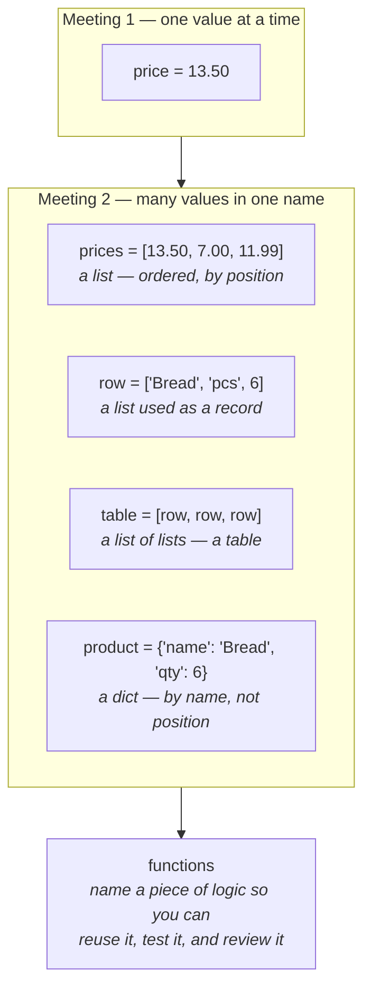
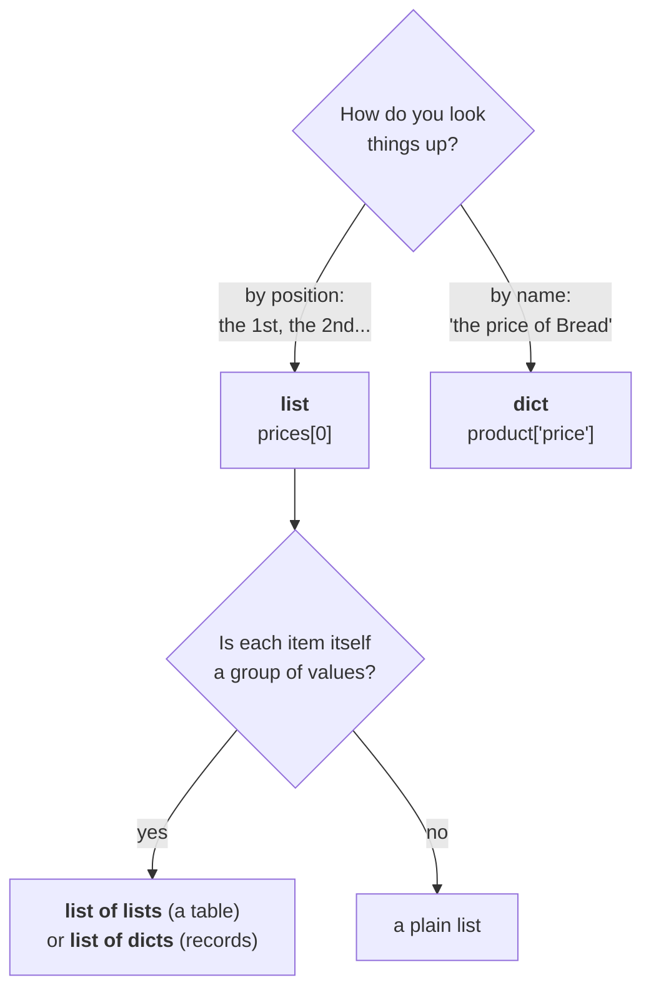

# Meeting 2 — Structure

**Goal of this meeting:** stop handling one value at a time. By the end you can hold a
whole table in memory, walk over it, and split a problem into named functions.

⏱ ~2.5 hours including a break. ⬅ [Back to course home](../../README.md)

---

## Agenda

| | Lesson | Minutes | What we cover |
|---|--------|---------|---------------|
| 6 | [Lists](06-lists.md) | 35 | Indexing, slicing, `append`, `len`, `sum`, sorting, comprehensions |
| 7 | [Nested lists = tables](07-nested-lists-and-matrices.md) | 35 | Rows and columns, double loops, printing a real table |
| — | ☕ break | 10 | |
| 8 | [Functions](08-functions.md) | 40 | `def`, arguments, `return`, scope, why functions are the unit of review |
| 9 | [Dictionaries = records](09-dicts-and-records.md) | 30 | Key→value, nested dicts, a product database |
| — | [Exercises](exercises.md) | rest | 16 tasks |

---

## The mental model for this meeting

Meeting 1 gave you one value per variable. Now one variable holds *many* values —
and that is the step that makes real data work possible.

### Choosing a container

This is the decision you will make constantly, so here is the rule:

**In practice:** a CSV file becomes a *list of dicts* — one dict per row, keyed by column
name. That is the shape almost all of Meeting 3 works with, and it is the shape
`pandas` and `polars` are built to replace once your data gets big.

---

## Before you start

You need [Meeting 1](../meeting-1/README.md) — specifically `for` loops and `if`.
Everything here is those two ideas applied to collections.

➡ **Start with [Lesson 6: Lists](06-lists.md)**
