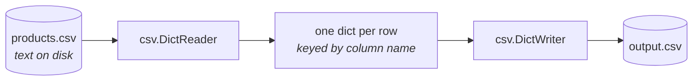

# Lesson 11 — CSV and Excel

⬅ [Previous: Files](10-files.md) · [Meeting 3](README.md) · ➡ [Next: SQL from Python](12-sql-from-python.md)

---

## Why you care

CSV is how data actually moves between systems. Every ERP, every webshop, every
supplier portal exports CSV. It looks trivially simple — values separated by commas —
and that simplicity is a trap, because of quoting, delimiters, encodings and decimal
separators. Python's `csv` module handles all four correctly; hand-rolled `.split(",")`
handles none of them.

---

## Why `.split(",")` is not enough

```python
line = 'Bread 500g,1.35,"Contains wheat, may contain nuts",7'
print(line.split(","))
```

```
['Bread 500g', '1.35', '"Contains wheat', ' may contain nuts"', '7']
```

Four fields became five, because there is a comma **inside** a quoted value. Every
downstream index is now shifted and the row is silently corrupted.

```python
import csv, io

print(next(csv.reader(io.StringIO(line))))
```

```
['Bread 500g', '1.35', 'Contains wheat, may contain nuts', '7']
```

The `csv` module knows the quoting rules. **Use it. Always.** This is not a
style preference — `.split(",")` on real CSV is a bug, and one that surfaces
months later when a supplier first puts a comma in a product description.

---

## The idea



`DictReader` turns each row into a dictionary keyed by the header — which is exactly
the list-of-dicts shape from [Lesson 9](../meeting-2/09-dicts-and-records.md).
That is not a coincidence; it is why we taught it.

---

## Reading a CSV

Our sample file `data/products.csv` is **semicolon-separated**, which is the norm in
Germany, Austria and much of Europe (because the comma is the decimal separator there):

```
ean;name;unit;category;unit_price;vat_rate
4006381333931;Bread 500g;pcs;bakery;1.35;7
4009900484147;Milk 1L;pack;dairy;1.40;7
```

```python
import csv

with open("data/products.csv", newline="", encoding="utf-8-sig") as f:
    reader = csv.DictReader(f, delimiter=";")
    products = list(reader)

print(f"{len(products)} products")
print(products[0])
```

```
10 products
{'ean': '4006381333931', 'name': 'Bread 500g', 'unit': 'pcs',
 'category': 'bakery', 'unit_price': '1.35', 'vat_rate': '7'}
```

Note the three arguments to `open`, all of which matter:

| Argument | Why |
|----------|-----|
| `newline=""` | **required** by the `csv` module; without it, quoted fields containing newlines break on Windows |
| `encoding="utf-8-sig"` | strips Excel's BOM, so the first column is `ean` and not `"ean"` |
| `delimiter=";"` | our file is semicolon-separated |

> **Memorise `open(path, newline="", encoding="utf-8-sig")` for reading CSV.**
> It is the incantation that avoids three separate afternoon-ruining bugs.

### ⚠️ Every value from a CSV is a string

Look again: `'unit_price': '1.35'` and `'vat_rate': '7'` — those are **text**.

```python
row = products[0]
print(row["unit_price"] * 2)        # '1.351.35'   ← the Lesson 1 trap, for real
print(float(row["unit_price"]) * 2) # 2.7          ✓
```

This is the `"10" + "10"` lesson from [Lesson 1](../meeting-1/01-values-and-types.md)
arriving in production. **A CSV has no types.** Converting each column deliberately,
and deciding what to do when the conversion fails, *is* the work of a pipeline.

And keep identifiers as strings:

```python
print(row["ean"])              # '4006381333931'  ✓ 13 characters
print(int(row["ean"]))         # 4006381333931    — looks fine...
```

…until a code starts with a zero:

```python
print(int("0401234567890"))    # 401234567890  ← 12 digits. The join is dead.
```

**Codes, IDs, postcodes, phone numbers: always `str`.** If it has a leading zero,
or you would never do arithmetic on it, it is not a number.

---

## Writing a CSV

```python
import csv
from pathlib import Path

rows = [
    {"ean": "4006381333931", "name": "Bread 500g", "gross_price": 1.44},
    {"ean": "4009900484147", "name": "Milk 1L", "gross_price": 1.50},
]

Path("out").mkdir(exist_ok=True)

with open("out/prices.csv", "w", newline="", encoding="utf-8") as f:
    writer = csv.DictWriter(f, fieldnames=["ean", "name", "gross_price"], delimiter=";")
    writer.writeheader()
    writer.writerows(rows)
```

`out/prices.csv`:
```
ean;name;gross_price
4006381333931;Bread 500g;1.44
4009900484147;Milk 1L;1.5
```

| Detail | Note |
|--------|------|
| `fieldnames=` | required, and it fixes the **column order** |
| `writeheader()` | easy to forget; then your file has no header |
| `newline=""` | required on write too, or you get blank lines between rows on Windows |
| `encoding="utf-8"` | plain `utf-8` for writing — do not write a BOM unless Excel needs it |

Note `1.5` rather than `1.50` — `DictWriter` writes the float as Python renders it.
If you need two decimals in the file, format it yourself: `f"{value:.2f}"`.

---

## Worked example — a typed, validated product loader

This is the pattern for every CSV you will ever load. Read it carefully; the shape
matters more than the details.

```python
import csv

REQUIRED_COLUMNS = {"ean", "name", "unit", "category", "unit_price", "vat_rate"}


def parse_decimal(raw):
    """'1,35' or ' 1.35 ' -> 1.35.  None if it is not a number."""
    if raw is None:
        return None
    cleaned = raw.strip().replace(",", ".")      # accept both decimal separators
    if not cleaned:
        return None
    try:
        return float(cleaned)
    except ValueError:
        return None


def load_products(path):
    """Read products.csv into typed dicts.

    Returns (good_rows, problems). Never raises on bad data — a bad row
    becomes a problem report, so the caller can decide what to do.
    """
    good, problems = [], []

    with open(path, newline="", encoding="utf-8-sig") as f:
        reader = csv.DictReader(f, delimiter=";")

        # Check the header BEFORE processing a single row. If the supplier
        # renamed a column, fail now with a clear message rather than
        # producing 40,000 KeyErrors.
        header = set(reader.fieldnames or [])
        missing = REQUIRED_COLUMNS - header
        if missing:
            raise ValueError(f"{path}: missing column(s): {sorted(missing)}")

        for line_number, row in enumerate(reader, start=2):   # start=2: row 1 is the header
            ean = (row["ean"] or "").strip()
            name = (row["name"] or "").strip()
            price = parse_decimal(row["unit_price"])
            vat = parse_decimal(row["vat_rate"])

            if len(ean) != 13 or not ean.isdigit():
                problems.append((line_number, ean, f"bad EAN: {ean!r}"))
                continue
            if not name:
                problems.append((line_number, ean, "empty name"))
                continue
            if price is None or price < 0:
                problems.append((line_number, ean, f"bad price: {row['unit_price']!r}"))
                continue
            if vat is None or vat not in (0, 7, 19):
                problems.append((line_number, ean, f"bad VAT rate: {row['vat_rate']!r}"))
                continue

            good.append({
                "ean": ean,                                   # str — an identifier
                "name": name,
                "unit": row["unit"].strip(),
                "category": row["category"].strip(),
                "unit_price": price,                          # float — money
                "vat_rate": int(vat),                         # int — a code
                "gross_price": round(price * (1 + vat / 100), 2),
            })

    return good, problems


products, problems = load_products("data/products.csv")

print(f"Loaded {len(products)} products, {len(problems)} problem(s)")
for line_number, ean, reason in problems:
    print(f"  line {line_number}: {reason}")

print(f"\n{'EAN':<15}{'Name':<22}{'Net':>8}{'VAT':>5}{'Gross':>9}")
print("-" * 59)
for p in products[:5]:
    print(f"{p['ean']:<15}{p['name']:<22}{p['unit_price']:>8.2f}"
          f"{p['vat_rate']:>4}%{p['gross_price']:>9.2f}")
```

```
Loaded 10 products, 0 problem(s)

EAN            Name                       Net  VAT    Gross
-----------------------------------------------------------
4006381333931  Bread 500g                1.35   7%     1.44
4009900484147  Milk 1L                   1.40   7%     1.50
4311501676851  Salt 1kg                  0.72  19%     0.86
5000112637922  Cola 330ml                1.19  19%     1.42
4008400403021  Chocolate 100g            2.49   7%     2.66
```

### Why this shape is right — the five decisions

1. **Header check first.** A renamed column is caught in one clear message, before any
   rows are read, instead of 40,000 `KeyError`s.
2. **`(good, problems)` returned, nothing printed.** The caller decides whether to log,
   halt, or write a rejects file. [Lesson 8's](../meeting-2/08-functions.md) rule.
3. **`continue` on the first failure per row.** One row cannot produce four
   contradictory problem reports.
4. **`line_number` starts at 2.** Row 1 is the header, so "line 5" in the report means
   line 5 in the file — the one you can open in an editor and look at.
5. **Each column converted deliberately**, with its intended type stated:
   `ean` stays `str`, price becomes `float`, VAT becomes `int`.

`parse_decimal` handling both `1,35` and `1.35` is not over-engineering — it is
Tuesday, when the Austrian supplier's export arrives with comma decimals.

▶ Run it: `python3 examples/meeting-3/11_load_products.py`

---

## Delimiters, and how to detect one

| Region / source | Usual delimiter | Decimal separator |
|-----------------|-----------------|-------------------|
| UK / US | `,` | `.` |
| Germany, Austria, much of Europe | `;` | `,` |
| Tab-separated exports (`.tsv`) | `\t` | either |
| SAP and similar | `|` | either |

Python can guess:

```python
import csv

with open("data/products.csv", newline="", encoding="utf-8-sig") as f:
    sample = f.read(2048)
    f.seek(0)                                     # rewind after sniffing
    dialect = csv.Sniffer().sniff(sample, delimiters=";,\t|")
    print(f"Detected delimiter: {dialect.delimiter!r}")
    reader = csv.DictReader(f, dialect)
```

`Sniffer` is useful for exploring an unfamiliar file. **Do not rely on it in a
production pipeline** — it is a heuristic and it can guess wrong on files with few
rows. Sniff once to find out, then hard-code the answer so the behaviour is
predictable. A pipeline that guesses differently on Tuesday is worse than one that
fails loudly.

---

## Excel files

`.xlsx` is not text — it is a zip archive full of XML. `open()` cannot read it, and
the `csv` module cannot either.

### Option 1 — ask for CSV (genuinely the best answer)

If the file comes from a colleague or a system you can configure, request a CSV export.
You avoid a dependency, the file is diffable in Git, and it streams. Most "I need to
read Excel" problems are better solved upstream.

### Option 2 — `openpyxl`

```bash
pip install openpyxl
```

```python
from openpyxl import load_workbook

workbook = load_workbook("data/products.xlsx", read_only=True, data_only=True)
sheet = workbook["Products"]                         # or workbook.active

rows = sheet.iter_rows(values_only=True)             # tuples, not Cell objects
header = [str(h).strip() for h in next(rows)]        # first row is the header

products = [dict(zip(header, row)) for row in rows]  # zip: pair names with values
workbook.close()
```

Two arguments that matter:

- **`data_only=True`** gives you the cached *result* of a formula rather than the
  formula text. Without it, a cell containing `=B2*1.19` reads as the string
  `"=B2*1.19"`. ⚠️ If the file was written by a program rather than by Excel, there
  is no cached result and you get `None` — a real trap.
- **`read_only=True`** streams rather than loading the whole workbook, which matters
  from about 50,000 rows up.

### What Excel does to your data

This is the part to be wary of, and it is why CSV is preferable:

| Excel's habit | Result |
|---------------|--------|
| a 13-digit code in a General cell | `4.00638E+12` — **your code is gone** |
| a leading zero: `0401234` | `401234` — silently stripped |
| something that looks like a date: `1-5` | `2026-01-05` |
| a gene name, a part number: `SEPT2`, `MAR1` | converted to a date |
| large integers | converted to float, losing precision past 2⁵³ |

Openpyxl reads what is *in the cell*, so if Excel already mangled it, you get the
mangled value. **The damage happens when a human opens the CSV in Excel and saves it.**

> **The practical rule:** when you send a colleague a file with product codes in it,
> send `.xlsx` with those columns explicitly formatted as Text, or tell them not to
> open the CSV in Excel. And when you receive a file, check the codes before trusting
> them — `len(code) == 13` catches `4.00638E+12` immediately.

▶ A runnable demonstration (creates its own xlsx, no download needed):
`python3 examples/meeting-3/11_excel_demo.py`
— it skips itself with a clear message if `openpyxl` is not installed.

---

## 🔍 Read this code

**(a)** The CSV cell contains `1.35`. What prints?
```python
row = {"price": "1.35"}
print(row["price"] + 1)
```

**(b)** Why does this fail?
```python
with open("data.csv") as f:
    reader = csv.DictReader(f)
    for row in reader:
        print(row["ean"])
```
The header line in the file is `ean,name,price` and it came from Excel.

**(c)** What is wrong?
```python
with open("out.csv", "w") as f:
    writer = csv.DictWriter(f, fieldnames=["a", "b"])
    writer.writerows([{"a": 1, "b": 2}])
```

**(d)**
```python
print(int("0401234567890"))
print(len("0401234567890"), len(str(int("0401234567890"))))
```

<details>
<summary><b>Answers</b></summary>

**(a)** `TypeError: can only concatenate str (not "int") to str`. Every CSV value is a
string. You need `float(row["price"]) + 1`.

**(b)** Two problems. No `newline=""`, which breaks quoted multi-line fields. And no
`encoding="utf-8-sig"`, so Excel's BOM makes the first column `"ean"` — and
`row["ean"]` raises `KeyError` even though printing the header looks completely normal.
This is the single most common CSV bug in practice.

**(c)** Two things: no `writeheader()`, so the file has no header row; and no
`newline=""`, so on Windows every row is followed by a blank line.

**(d)** `401234567890`, then `13 12`. The leading zero is gone and the length dropped
from 13 to 12. Any join on this code now fails, silently, for every product whose code
starts with a zero.

</details>

---

## Traps

| Trap | Symptom | Fix |
|------|---------|-----|
| `.split(",")` instead of `csv` | rows with quoted commas corrupt silently | use `csv.reader`/`DictReader` |
| missing `newline=""` | blank lines on write; broken multi-line fields on read | add it, both directions |
| missing `encoding="utf-8-sig"` on Excel CSV | `KeyError` on the first column | `utf-8-sig` for reading |
| treating CSV values as numbers | `TypeError`, or string concatenation | convert every column deliberately |
| `int()` on a product code | leading zeros lost, joins fail | keep identifiers as `str` |
| forgot `writeheader()` | output has no header | call it |
| wrong delimiter | one giant column | check the file; hard-code the delimiter |
| trusting `Sniffer` in production | behaviour changes between files | sniff once, then hard-code |
| `data_only=True` on a program-written xlsx | every formula cell is `None` | compute in Python instead |
| a `.strip()` you skipped | `"DE "` != `"DE"` | strip every field |

---

## When your data gets bigger

The `DictReader` loop streams, so it does not run out of memory. What it costs you is
speed — Python-level per-row work is roughly 10–100× slower than a vectorised engine.

```python
import polars as pl

products = pl.read_csv(
    "data/products.csv",
    separator=";",
    schema_overrides={"ean": pl.Utf8, "unit_price": pl.Float64},   # types up front
)

result = (
    products
    .with_columns((pl.col("unit_price") * (1 + pl.col("vat_rate") / 100)).round(2).alias("gross"))
    .filter(pl.col("gross") > 1.00)
    .sort("gross", descending=True)
)
```

`schema_overrides={"ean": pl.Utf8}` is the same decision as keeping `ean` a string in
our loader — declared once, up front, instead of per row. That is the real advantage of
a dataframe library: **the schema becomes an explicit object you can check and enforce**,
rather than an implicit assumption scattered through a loop.

Reading Excel at scale: `pl.read_excel()`, or `pandas.read_excel()`, both of which use
`openpyxl` underneath and still inherit all of Excel's data-mangling habits.

---

## Recap

- **Never `.split(",")` a CSV.** Use the `csv` module; it knows the quoting rules.
- `open(path, newline="", encoding="utf-8-sig")` for reading — memorise it.
- `DictReader` gives you one dict per row: the list-of-dicts shape from Lesson 9.
- **Every CSV value is a string.** Convert every column on purpose and handle failures.
- Identifiers stay `str`. `int()` on a code destroys leading zeros.
- `DictWriter` needs `fieldnames` and `writeheader()`.
- Check the header before reading rows; a renamed column should fail loudly and once.
- Return `(good, problems)` rather than printing or crashing.
- European exports are `;`-separated with `,` decimals — handle both.
- `.xlsx` needs `openpyxl`; prefer asking for CSV; never trust codes that passed
  through Excel without checking their length.

➡ [Next: SQL from Python](12-sql-from-python.md)
