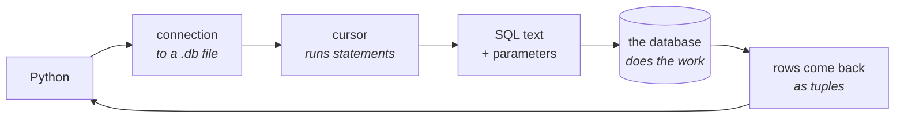
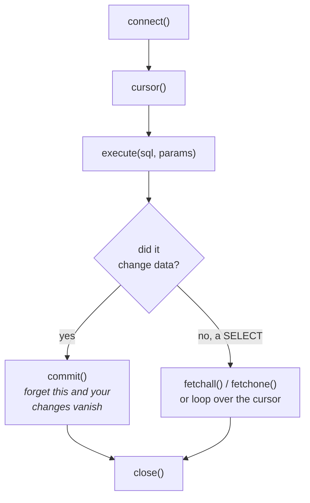
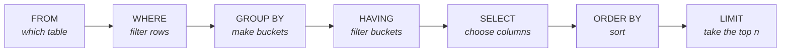

# Lesson 12 — SQL from Python

⬅ [Previous: CSV and Excel](11-csv-and-excel.md) · [Meeting 3](README.md) · ➡ [Next: A mini ETL project](13-mini-etl-project.md)

---

## Why you care

You already know how to group and aggregate — you wrote it by hand in
[Exercise 2.14](../meeting-2/exercises.md#exercise-214--column-statistics-).
This lesson shows the same job in one line of SQL, and explains when to write the loop
and when to let the database do it.

`sqlite3` ships **with Python**. No server, no installation, no configuration: a database
is a single file. And the SQL you write here runs almost unchanged against DuckDB,
PostgreSQL, MySQL and SQL Server.

---

## The idea



The important part of that picture: **the database does the work.** You send a
description of what you want; it decides how to get it.

---

## Five lines to a working database

```python
import sqlite3

connection = sqlite3.connect("data/shop.db")     # ":memory:" for a throwaway one
cursor = connection.cursor()

cursor.execute("CREATE TABLE IF NOT EXISTS product (ean TEXT PRIMARY KEY, name TEXT)")
cursor.execute("INSERT OR REPLACE INTO product VALUES (?, ?)", ("4006381333931", "Bread"))
connection.commit()                              # ← without this, nothing is saved

for row in cursor.execute("SELECT ean, name FROM product"):
    print(row)                                   # ('4006381333931', 'Bread')

connection.close()
```



> **`connection.commit()` is the one everybody forgets.** Without it your inserts are
> rolled back when the program ends, and the puzzling symptom is a script that reports
> success against an empty database. If data is mysteriously not there, look for the
> missing `commit()` first.

`sqlite3.connect(":memory:")` gives you a database that exists only while the program
runs. It is perfect for tests and for the examples in this lesson.

---

## The four statements you need

```sql
-- 1. define a table
CREATE TABLE sale (
    order_id    INTEGER PRIMARY KEY,   -- unique, and enforced by the database
    order_date  TEXT    NOT NULL,      -- SQLite stores dates as ISO text
    ean         TEXT    NOT NULL,      -- TEXT, so leading zeros survive
    quantity    INTEGER NOT NULL CHECK (quantity > 0),
    unit_price  REAL    NOT NULL CHECK (unit_price >= 0)
);

-- 2. put data in
INSERT INTO sale (order_id, order_date, ean, quantity, unit_price)
VALUES (1001, '2026-01-05', '4006381333931', 12, 1.35);

-- 3. get data out
SELECT ean, SUM(quantity) AS units
FROM   sale
WHERE  order_date >= '2026-01-06'
GROUP  BY ean
HAVING SUM(quantity) > 10
ORDER  BY units DESC
LIMIT  5;

-- 4. change or remove data
UPDATE sale SET quantity = 13 WHERE order_id = 1001;
DELETE FROM sale WHERE order_id = 1001;
```

### The `CHECK` constraints are the point

`CHECK (quantity > 0)` means the database **refuses** a negative quantity. Remember
[Lesson 9](../meeting-2/09-dicts-and-records.md), where the archive's warehouse could
reach −993 units? A `CHECK` constraint makes that state impossible, permanently, for
every program that ever touches the table — not just the one you remembered to validate.

**Validation in code protects one script. A constraint protects the data.** When you
have the choice, put the rule in the schema.

`PRIMARY KEY` similarly makes duplicate `order_id`s impossible — which is the
duplicate-key problem from
[Exercise 2.15](../meeting-2/exercises.md#exercise-215--find-the-duplicates-)
solved by declaration rather than by checking.

### Reading a `SELECT`

The clauses always run in this order, whatever order you write them in:



**`WHERE` filters rows; `HAVING` filters groups.** That is the distinction people get
wrong. `WHERE quantity > 0` throws away individual sales; `HAVING SUM(quantity) > 10`
throws away whole products whose total is too small. You often need both.

---

## ⚠️ Parameters, not string formatting

This is the one rule in the lesson you must not break.

```python
# ✗ NEVER — SQL injection, and it breaks on any value containing a quote
ean = user_input
cursor.execute(f"SELECT * FROM product WHERE ean = '{ean}'")

# ✓ ALWAYS — pass values as parameters
cursor.execute("SELECT * FROM product WHERE ean = ?", (ean,))
```

If `ean` is `"'; DROP TABLE product; --"`, the first version deletes your table.
The second looks for a product whose code is literally that text, finds none, and
carries on.

```python
# one parameter — note the trailing comma: (ean,) is a tuple, (ean) is not
cursor.execute("SELECT * FROM sale WHERE ean = ?", (ean,))

# several — in order
cursor.execute("SELECT * FROM sale WHERE ean = ? AND quantity > ?", (ean, 10))

# named, which is clearer once there are more than two
cursor.execute(
    "SELECT * FROM sale WHERE ean = :ean AND quantity > :minimum",
    {"ean": ean, "minimum": 10},
)

# many rows at once — far faster than a loop of execute() calls
cursor.executemany("INSERT INTO sale VALUES (?, ?, ?, ?, ?)", list_of_tuples)
```

> **`(ean,)` — the trailing comma is required.** `(ean)` is just `ean` in brackets, not
> a tuple, and you get `ValueError: parameters are of unsupported type`. Everyone hits
> this once.

**`executemany` is not a style choice.** Inserting 40,000 rows with a loop of
`execute()` takes minutes; one `executemany` inside one transaction takes under a
second. If you review code that loops `execute()` over a large list, that is your
comment.

Even when injection is impossible — an internal script, a value you generated
yourself — use parameters anyway. It is one habit instead of a judgement call every
time, and it handles quoting and type conversion for free.

---

## Worked example — CSV in, report out

The full pipeline: load our CSV into SQLite, then answer questions with SQL.

```python
import csv
import sqlite3

SCHEMA = """
CREATE TABLE product (
    ean        TEXT PRIMARY KEY,
    name       TEXT NOT NULL,
    unit       TEXT NOT NULL,
    category   TEXT NOT NULL,
    unit_price REAL NOT NULL CHECK (unit_price >= 0),
    vat_rate   INTEGER NOT NULL CHECK (vat_rate IN (0, 7, 19))
);
"""

connection = sqlite3.connect(":memory:")          # a throwaway database
connection.row_factory = sqlite3.Row              # ← rows behave like dicts
connection.executescript(SCHEMA)

# --- load ---------------------------------------------------------------
with open("data/products.csv", newline="", encoding="utf-8-sig") as f:
    rows = [
        (
            r["ean"].strip(),                      # TEXT — leading zeros survive
            r["name"].strip(),
            r["unit"].strip(),
            r["category"].strip(),
            float(r["unit_price"]),                # REAL
            int(r["vat_rate"]),                    # INTEGER
        )
        for r in csv.DictReader(f, delimiter=";")
    ]

connection.executemany("INSERT INTO product VALUES (?, ?, ?, ?, ?, ?)", rows)
connection.commit()
print(f"Loaded {len(rows)} products")

# --- query --------------------------------------------------------------
print("\nProducts per category, dearest first:")
query = """
    SELECT   category,
             COUNT(*)              AS product_count,
             ROUND(AVG(unit_price), 2) AS avg_price,
             ROUND(MAX(unit_price), 2) AS max_price
    FROM     product
    GROUP BY category
    ORDER BY avg_price DESC
"""
print(f"{'Category':<16}{'Count':>7}{'Avg':>9}{'Max':>9}")
print("-" * 41)
for row in connection.execute(query):
    # row_factory=sqlite3.Row lets us use column NAMES, not positions
    print(f"{row['category']:<16}{row['product_count']:>7}"
          f"{row['avg_price']:>9.2f}{row['max_price']:>9.2f}")

# --- a parameterised query ---------------------------------------------
print("\nGrocery items over 1.00:")
for row in connection.execute(
    "SELECT name, unit_price FROM product WHERE category = ? AND unit_price > ? ORDER BY unit_price DESC",
    ("grocery", 1.00),
):
    print(f"  {row['name']:<22}{row['unit_price']:>8.2f}")

connection.close()
```

```
Loaded 10 products

Products per category, dearest first:
Category          Count      Avg      Max
-----------------------------------------
grocery               4     4.10     7.99
confectionery         1     2.49     2.49
bakery                1     1.35     1.35
dairy                 2     1.25     1.40
drinks                2     0.92     1.19

Grocery items over 1.00:
  Coffee 500g                7.99
  Olive oil 750ml            6.49
  Pasta 500g                 1.19
```

### `connection.row_factory = sqlite3.Row`

Set this on every connection. Without it you get plain tuples and must write
`row[0]`, `row[3]` — and every inserted column shifts all your indexes, exactly like
the list-vs-dict problem from [Lesson 9](../meeting-2/09-dicts-and-records.md). With it
you write `row["category"]`, which survives schema changes and explains itself to a
reviewer.

▶ Run it: `python3 examples/meeting-3/12_csv_to_sqlite.py`

---

## The loop or the query? A real decision

Compare the two ways of answering "total units per country":

```python
# --- Python ---
totals = {}
for row in rows:
    totals[row["country"]] = totals.get(row["country"], 0) + row["quantity"]
```

```sql
-- SQL --
SELECT country, SUM(quantity) FROM sale GROUP BY country;
```

| | Python loop | SQL |
|---|-------------|-----|
| Rows must fit in memory | **yes** | no |
| Speed at 10 million rows | minutes | seconds |
| Uses indexes | no | yes |
| Easy to debug step by step | **yes** | harder |
| Arbitrary custom logic | **anything** | limited to SQL |
| Anyone can read it | with Python | with SQL |

**The rule: filter and aggregate in the database, then bring back the small result.**

```python
# ✗ pulls 10 million rows into Python to throw nearly all of them away
rows = connection.execute("SELECT * FROM sale").fetchall()
big = [r for r in rows if r["quantity"] > 100]

# ✓ the database throws them away and sends you what is left
big = connection.execute("SELECT * FROM sale WHERE quantity > 100").fetchall()
```

The second version moves less data over the wire, uses the index on `quantity`, and
does the filtering in C rather than Python. On a real table that is the difference
between 40 seconds and 40 milliseconds.

> **`SELECT *` in production code is a review comment.** It fetches columns you do not
> need, and it breaks the moment someone adds a column in a different position.
> Name the columns you want.

---

## Transactions: all or nothing

```python
try:
    connection.execute("UPDATE stock SET quantity = quantity - 5 WHERE ean = ?", (ean,))
    connection.execute("INSERT INTO shipment VALUES (?, ?)", (ean, 5))
    connection.commit()                       # both succeed together
except Exception:
    connection.rollback()                     # or neither happens
    raise
```

If the second statement fails, `rollback()` undoes the first. Without it you have
removed stock without recording a shipment — the data now says something that is not
true, and no later script can tell.

This is worth internalising: **a half-finished update is usually worse than a failed
one**, because a failure is visible and a half-finished update is not.

---

## When your data gets bigger

`sqlite3` is a genuine database and handles hundreds of millions of rows. What it is
not is *analytical* — it stores data row by row, so `SUM()` over one column of a wide
table still reads every column of every row.

**DuckDB** is the same interface with a column-oriented engine underneath, built for
exactly this:

```bash
pip install duckdb
```

```python
import duckdb

# It queries CSV and Parquet files directly - no loading step at all
result = duckdb.sql("""
    SELECT   country, SUM(quantity) AS units
    FROM     read_csv('data/sales_raw.csv', delim=';', header=true)
    WHERE    TRY_CAST(quantity AS INTEGER) > 0
    GROUP BY country
    ORDER BY units DESC
""").fetchall()
```

Three things worth knowing from that snippet:

- **`read_csv(...)` inside SQL.** No `INSERT`, no schema, no loading — DuckDB reads the
  file as a table. For ad-hoc analysis this is transformative.
- **`TRY_CAST` returns `NULL` instead of raising** on a value that will not convert.
  That is our `parse_decimal` returning `None`, built into the engine.
- **Parquet.** Once files get large, `read_parquet()` on a columnar file is often
  10–100× faster than CSV, because it reads only the columns you asked for.

Same SQL, same mental model, different engine. Everything you learned in this lesson
transfers — which is why it was worth learning on the one that needs no installation.

---

## 🔍 Read this code

**(a)** Why is the table empty afterwards?
```python
cursor.execute("INSERT INTO product VALUES ('123', 'Bread')")
connection.close()
```

**(b)** What is dangerous?
```python
name = input("Product name: ")
cursor.execute(f"SELECT * FROM product WHERE name = '{name}'")
```

**(c)** Why does this raise `ValueError`?
```python
cursor.execute("SELECT * FROM product WHERE ean = ?", ("4006381333931"))
```

**(d)** What is the difference?
```sql
SELECT ean, SUM(quantity) FROM sale WHERE quantity > 5 GROUP BY ean;
SELECT ean, SUM(quantity) FROM sale GROUP BY ean HAVING SUM(quantity) > 5;
```

<details>
<summary><b>Answers</b></summary>

**(a)** No `connection.commit()`. The insert was rolled back on close. This is the most
common SQLite mistake there is.

**(b)** SQL injection. Type `'; DROP TABLE product; --` and the table is gone. It also
simply breaks on a legitimate name like `O'Brien`. Use `("SELECT ... WHERE name = ?",
(name,))`.

**(c)** `("4006381333931")` is a **string in brackets**, not a tuple — Python sees a
13-character string where it wants a sequence of parameters. It needs the trailing
comma: `("4006381333931",)`.

**(d)** The first drops individual sales of 5 or fewer units, then totals what is left.
The second totals *all* sales, then drops products whose total is 5 or fewer.
Completely different answers. `WHERE` filters rows, `HAVING` filters groups.

</details>

---

## Traps

| Trap | Symptom | Fix |
|------|---------|-----|
| no `commit()` | data silently absent | `connection.commit()` after writes |
| f-string in SQL | injection; breaks on quotes | parameters `?` or `:name` |
| `(value)` instead of `(value,)` | `ValueError` | trailing comma |
| storing a code as `INTEGER` | leading zeros lost | `TEXT` for identifiers |
| `SELECT *` | breaks when columns change | name the columns |
| looping `execute()` for inserts | minutes instead of a second | `executemany` |
| filtering in Python after `SELECT *` | slow, memory-hungry | filter in `WHERE` |
| no `row_factory` | `row[3]` everywhere, breaks on schema change | `sqlite3.Row` |
| no `CHECK` / `PRIMARY KEY` | impossible data becomes possible | put the rule in the schema |
| forgetting `rollback()` on error | half-applied changes | `try` / `except` / `rollback` |

---

## Recap

- `sqlite3` is in the standard library; a database is one file. `":memory:"` for tests.
- `connect` → `cursor` → `execute` → **`commit`** → `close`.
- **Always parameters, never f-strings**, in SQL. `(value,)` needs the comma.
- `executemany` for bulk inserts — orders of magnitude faster.
- `connection.row_factory = sqlite3.Row` so you can use column names.
- `WHERE` filters rows; `HAVING` filters groups.
- Put rules in the schema: `PRIMARY KEY`, `NOT NULL`, `CHECK`. A constraint protects
  the data; validation protects one script.
- Identifiers are `TEXT`.
- Filter and aggregate in the database; bring back the small answer.
- Wrap related writes in a transaction and `rollback()` on failure.
- The same SQL runs on DuckDB and PostgreSQL. This knowledge transfers.

➡ [Next: A mini ETL project](13-mini-etl-project.md)
