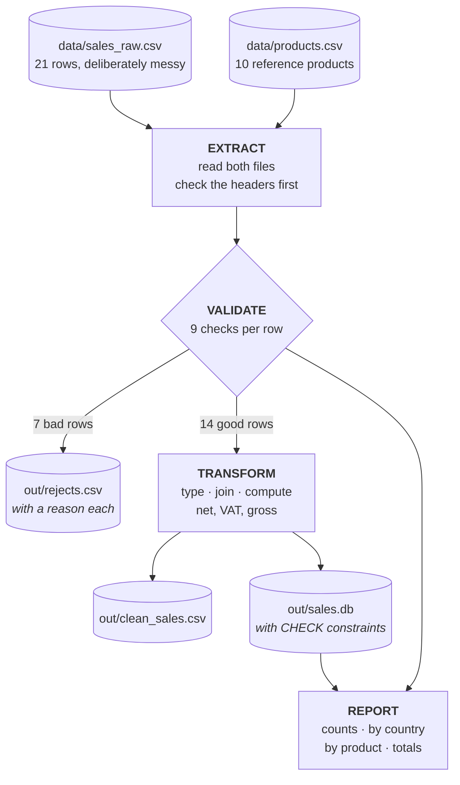

# Lesson 13 — A mini ETL project

⬅ [Previous: SQL from Python](12-sql-from-python.md) · [Meeting 3](README.md) · ➡ [Next: How to read code](14-how-to-read-code.md)

---

## Why you care

This is the capstone. Everything from the previous twelve lessons, assembled into one
script that does a real job: read a messy sales file, reject what is unusable, compute
what is needed, store it, and report on itself.

**It is also the thing you will be asked to review.** When a colleague or an AI hands
you a data script, this is the shape it should have — and this lesson is the reference
you compare against.

---

## The pipeline



▶ **Run it now**, then read on:
```bash
python3 examples/meeting-3/13_etl_pipeline.py
```

---

## What it actually prints

```
Extracted 21 sales rows and 10 reference products

========================================================================
  RUN SUMMARY
========================================================================
  rows read     :     21
  rows accepted :     14
  rows rejected :      7
  ------------------------------
  reconciles    : True
  acceptance    :  66.7%

========================================================================
  REVENUE BY COUNTRY
========================================================================
  Country     Orders   Units         Net       Gross
  --------------------------------------------------
  DE               5      57       86.15       92.17
  FR               2      69       59.55       67.46
  FI               1       6       47.94       51.30
  AT               3      18       44.52       47.64
  SE               2      26       29.84       31.93
  UK               1      24       17.28       20.56

========================================================================
  GRAND TOTAL
========================================================================
  orders 14   units 200
  net 285.28   VAT 25.78   gross 311.06
  net + VAT == gross : True

========================================================================
  REJECTED ROWS (7)
========================================================================
  line   5  order 1004    quantity is not a whole number: ''
  line   7  order 1006    ean is not 13 digits: '99999999'
  line   9  order 1008    quantity must be positive, got -2
  line  14  order 1013    order_date is not an ISO date: 'not-a-date'
  line  15  order 1014    unit_price is not a number: 'abc'
  line  19  order 1017    duplicate order_id 1017
  line  21  order 1019    ean is not 13 digits: ''

  Written to out/rejects.csv - nothing was dropped silently.
```

---

## The two lines that make it trustworthy

Out of 60 lines of output, these two are the ones that matter:

```
  reconciles    : True
  net + VAT == gross : True
```

### `reconciles` — every row is accounted for

```python
print(f"  reconciles    : {clean_count + reject_count == raw_count}")
```

21 rows in. 14 accepted, 7 rejected. 14 + 7 = 21. ✓

**If that ever printed `False`, a row vanished somewhere** — and you would know
immediately, on this run, rather than three weeks later when someone asks why the
January figures are short.

This is a *three-line* check and it is the single highest-value thing in the script.
A pipeline that cannot account for every input row is not a pipeline, it is a hope.

### `net + VAT == gross` — the arithmetic checks itself

```python
difference = abs((totals["net"] + totals["vat"]) - totals["gross"])
print(f"  net + VAT == gross : {difference < 0.005}")
```

An independent identity that must hold if the maths is right. Note it compares against
a tolerance, not with `==` — these are floats, and rounding each row to 2 decimals means
the totals will not match to the last bit. That is the epsilon idea from
[Lesson 1](../meeting-1/01-values-and-types.md), earning its keep in production.

> **Every pipeline should assert something it can check independently.**
> Row counts that add up. A total that matches the source system. A sum of parts
> equalling a whole. Without a self-check you are trusting code that nobody verified.

---

## Walking through the code

### 1. Configuration at the top

```python
SALES_CSV = Path("data/sales_raw.csv")
PRODUCTS_CSV = Path("data/products.csv")
OUT_DIR = Path("out")
DELIMITER = ";"
ENCODING = "utf-8-sig"
VALID_VAT_RATES = (0, 7, 19)
```

Every tunable value in one block, in capitals. A reviewer can see what the script
touches and what it assumes **without reading the logic** — and changing the delimiter
is a one-line edit rather than a search-and-replace.

### 2. Small parsers that return `None` instead of raising

```python
def parse_decimal(raw):
    """'1,40' or ' 1.40 ' -> 1.4.  None if it is not a number."""
    if raw is None:
        return None
    cleaned = str(raw).strip().replace(",", ".")
    if not cleaned:
        return None
    try:
        return float(cleaned)
    except ValueError:
        return None
```

Each parser answers one question and reports failure by returning `None`.
They do not print, they do not raise, and they do not decide what a bad value *means* —
that belongs to the validator. This is [Lesson 8](../meeting-2/08-functions.md)'s rule,
and it is why each of these is four lines you can verify at a glance.

Note `replace(",", ".")`: row 1002 in our file has `1,40` with an Austrian comma
decimal, and it is accepted correctly. That is not over-engineering; it is the reality
of receiving files from more than one country.

### 3. The reference list keyed by ID

```python
def load_products(path):
    """...keyed by EAN because we are about to look products up 20 times -
    or 40,000 times on a real file."""
    return {row["ean"].strip(): {...} for row in reader}
```

This is [Exercise 2.16](../meeting-2/exercises.md#exercise-216--reconcile-two-price-lists-)
applied. The alternative — scanning the product list for each sale — is
20 × 10 here but 40,000 × 40,000 on a real file, which is 1.6 **billion** comparisons.
A dict lookup makes it 40,000.

**It is the same code either way.** The only difference is a dict comprehension instead
of a list, and it is the difference between a 5-second job and a 5-hour one.

### 4. Header check before any row

```python
required = {"order_id", "order_date", "ean", "quantity", ...}
missing = required - set(reader.fieldnames or [])
if missing:
    raise ValueError(f"{path}: missing column(s) {sorted(missing)}")
```

If a supplier renames `quantity` to `qty`, you get **one** clear error naming the
column — not 40,000 `KeyError`s, and not a silently empty result.

Note this one *does* raise. A missing column is not a bad row, it is a broken file:
there is no sensible way to continue, so stopping is correct. **Deciding which failures
are recoverable and which are fatal is the core design judgement in a pipeline.**

### 5. One reason per rejected row

```python
for line_number, row in raw_rows:
    ...
    if order_id is None:
        reject(f"order_id is not a whole number: {row.get('order_id')!r}")
        continue
    if order_id in seen_order_ids:
        reject(f"duplicate order_id {order_id}")
        continue
    ...
```

Nine checks, each followed by `continue`, ordered cheapest and most fundamental first.
A row that fails gets **exactly one** reason — the first thing wrong with it — rather
than a confusing pile of consequences.

The `!r` in the f-string uses `repr()`, which shows quotes. `''` is visibly an empty
string; without `!r` the message would read `quantity is not a whole number:` and
trail off, and you would not know whether the value was empty or missing.

### 6. Rejects are data, not a log line

```python
write_csv(OUT_DIR / "rejects.csv", rejects, ["line", "order_id", "ean", "reason"])
```

`out/rejects.csv`:
```
line;order_id;ean;reason
5;1004;5000112637922;quantity is not a whole number: ''
7;1006;99999999;ean is not 13 digits: '99999999'
```

This file is the deliverable you send back to whoever produced the data. It has the
line number, the key, and the reason — everything needed to fix it at source.

> **A dropped row with no record is data loss.** A `print()` in a terminal that
> nobody kept is also data loss. Rejects belong in a file, next to the output.

### 7. Constraints repeat the validation, deliberately

```sql
CREATE TABLE sale (
    order_id   INTEGER PRIMARY KEY,
    ean        TEXT    NOT NULL,
    quantity   INTEGER NOT NULL CHECK (quantity > 0),
    vat_rate   INTEGER NOT NULL CHECK (vat_rate IN (0, 7, 19)),
    country    TEXT    NOT NULL CHECK (length(country) = 2)
);
```

Every one of these repeats a check the Python already did. That is not redundancy to
be cleaned up — it is a second line of defence:

- **Python validation protects this run.** Someone edits the script, drops a check,
  and bad data flows.
- **A constraint protects the data.** Every program that ever writes to this table is
  held to the rule, including the one a colleague writes next year and the one an AI
  generates next week.

`order_id INTEGER PRIMARY KEY` also means that even if the duplicate check were
removed, the database would reject order 1017's twin. **Belt and braces, on purpose.**

---

## The seven planted problems

Our `data/sales_raw.csv` contains one of each realistic failure, so you can see what
each check is for:

| Line | Problem | Realistic cause |
|------|---------|-----------------|
| 5 | `quantity` empty | a blank cell in the source spreadsheet |
| 7 | `ean` is `99999999` | 8 digits — a truncated or internal code |
| 9 | `quantity` is `-2` | a return entered into the sales file |
| 14 | `order_date` is `not-a-date` | a locale mishap, or a free-text cell |
| 15 | `unit_price` is `abc` | a formula error copied as text |
| 19 | `order_id` 1017 twice | the classic double export |
| 21 | `ean` empty | a product never assigned a code |

And one problem that is **recovered rather than rejected**:

| Line | Input | Handled by |
|------|-------|-----------|
| 3 | `1,40` | `parse_decimal` replacing `,` with `.` |

That distinction is the whole art of the thing. `1,40` is a *formatting* difference and
recovering it is correct. `-2` is a *semantic* problem and guessing would be wrong —
maybe it is a return that belongs in a different table, maybe it is a typo for `2`.
**When you cannot know, reject and report. Never guess.**

Every silent guess is a bug you will not find until someone asks why a total is wrong.

---

## 🔍 Read this code

A colleague sends you this "quick script". Find as many problems as you can before
looking at the answers.

```python
import csv

f = open("sales.csv")
rows = csv.reader(f)

total = 0
for row in rows:
    total = total + row[4] * row[3]

print("Total: " + str(total))

out = open("report.txt", "w")
out.write(str(total))
```

<details>
<summary><b>Answers — there are ten</b></summary>

1. **No `with`** — neither file is closed. On Windows they stay locked.
2. **No `encoding=`** — behaves differently on Linux and Windows.
3. **No `newline=""`** — quoted multi-line fields break.
4. **`csv.reader`, not `DictReader`** — `row[4]` and `row[3]` mean nothing to a reader,
   and every index shifts if a column is inserted.
5. **The header row is not skipped** — the first pass tries to multiply the header text.
6. **`row[4] * row[3]` is string arithmetic** — CSV values are strings, so this either
   raises `TypeError` or (if one is a digit string) silently repeats text.
7. **No validation at all** — a blank or non-numeric cell crashes the whole run.
8. **No reject handling** — a bad row takes down the entire job with no record.
9. **`"Total: " + str(total)`** — works, but an f-string with `:.2f` is what a money
   figure needs; unformatted floats in reports look like errors.
10. **`out.write(str(total))`** — no newline, no label, no header. Unreadable next week
    and unparseable by anything.

And one more, the most important: **there is no row count.** Even once fixed, you could
not tell whether it processed 20 rows or 2.

Compare each point with `13_etl_pipeline.py`. That is what the lesson is for.

</details>

---

## The checklist for any pipeline

Use this on your own code and on code you review:

**Reading**
- [ ] `with open(...)`, with `encoding=` and (for CSV) `newline=""`
- [ ] header checked before rows are processed
- [ ] identifiers kept as strings
- [ ] every column converted deliberately, with failures handled

**Validating**
- [ ] every field checked before use
- [ ] one reason per rejected row
- [ ] rejects written to a file, not printed and forgotten
- [ ] recoverable formatting fixed; ambiguous values rejected, never guessed

**Writing**
- [ ] output folder created if missing
- [ ] output readable *and* re-readable (CSV with a header, not `str(list)`)
- [ ] SQL uses parameters, never f-strings
- [ ] `commit()` after writes; `rollback()` on failure
- [ ] constraints in the schema as well as checks in the code

**Proving it worked**
- [ ] rows in = rows out + rows rejected, **printed**
- [ ] at least one independent arithmetic self-check
- [ ] money formatted to 2 decimals
- [ ] float comparisons use a tolerance

**Being readable**
- [ ] configuration in one block at the top
- [ ] functions small enough to review individually
- [ ] each function returns a result rather than printing
- [ ] docstrings say what happens on bad input

---

## When your data gets bigger

The structure above is right at any scale — only the engine changes. Here is the same
pipeline in Polars, so you can see what stays and what goes:

```python
import polars as pl

clean = (
    pl.scan_csv("data/sales_raw.csv", separator=";", schema_overrides={"ean": pl.Utf8})
    .with_columns(
        # str.to_date / cast with strict=False are the vectorised equivalents
        # of our parse_* helpers: invalid values become null, not exceptions.
        pl.col("order_date").str.to_date("%Y-%m-%d", strict=False),
        pl.col("quantity").cast(pl.Int64, strict=False),
        pl.col("unit_price").str.replace(",", ".").cast(pl.Float64, strict=False),
    )
    .filter(
        pl.col("order_date").is_not_null()
        & pl.col("quantity").is_not_null()
        & (pl.col("quantity") > 0)
        & pl.col("unit_price").is_not_null()
        & (pl.col("ean").str.len_chars() == 13)
    )
    .join(pl.scan_csv("data/products.csv", separator=";"), on="ean", how="inner")
    .with_columns((pl.col("quantity") * pl.col("unit_price")).round(2).alias("net_amount"))
    .collect()
)
```

**What changed:** the per-row Python loop became column expressions, which run
vectorised and in parallel. On 10 million rows that is the difference between minutes
and seconds.

**What did not change — and this is the point:** you still need the header check, the
reject file, the row-count reconciliation and the self-check. `.filter()` *silently
drops* the rows it removes, so to keep your rejects you must capture the inverse:

```python
rejects = raw.filter(~validity_condition)      # ~ is "not"
assert rejects.height + clean.height == raw.height
```

A faster engine does not make your data cleaner, and it does not tell you what it threw
away. **The discipline in this lesson is the part that transfers; the loop is the part
that gets replaced.**

For the database side, DuckDB reads the CSV directly and can write Parquet:

```python
import duckdb
duckdb.sql("COPY (SELECT * FROM read_csv('data/sales_raw.csv', delim=';')) TO 'out/sales.parquet'")
```

---

## Recap

- Five stages: **extract → validate → transform → load → report.**
- Configuration in one block at the top.
- Small parsers that return `None`; a validator that decides what `None` means.
- Key your reference data by ID. Nested loops do not scale; dict lookups do.
- Check the header before the rows. A broken file should fail once and clearly.
- One reason per rejected row, written to a **file**.
- Recover formatting differences; reject ambiguity. Never guess.
- Constraints in the schema *and* checks in the code — two lines of defence.
- **Print `rows in = rows out + rejected`.** Three lines, and the whole basis of trust.
- Assert something independent — a total, an identity, a count.
- The structure survives a change of engine. The loop does not.

---

🎉 **You have built a real pipeline.** It reads messy data, refuses what it cannot
process, explains why, computes correctly, stores the result under constraints, and
proves its own arithmetic.

➡ [Next: How to read code](14-how-to-read-code.md) — the most useful lesson in the course.
