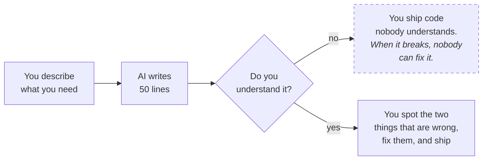
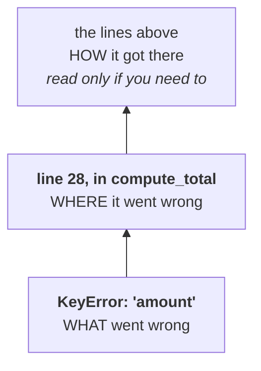
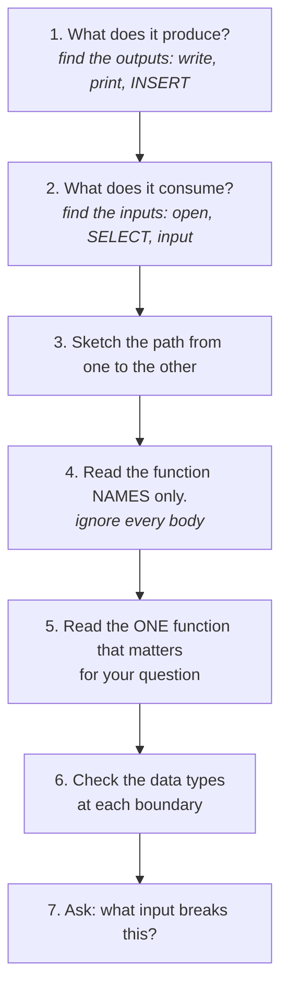

# Lesson 14 — How to read code (and review it)

⬅ [Previous: Mini ETL project](13-mini-etl-project.md) · [Meeting 3](README.md) · ➡ [Exercises](exercises.md)

---

## Why this is the most important lesson

You can ask an AI for a function and have it in four seconds. What you cannot outsource
is the judgement about whether to **trust** it.



The gap between those two outcomes is *reading skill*. That is all this lesson is about.

And it is not only about AI. Most of the code you will meet was written by a colleague
who has left, or by you, eight months ago, which is nearly the same thing.

---

## Part 1 — Reading an error message

Python errors are a report, not an insult. Learn the shape once.

```
Traceback (most recent call last):
  File "pipeline.py", line 42, in <module>
    main()
  File "pipeline.py", line 35, in main
    total = compute_total(rows)
  File "pipeline.py", line 28, in compute_total
    return sum(r["amount"] for r in rows)
  File "pipeline.py", line 28, in <genexpr>
    return sum(r["amount"] for r in rows)
           ~~^^^^^^^^^^
KeyError: 'amount'
```

**Read it bottom-up:**



1. **The last line is the problem.** `KeyError: 'amount'` — a dictionary has no key
   called `"amount"`.
2. **The lowest `File` line is the place.** Line 28. Go and look at line 28.
3. **The lines above are the route.** `main()` called `compute_total()`.
   Usually you do not need them; when the failing line looks innocent, they tell you
   what data was passed in.

"Most recent call **last**" means the deepest, most relevant frame is at the bottom.
The top is just how you got there.

### The errors you will actually see

| Error | Means | Look for |
|-------|-------|----------|
| `NameError: name 'x' is not defined` | typo, or used before assignment | spelling; is it defined above? |
| `TypeError: can only concatenate str...` | mixing text and numbers | a missing `int()`/`float()`, often from a CSV |
| `KeyError: 'name'` | no such dict key | the actual keys — `print(row.keys())`; a BOM? |
| `IndexError: list index out of range` | position beyond the end | off-by-one; an empty list; a short CSV row |
| `ValueError: invalid literal for int()` | `int("abc")` | validate before converting |
| `AttributeError: 'NoneType' object has no...` | something returned `None` | a function with a missing `return` |
| `FileNotFoundError` | wrong path, or wrong directory | run from the repo root |
| `ZeroDivisionError` | divided by zero | an empty list you averaged |
| `IndentationError` / `TabError` | mixed tabs and spaces | set the editor to 4 spaces |
| `UnicodeDecodeError` | wrong encoding | `utf-8`, then `cp1252` |

`AttributeError: 'NoneType' object has no attribute ...` deserves a note: it almost
never means the *current* line is wrong. It means something **earlier** returned `None`
when you expected a value — a function that forgot to `return` on one branch, or a
`.get()` that found nothing. Look up the chain, not at the line that crashed.

### Three debugging tools, in order of usefulness

**1. `print()` — do not be embarrassed by this**

```python
print(f"DEBUG row={row!r} type={type(row)}")
```

`!r` shows quotes and escapes, so you can see `'12 '` versus `'12'`. This single habit
finds most bugs, and professionals use it daily.

**2. Narrow it down by halving**

The bug is somewhere in 200 lines. Put a `print("reached A")` in the middle. If it
prints, the bug is after it; if not, before. Repeat. Eight steps finds it in 200 lines.

**3. The interactive shell**

```bash
python3
>>> from mymodule import parse_price
>>> parse_price("13,50")
13.5
>>> parse_price("")
>>> parse_price("abc")
```

Poking one function with odd inputs is the fastest way to understand it — and it is
exactly why [Lesson 8](../meeting-2/08-functions.md) insisted that functions
`return` rather than `print`.

---

## Part 2 — Reading unfamiliar code

You have 200 lines you did not write. **Do not start at line 1.**



### 1. Start at the end

Search for what it writes: `open(..., "w")`, `print(`, `INSERT`, `to_csv`, `return`.
The outputs tell you the purpose. Nothing else in the file matters until you know
what it is *for*.

### 2. Then the start

Search for inputs: `open(`, `input(`, `SELECT`, `read_csv`, `requests.get`.
Now you know both ends, and everything in between is a transformation.

### 3. Read names, not bodies

```python
def load_products(path): ...
def validate_and_transform(raw_rows, products): ...
def load_to_sqlite(path, rows): ...
def report(connection, raw_count, clean_count, reject_count): ...
```

You now understand the script and have read none of it. **This is why function names
matter so much** — and why a file of 300 unbroken lines is so much harder to work with
than the same logic in eight named pieces.

If the names are bad, that is your first review comment. If there are no functions at
all, that is your first and biggest one.

### 4. Read the one function you need

Now — and only now — read a body. Just the one that answers your question.

### 5. Check the types at the boundaries

The most common real bug in data code is a type surprise. At each boundary ask:
*what type is this, actually?*

```python
row["quantity"]                      # a str, from a CSV
int(row["quantity"])                 # an int — but ValueError on ""
row["ean"]                           # a str — good
int(row["ean"])                      # leading zeros destroyed
7 / 2                                # a float, always
some_function(x)                     # None on the branch that forgot to return
```

### 6. Finally, attack it

- What happens on an **empty** file? Zero rows?
- What happens on a **missing** column? A renamed one?
- What happens on a value that is **text where a number is expected**?
- What happens on a **duplicate** key?
- What happens on a **negative** number? A zero?
- Does it **close** its files? **commit** its transaction?
- If a row is dropped, **is there a record of it?**
- Do the **counts add up** at the end?

That list *is* the review. Six lessons of traps, compressed into eight questions.

---

## Part 3 — Reviewing AI-generated code

AI-written Python is usually syntactically perfect, idiomatic, and confidently wrong in
a small number of specific places. Those places are predictable.

### The AI-specific checklist

| Check | Why it matters |
|-------|----------------|
| **Are identifiers kept as strings?** | AI loves `int(row["id"])`. Leading zeros die. |
| **Is the error handling real?** | `except Exception: pass` hides the bug you needed to see. |
| **Are dropped rows reported?** | A generated `.filter()` or `if valid:` usually drops silently. |
| **Does it hard-code a delimiter or encoding that matches your files?** | It will assume `,` and UTF-8. |
| **Is there a `commit()`?** | Frequently missing. |
| **Are SQL values parameterised?** | f-strings in SQL are a very common generated pattern. |
| **Does it handle the empty case?** | `sum(x)/len(x)` with no guard appears constantly. |
| **Are floats compared with `==`?** | Especially for money. |
| **Are the libraries real, and installed?** | Occasionally a plausible-sounding function does not exist. |
| **Does it do what you asked, or what it assumed?** | The most common failure by far. |

### It is right about the syntax and wrong about your data

An AI has never seen your files. It does not know that:

- your product codes have leading zeros,
- your Austrian supplier sends comma decimals,
- `quantity` is occasionally negative because someone logs returns there,
- column 4 was renamed last March,
- the file arrives as `cp1252` because it comes out of an old system.

**Those are exactly the things that break pipelines, and they are all invisible to the
generator.** It can write flawless code that is wrong for your situation, and it will
sound completely certain while doing so.

### A worked review

Here is a perfectly plausible AI answer to *"write a function to load my sales CSV
and total the revenue per country"*:

```python
import pandas as pd

def total_revenue_by_country(csv_path):
    df = pd.read_csv(csv_path)
    df['revenue'] = df['quantity'] * df['unit_price']
    return df.groupby('country')['revenue'].sum().to_dict()
```

It is clean, idiomatic, and would pass a casual glance. Seven problems:

<details>
<summary><b>Find them yourself first, then open this</b></summary>

1. **`pd.read_csv` defaults to a comma delimiter.** Our file is `;`-separated,
   so this produces a single column and `KeyError: 'quantity'`. Needs `sep=";"`.
2. **No encoding.** An Excel-exported file has a BOM, making the first column
   `"ean"`. Needs `encoding="utf-8-sig"`.
3. **`ean` will be read as an integer** and any leading zero destroyed. Needs
   `dtype={"ean": str}`.
4. **`unit_price` of `abc` makes the whole column text**, and
   `quantity * unit_price` then either raises or silently repeats strings.
   No `to_numeric(..., errors="coerce")`.
5. **Negative quantities are included.** Our line 9 has `-2`, which quietly
   *reduces* a country's revenue. No filter.
6. **Duplicate rows are counted twice.** Order 1017 appears twice in our file,
   inflating France. No de-duplication.
7. **Nothing is reported.** No row count, no rejects, no indication that 7 of 21
   rows were problematic. The function returns a confident dictionary of wrong numbers.

And the meta-problem: **it returns a plausible answer whatever you feed it.** There is
no input for which this function says "I could not do this." That is what makes it
dangerous rather than merely buggy — a crash you would notice.

Compare it with `validate_and_transform` in
[`13_etl_pipeline.py`](../../examples/meeting-3/13_etl_pipeline.py), which rejects
7 rows, says why, writes them to a file, and proves the counts add up.

</details>

> **None of those seven is a Python problem.** They are all *data* problems, and you
> found them because you have spent three meetings looking at exactly these traps.
> That is the skill. It does not go obsolete when the model improves.

### How to use AI well

This is not an argument against these tools — they are genuinely excellent. It is an
argument about how to hold them.

- **Ask for small pieces.** One function you can read beats 200 lines you cannot.
- **Give it your real constraints.** "Semicolon-separated, UTF-8 with BOM, `ean` is a
  13-character string with leading zeros, quantity can be negative and those rows must
  be rejected not dropped." You get dramatically better code.
- **Ask it to explain its own code**, then check the explanation against the code.
  Where they disagree, one of them is wrong and it is worth finding out which.
- **Ask for the edge cases**: *"what inputs would break this?"* It is often good at
  this when asked directly and silent about it when not.
- **Write the tests yourself.** You know what your data looks like. Five `assert` lines
  of your own are worth more than any amount of generated confidence.
- **Never ship what you cannot explain.** If you could not defend a line of it in a
  review, you are not the owner of that code — and you will be the person paged when
  it fails.

---

## Part 4 — The review checklist

Print this. Use it on your own code first.

### Correctness
- [ ] What happens with **zero** rows? An **empty** file?
- [ ] What happens with a **missing or renamed** column?
- [ ] What happens with text where a number belongs?
- [ ] **Duplicate keys** — checked, or would they silently multiply a join?
- [ ] **Negative or zero** values where only positive make sense?
- [ ] Are **identifiers** strings? Would a leading zero survive?
- [ ] Are **floats** compared with a tolerance rather than `==`?
- [ ] Is **money** formatted to 2 decimals in every output?
- [ ] Does every `if`/`elif` chain have a path for the unexpected case?
- [ ] Does every function `return` on **every** branch?

### Data integrity
- [ ] Are **rows in = rows out + rejected**, and is it printed?
- [ ] Are rejects written **somewhere durable**, with a reason?
- [ ] Is there **one independent self-check** (a total, an identity)?
- [ ] Are files opened with `with`, and with an explicit `encoding`?
- [ ] Is there a `commit()`? A `rollback()` on failure?
- [ ] Are there **constraints** in the schema, not just checks in the code?

### Safety
- [ ] Any `open(..., "w")` — is the filename definitely right?
- [ ] Is SQL **parameterised**? No f-strings in a query?
- [ ] Any `except: pass` hiding a failure that matters?
- [ ] Anything that silently drops data?

### Readability
- [ ] Do the names say what the values **mean**?
- [ ] Is each function small enough to review on its own?
- [ ] Is configuration in **one block** at the top?
- [ ] Do docstrings say what happens on **bad input**?
- [ ] Could someone else fix a bug in this at 6pm on a Friday?

### Performance — only when it matters
- [ ] Any nested loop over two large collections? (→ key one by ID)
- [ ] Is filtering done in SQL, or after `SELECT *` in Python?
- [ ] Bulk inserts via `executemany`, not a loop of `execute`?
- [ ] Is the whole file loaded when streaming would do?

---

## How to write a review comment

Aim for specific, kind, and about the code:

| ✗ Less useful | ✓ More useful |
|---------------|---------------|
| "This is wrong." | "Line 42: `int(row['ean'])` loses the leading zero on codes like `0401234567890`, so the join on line 58 silently misses those products." |
| "Add error handling." | "Line 30: `float(row['price'])` raises on the empty cells we get in column E. Could this return `None` and add the row to rejects?" |
| "Use pandas." | "This works. At 40k rows the nested loop on line 22 would be ~1.6bn comparisons — worth keying `products` by EAN first, as in lesson 13." |
| "Bad naming." | "`d` on line 15 holds the product total — `product_total` would save the next reader a scroll." |

The pattern: **line number → what happens → why it matters → a concrete suggestion.**

And when the code is good, say so and say what specifically. A review that only ever
lists faults teaches nobody anything.

---

## Recap

- **Read tracebacks bottom-up:** what, then where, then how it got there.
- `print(f"{value!r}")` is a real debugging tool. Use it without shame.
- Read unfamiliar code **outputs first, then inputs, then names, then one body.**
- Check the **type at every boundary**. Most data bugs are type surprises.
- Attack the code with the eight questions: empty, missing, wrong type, duplicate,
  negative, unclosed, silently dropped, counts.
- AI code is usually syntactically right and **wrong about your specific data**.
  It has never seen your files.
- **Never ship code you could not explain in a review.**
- Review comments: line → effect → why → suggestion.

---

🎉 **This is the end of the course material.**

You started with `print("Hello")`. You can now read a data pipeline, find its bugs,
and say why they matter. That last part is the one that will still be valuable in
ten years.

➡ **[Meeting 3 exercises](exercises.md)** — 12 tasks, including two code reviews.
