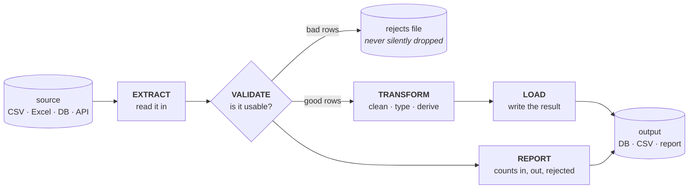

# Meeting 3 — Real data

**Goal of this meeting:** stop typing data in. Read it from files and databases,
validate it, and — most importantly — learn to **read and review** a pipeline
somebody else (or an AI) wrote.

⏱ ~3 hours including a break. ⬅ [Back to course home](../../README.md)

---

## Agenda

| | Lesson | Minutes | What we cover |
|---|--------|---------|---------------|
| 10 | [Files](10-files.md) | 30 | `open`, `with`, reading lines, writing results, encodings |
| 11 | [CSV and Excel](11-csv-and-excel.md) | 40 | The `csv` module, `DictReader`, delimiters, and how to handle `.xlsx` |
| — | ☕ break | 10 | |
| 12 | [SQL from Python](12-sql-from-python.md) | 40 | `sqlite3`, queries, parameters, why you push work into the database |
| 13 | [A mini ETL project](13-mini-etl-project.md) | 40 | Extract → validate → transform → load → report, end to end |
| 14 | [How to read code](14-how-to-read-code.md) | 30 | Tracebacks, reading strategy, and a code-review checklist |
| — | [Exercises](exercises.md) | rest | 12 tasks, all work-shaped |

---

## The shape of every pipeline you will ever build

Five verbs — **extract, validate, transform, load, report** — and the whole of
[Lesson 13](13-mini-etl-project.md) is one worked instance of this diagram.

Two things in that picture are the difference between a script and a pipeline:

- **Rejects go somewhere.** A row you cannot process is written to a rejects file with
  a reason, not silently skipped. If you cannot say where a row went, you have data loss.
- **Counts are reported.** `1,000 in → 987 out → 13 rejected` and the numbers must add up.
  A pipeline that does not count itself cannot be trusted.

---

## Why we use only the standard library

You will notice this meeting uses `csv`, `sqlite3` and `json` — all built into Python —
rather than `pandas` or `polars`.

That is deliberate, for three reasons:

1. **It runs on every machine, with no installs and no internet.** Nobody spends the
   first 20 minutes of the meeting fighting `pip`.
2. **You see the mechanism.** `pandas.read_csv()` is one line that hides a hundred
   decisions about types, delimiters, encodings and missing values. Writing the loop
   once means you know what those decisions *are* — and you will make better use of
   `read_csv` afterwards, not worse.
3. **`sqlite3` is real SQL.** The queries you write in [Lesson 12](12-sql-from-python.md)
   run unchanged against DuckDB, PostgreSQL and most other databases.

Each lesson ends with a **"when your data gets bigger"** box pointing at the
production tool for that job and showing the same task in it — so you know exactly
what to reach for and why.

---

## And the real point of this meeting

You will spend far more of your career **reading** data code than writing it —
your colleagues' code, your own code from six months ago, and increasingly code an
AI generated in four seconds.

[Lesson 14](14-how-to-read-code.md) is therefore the most valuable thing in this
course. It gives you a strategy for reading unfamiliar code and a concrete checklist
for reviewing a pipeline. Everything before it exists so that the checklist makes sense.

➡ **Start with [Lesson 10: Files](10-files.md)**
