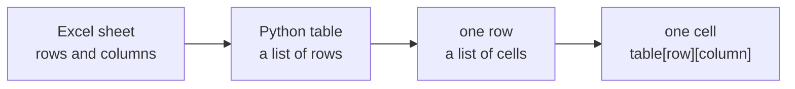

# Session 2 — Tables — a list of lists

⬅ [Practice home](README.md) · [Course home](../../README.md)

A spreadsheet is a **table**: rows going down, columns going across. In Python, a table is a **list of rows**, and every row is itself a list of cells. A list inside a list is called a *nested list*.



This is the table we will use all session. It shows how many units Pixel Shop sold of each product in January, February and March:

```python
sales = [
    ["Hoodie",   30,  45, 50],
    ["Cap",      20,  15, 25],
    ["Mug",      40,  35, 60],
    ["Sticker", 100, 120, 90],
]
```

As a picture:

| | column 0 | column 1 | column 2 | column 3 |
|---|---|---|---|---|
| **row 0** | Hoodie | 30 | 45 | 50 |
| **row 1** | Cap | 20 | 15 | 25 |
| **row 2** | Mug | 40 | 35 | 60 |
| **row 3** | Sticker | 100 | 120 | 90 |

### Three rules that solve most problems

1. **Row first, then column.** `sales[2][1]` means row 2, column 1.
2. **Counting starts at 0.** The Hoodie is row 0, the Mug is row 2.
3. **In this table, column 0 is the product name.** The numbers start at column 1: column 1 is January, 2 is February, 3 is March.

### The two loops you need

```python
for row in sales:        # one row at a time
    for cell in row:     # one cell at a time inside that row
        print(cell, end=" ")
    print()              # new line after each row
```

The inner loop finishes completely before the outer loop moves on. 4 rows with 4 cells each means 16 visits.

## The exercises at a glance

| # | Exercise | Level | Time |
|---|----------|-------|------|
| 2.1 | Find the cell | ⭐ easy | 3 min |
| 2.2 | Print the table | ⭐ easy | 3 min |
| 2.3 | A nice-looking table | ⭐⭐ medium | 5 min |
| 2.4 | Total per product | ⭐ easy | 3 min |
| 2.5 | Best seller | ⭐⭐ medium | 4 min |
| 2.6 | Total per month | ⭐⭐ medium | 5 min |
| 2.7 | Did we hit the target? | ⭐⭐ medium | 5 min |
| 2.8 | Add a product (a new row) | ⭐ easy | 3 min |
| 2.9 | Add a Total column | ⭐⭐ medium | 4 min |
| 2.10 | Share of the total | ⭐⭐⭐ stretch | 5 min |
| 2.11 | A blank tracking grid | ⭐⭐⭐ stretch | 5 min |
| 2.12 | Bonus: flip the table | ⭐⭐⭐ stretch | 6 min |

About **51 minutes** in total. Work top to bottom: each exercise leans on the one before it.

> **How to work:** read the task, type the data yourself, try it, open the **hint** only if you are stuck, and open the **solution** only after you have something that runs. Then compare — a different working answer is fine.

---

## Exercise 2.1 — Find the cell

Level: ⭐ easy · about 3 min

**Your task.** Print the whole **Cap** row, the number of **Mugs sold in February**, how many **rows** the table has and how many **columns**.

Start with this data:

```python
sales = [
    ["Hoodie",   30,  45, 50],
    ["Cap",      20,  15, 25],
    ["Mug",      40,  35, 60],
    ["Sticker", 100, 120, 90],
]
```

You should see:

```text
Cap row: ['Cap', 20, 15, 25]
Mug in Feb: 35
Rows: 4
Columns: 4
```

<details>
<summary>Hint (try without it first)</summary>

Row first, then column, and start counting at 0. Cap is row 1 and Mug is row 2. February is column **2**, because column 0 holds the name. `len(sales)` counts the rows; `len(sales[0])` counts the cells in one row.

</details>

<details>
<summary>Full solution</summary>

```python
sales = [
    ["Hoodie",   30,  45, 50],
    ["Cap",      20,  15, 25],
    ["Mug",      40,  35, 60],
    ["Sticker", 100, 120, 90],
]
print("Cap row:", sales[1])
print("Mug in Feb:", sales[2][2])
print("Rows:", len(sales))
print("Columns:", len(sales[0]))
```

**How it works**

- `sales[1]` is the whole second row (a list).
- `sales[2][2]` first picks row 2 (the Mug row), then column 2 inside it (February).
- `len(sales)` is the number of rows. `len(sales[0])` is the length of the first row, which is the number of columns.

</details>

---

## Exercise 2.2 — Print the table

Level: ⭐ easy · about 3 min

**Your task.** Print the table with a loop inside a loop: one line per row, cells separated by a space.

Start with this data:

```python
sales = [
    ["Hoodie",   30,  45, 50],
    ["Cap",      20,  15, 25],
    ["Mug",      40,  35, 60],
    ["Sticker", 100, 120, 90],
]
```

You should see:

```text
Hoodie 30 45 50 
Cap 20 15 25 
Mug 40 35 60 
Sticker 100 120 90 
```

<details>
<summary>Hint (try without it first)</summary>

The outer loop takes one **row** at a time. The inner loop takes one **cell** of that row. `print(cell, end=" ")` stays on the same line; a plain `print()` at the end of each row starts a new line.

</details>

<details>
<summary>Full solution</summary>

```python
sales = [
    ["Hoodie",   30,  45, 50],
    ["Cap",      20,  15, 25],
    ["Mug",      40,  35, 60],
    ["Sticker", 100, 120, 90],
]
for row in sales:
    for cell in row:
        print(cell, end=" ")
    print()
```

**How it works**

- Normally `print` jumps to a new line. `end=" "` says "end with a space instead".
- After the inner loop has printed a whole row, the empty `print()` jumps to the next line.

Delete the empty `print()` and see what happens: everything lands on one long line.

</details>

---

## Exercise 2.3 — A nice-looking table

Level: ⭐⭐ medium · about 5 min

**Your task.** Print the table with a header line and neat columns: names on the left, numbers lined up on the right.

Start with this data:

```python
sales = [
    ["Hoodie",   30,  45, 50],
    ["Cap",      20,  15, 25],
    ["Mug",      40,  35, 60],
    ["Sticker", 100, 120, 90],
]
```

You should see:

```text
Product      Jan   Feb   Mar
Hoodie        30    45    50
Cap           20    15    25
Mug           40    35    60
Sticker      100   120    90
```

<details>
<summary>Hint (try without it first)</summary>

In an f-string, `:<10` means "left-aligned in 10 characters" and `:>6` means "right-aligned in 6 characters". Use `<` for text and `>` for numbers. Print the header first, then loop over the rows.

</details>

<details>
<summary>Full solution</summary>

```python
sales = [
    ["Hoodie",   30,  45, 50],
    ["Cap",      20,  15, 25],
    ["Mug",      40,  35, 60],
    ["Sticker", 100, 120, 90],
]
print(f"{'Product':<10}{'Jan':>6}{'Feb':>6}{'Mar':>6}")
for row in sales:
    print(f"{row[0]:<10}{row[1]:>6}{row[2]:>6}{row[3]:>6}")
```

**How it works**

- `{row[0]:<10}` — the product name, padded on the right up to 10 characters.
- `{row[1]:>6}` — a number, padded on the left up to 6 characters, so the digits line up.
- The header uses the same widths, so the titles sit exactly above their numbers.

</details>

---

## Exercise 2.4 — Total per product

Level: ⭐ easy · about 3 min

**Your task.** For every product, print how many units it sold in total over the three months.

Start with this data:

```python
sales = [
    ["Hoodie",   30,  45, 50],
    ["Cap",      20,  15, 25],
    ["Mug",      40,  35, 60],
    ["Sticker", 100, 120, 90],
]
```

You should see:

```text
Hoodie sold 125 units
Cap sold 60 units
Mug sold 135 units
Sticker sold 310 units
```

<details>
<summary>Hint (try without it first)</summary>

One row is a list, so `sum(...)` works on it. But the first cell is a **name**, and you cannot add text to numbers. `row[1:]` means "everything from position 1 onwards", which skips the name.

</details>

<details>
<summary>Full solution</summary>

```python
sales = [
    ["Hoodie",   30,  45, 50],
    ["Cap",      20,  15, 25],
    ["Mug",      40,  35, 60],
    ["Sticker", 100, 120, 90],
]
for row in sales:
    name = row[0]
    total = sum(row[1:])
    print(f"{name} sold {total} units")
```

**How it works**

- `row[1:]` for the Hoodie row is `[30, 45, 50]`.
- `sum([30, 45, 50])` is `125`.

In Excel this is `=SUM(B2:D2)`, written once for every row.

</details>

---

## Exercise 2.5 — Best seller

Level: ⭐⭐ medium · about 4 min

**Your task.** Find the product with the most units sold in total and print its name and total.

Start with this data:

```python
sales = [
    ["Hoodie",   30,  45, 50],
    ["Cap",      20,  15, 25],
    ["Mug",      40,  35, 60],
    ["Sticker", 100, 120, 90],
]
```

You should see:

```text
Best seller: Sticker (310 units)
```

<details>
<summary>Hint (try without it first)</summary>

Keep two variables, like a "champion so far": the best name and the best total. Go through the rows one by one. If a row's total beats the champion, it becomes the new champion.

</details>

<details>
<summary>Full solution</summary>

```python
sales = [
    ["Hoodie",   30,  45, 50],
    ["Cap",      20,  15, 25],
    ["Mug",      40,  35, 60],
    ["Sticker", 100, 120, 90],
]
best_name = ""
best_total = 0
for row in sales:
    total = sum(row[1:])
    if total > best_total:
        best_total = total
        best_name = row[0]
print(f"Best seller: {best_name} ({best_total} units)")
```

**How it works**

Think of a race where each product runs past one at a time:

- Before the loop nobody is the champion (`0` units).
- Hoodie (125) beats 0, so it becomes champion.
- Cap (60) does not beat 125. Mug (135) does. Sticker (310) does.

Starting at `0` is fine here because sales can never be negative. If your numbers *could* be negative, start with the first row's value instead.

</details>

---

## Exercise 2.6 — Total per month

Level: ⭐⭐ medium · about 5 min

**Your task.** Print the total units sold in each month (all products together).

Start with this data:

```python
sales = [
    ["Hoodie",   30,  45, 50],
    ["Cap",      20,  15, 25],
    ["Mug",      40,  35, 60],
    ["Sticker", 100, 120, 90],
]
months = ["Jan", "Feb", "Mar"]
```

You should see:

```text
Jan: 190
Feb: 215
Mar: 225
```

<details>
<summary>Hint (try without it first)</summary>

Rows were easy because a row is already a list. A **column** is not: you have to visit every row and take the cell at the same position. So the outer loop picks the column number `j` (1, 2, 3) and the inner loop walks down the rows, adding `row[j]`.

</details>

<details>
<summary>Full solution</summary>

```python
sales = [
    ["Hoodie",   30,  45, 50],
    ["Cap",      20,  15, 25],
    ["Mug",      40,  35, 60],
    ["Sticker", 100, 120, 90],
]
months = ["Jan", "Feb", "Mar"]
for j, month in enumerate(months, start=1):
    month_total = 0
    for row in sales:
        month_total += row[j]
    print(f"{month}: {month_total}")
```

**How it works**

- `enumerate(months, start=1)` hands out the pairs `(1, "Jan")`, `(2, "Feb")`, `(3, "Mar")`. We start at 1 because column 0 is the name.
- For `j = 1`, the inner loop adds `30 + 20 + 40 + 100` = 190.

**A shortcut you will use a lot:** pull a whole column out as a list, then use `sum`:

```python
january = [row[1] for row in sales]   # [30, 20, 40, 100]
print(sum(january))                   # 190
```

</details>

---

## Exercise 2.7 — Did we hit the target?

Level: ⭐⭐ medium · about 5 min

**Your task.** The shop wants to sell at least **200 units** every month. For each month, say whether the target was reached or by how much it was missed.

Start with this data:

```python
sales = [
    ["Hoodie",   30,  45, 50],
    ["Cap",      20,  15, 25],
    ["Mug",      40,  35, 60],
    ["Sticker", 100, 120, 90],
]
months = ["Jan", "Feb", "Mar"]
TARGET = 200
```

You should see:

```text
Jan: 190 - missed by 10
Feb: 215 - target reached
Mar: 225 - target reached
```

<details>
<summary>Hint (try without it first)</summary>

Same idea as the last exercise: get the month total (try the one-line column trick), then use `if` / `else` to compare it with `TARGET`.

</details>

<details>
<summary>Full solution</summary>

```python
sales = [
    ["Hoodie",   30,  45, 50],
    ["Cap",      20,  15, 25],
    ["Mug",      40,  35, 60],
    ["Sticker", 100, 120, 90],
]
months = ["Jan", "Feb", "Mar"]
TARGET = 200
for j, month in enumerate(months, start=1):
    month_total = sum([row[j] for row in sales])
    if month_total >= TARGET:
        print(f"{month}: {month_total} - target reached")
    else:
        print(f"{month}: {month_total} - missed by {TARGET - month_total}")
```

**How it works**

This is the Excel formula `=IF(total>=200, "reached", "missed")` — except Python lets us print a different message for each case, and even do a little maths inside it (`TARGET - month_total`).

The capital letters in `TARGET` are a habit: they tell the reader "this number is a setting, not something that changes".

</details>

---

## Exercise 2.8 — Add a product (a new row)

Level: ⭐ easy · about 3 min

**Your task.** A new product, the **Poster**, sold 15, 25 and 30 units. Add it to the table, then print how many products there are and the new last row.

Start with this data:

```python
sales = [
    ["Hoodie",   30,  45, 50],
    ["Cap",      20,  15, 25],
    ["Mug",      40,  35, 60],
    ["Sticker", 100, 120, 90],
]
```

You should see:

```text
Products now: 5
Last row: ['Poster', 15, 25, 30]
```

<details>
<summary>Hint (try without it first)</summary>

A row is a list, and the table is a list of rows. So adding a row is just `.append(...)` with a new list inside the brackets.

</details>

<details>
<summary>Full solution</summary>

```python
sales = [
    ["Hoodie",   30,  45, 50],
    ["Cap",      20,  15, 25],
    ["Mug",      40,  35, 60],
    ["Sticker", 100, 120, 90],
]
sales.append(["Poster", 15, 25, 30])
print("Products now:", len(sales))
print("Last row:", sales[-1])
```

**How it works**

- `["Poster", 15, 25, 30]` is the new row.
- `sales.append(...)` puts it at the bottom of the table.
- `sales[-1]` is the last row, just like `-1` gave the last item of a plain list.

</details>

---

## Exercise 2.9 — Add a Total column

Level: ⭐⭐ medium · about 4 min

**Your task.** Add a **Total** cell at the end of every row, then print the table row by row.

Start with this data:

```python
sales = [
    ["Hoodie",   30,  45, 50],
    ["Cap",      20,  15, 25],
    ["Mug",      40,  35, 60],
    ["Sticker", 100, 120, 90],
]
```

You should see:

```text
['Hoodie', 30, 45, 50, 125]
['Cap', 20, 15, 25, 60]
['Mug', 40, 35, 60, 135]
['Sticker', 100, 120, 90, 310]
```

<details>
<summary>Hint (try without it first)</summary>

Go through every row. Each row is a list, so you can `.append(...)` one more cell to it. What goes in the cell? The total of that row's numbers (not the name!).

</details>

<details>
<summary>Full solution</summary>

```python
sales = [
    ["Hoodie",   30,  45, 50],
    ["Cap",      20,  15, 25],
    ["Mug",      40,  35, 60],
    ["Sticker", 100, 120, 90],
]
for row in sales:
    row.append(sum(row[1:]))

for row in sales:
    print(row)
```

**How it works**

This is Excel's "write a formula in the first cell and **drag it down**": the loop repeats the same formula for every row.

Careful: the loop **changes the table**. If you run the first loop twice, every row gets a second total. If you need the original table as well, make a copy first.

</details>

---

## Exercise 2.10 — Share of the total

Level: ⭐⭐⭐ stretch · about 5 min

**Your task.** What percentage of all units does each product make up? Print one line per product with one decimal.

Start with this data:

```python
sales = [
    ["Hoodie",   30,  45, 50],
    ["Cap",      20,  15, 25],
    ["Mug",      40,  35, 60],
    ["Sticker", 100, 120, 90],
]
```

You should see:

```text
Hoodie: 19.8%
Cap: 9.5%
Mug: 21.4%
Sticker: 49.2%
```

<details>
<summary>Hint (try without it first)</summary>

You need two passes. First go through all the rows to find the **grand total** of everything. Then go through them again: each product's share is its own total divided by the grand total, times 100.

</details>

<details>
<summary>Full solution</summary>

```python
sales = [
    ["Hoodie",   30,  45, 50],
    ["Cap",      20,  15, 25],
    ["Mug",      40,  35, 60],
    ["Sticker", 100, 120, 90],
]
grand_total = 0
for row in sales:
    grand_total += sum(row[1:])

for row in sales:
    share = sum(row[1:]) / grand_total * 100
    print(f"{row[0]}: {share:.1f}%")
```

**How it works**

- Pass 1 adds the totals of all products: 125 + 60 + 135 + 310 = **630**.
- Pass 2: the Hoodie's share is `125 / 630 * 100`, about 19.8%.

The four numbers add up to 99.9 instead of 100 because each one was rounded to one decimal. That is normal.

</details>

---

## Exercise 2.11 — A blank tracking grid

Level: ⭐⭐⭐ stretch · about 5 min

**Your task.** Make an empty tracking grid with **4 rows and 3 columns**, filled with zeros. Then record that **5 hoodies** were sold in the first month (first row, first column) and print the grid.

You should see:

```text
[5, 0, 0]
[0, 0, 0]
[0, 0, 0]
[0, 0, 0]
```

<details>
<summary>Hint (try without it first)</summary>

Build **each row separately** with the one-line pattern `[0 for _ in range(3)]`, and repeat that 4 times with another one around it. Do **not** write `[[0] * 3] * 4` — it looks right but it is a trap (see the solution).

</details>

<details>
<summary>Full solution</summary>

```python
tracker = [[0 for _ in range(3)] for _ in range(4)]
tracker[0][0] = 5
for row in tracker:
    print(row)
```

**How it works**

- The inside, `[0 for _ in range(3)]`, builds one row of three zeros.
- The outside repeats it 4 times and creates **4 separate rows**.
- `tracker[0][0] = 5` changes only the top-left cell.

The `_` is a normal variable name that means "I do not need this value".

**The trap: [[0] * 3] * 4**

```python
wrong = [[0] * 3] * 4
wrong[0][0] = 5
for row in wrong:
    print(row)
```

which prints:

```text
[5, 0, 0]
[5, 0, 0]
[5, 0, 0]
[5, 0, 0]
```

</details>

---

## Exercise 2.12 — Bonus: flip the table

Level: ⭐⭐⭐ stretch · about 6 min

**Your task.** Flip the table so that **months become rows** and print each month with its four numbers (one for each product).

Start with this data:

```python
sales = [
    ["Hoodie",   30,  45, 50],
    ["Cap",      20,  15, 25],
    ["Mug",      40,  35, 60],
    ["Sticker", 100, 120, 90],
]
months = ["Jan", "Feb", "Mar"]
```

You should see:

```text
Jan [30, 20, 40, 100]
Feb [45, 15, 35, 120]
Mar [50, 25, 60, 90]
```

<details>
<summary>Hint (try without it first)</summary>

`zip(*table)` flips rows and columns. First remove the product names so only numbers are left (`row[1:]` for every row). Then flip, and pair each month name with its column using another `zip`.

</details>

<details>
<summary>Full solution</summary>

```python
sales = [
    ["Hoodie",   30,  45, 50],
    ["Cap",      20,  15, 25],
    ["Mug",      40,  35, 60],
    ["Sticker", 100, 120, 90],
]
months = ["Jan", "Feb", "Mar"]
numbers = [row[1:] for row in sales]      # drop the names
flipped = list(zip(*numbers))
for month, column in zip(months, flipped):
    print(month, list(column))
```

**How it works**

- `numbers` is `[[30, 45, 50], [20, 15, 25], ...]`.
- `zip(*numbers)` takes the first number of every row, then the second of every row, and so on. That is exactly "column by column".
- The `*` spreads the rows out as separate pieces. It looks odd, but it is the standard trick for flipping a table (the data-frame word for it is *transpose*).

</details>

---

All the solutions of this session in one runnable file: [`exercise-bank/practice/practice_02_tables.py`](../../exercise-bank/practice/practice_02_tables.py)

⬅ [Session 1: Lists](01-lists.md) · ➡ [Session 3: Excel moves in Python](03-excel-moves.md)
