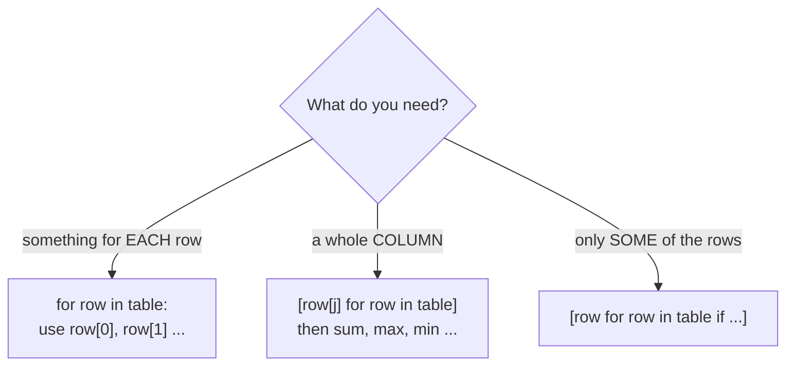

# Session 3 — Excel moves in Python

⬅ [Practice home](README.md) · [Course home](../../README.md)

You already know these moves from Excel: **SUM**, **IF**, **COUNTIF**, **VLOOKUP**, sorting, filtering, pivot tables. This session shows each one in Python, with a table of advertising campaigns.

```python
# channel, spend (EUR), clicks, orders
campaigns = [
    ["Instagram", 500, 5000, 100],
    ["TikTok",    300, 6000,  60],
    ["Email",     100, 2000, 100],
    ["Google",    800, 4000, 120],
    ["Flyers",    200,  500,   5],
]
```

Pixel Shop paid for ads on five **channels**. For each one we know the **spend** (money paid), the **clicks** (people who visited the shop through the ad) and the **orders** (people who actually bought).

### Marketing words in 30 seconds

| Word | Meaning |
|------|---------|
| **spend** | the money we paid for the ads |
| **click** | one visit to the shop that came from an ad |
| **order** | one purchase |
| **conversion rate** | out of every 100 clicks, how many became an order: `orders / clicks * 100` |
| **cost per order** | how much we paid to get one order: `spend / orders` |

### Excel to Python, side by side

| In Excel | What it does | In Python | Exercise |
|----------|--------------|-----------|----------|
| `=SUM(B2:B6)` | add up a column | a total variable, or `sum([row[1] for row in table])` | 3.1 |
| `=AVERAGE(C2:C6)` | average of a column | total divided by `len(...)` | 3.2 |
| `=MAX(B2:B6)` / `=MIN(...)` | biggest / smallest | `max(values)` / `min(values)` | 3.3 |
| `=COUNTIF(C2:C6,">3000")` | count the cells that match | a counter plus `if` | 3.4 |
| `=SUMIF(B2:B6,">250",D2:D6)` | add only the matching rows | an accumulator plus `if` | 3.5 |
| `=IF(E2>=2,"worth it","check")` | pick one of two answers | `if` / `else` | 3.6 |
| a formula in a new column, **dragged down** | the same formula for every row | `for row in table:` | 3.7 |
| `=VLOOKUP("Email",A2:D6,4,FALSE)` | find a row, read one cell | loop plus `if row[0] == name` | 3.8 |
| Sort largest to smallest | reorder the rows | `sorted(table, key=..., reverse=True)` | 3.9 |
| Filter | keep only matching rows | `[row for row in table if ...]` | 3.10 |
| PivotTable | total per group | a dictionary | 3.11 |

### Which loop do I need?



## The exercises at a glance

| # | Exercise | Level | Time |
|---|----------|-------|------|
| 3.1 | SUM a column | ⭐ easy | 3 min |
| 3.2 | AVERAGE a column | ⭐ easy | 3 min |
| 3.3 | Biggest and smallest | ⭐⭐ medium | 4 min |
| 3.4 | COUNTIF | ⭐⭐ medium | 3 min |
| 3.5 | SUMIF | ⭐⭐ medium | 4 min |
| 3.6 | IF | ⭐⭐ medium | 5 min |
| 3.7 | A formula column, dragged down | ⭐⭐ medium | 5 min |
| 3.8 | VLOOKUP | ⭐⭐⭐ stretch | 6 min |
| 3.9 | Sort largest to smallest | ⭐⭐⭐ stretch | 6 min |
| 3.10 | Filter | ⭐⭐ medium | 4 min |
| 3.11 | Bonus: a pivot table | ⭐⭐⭐ stretch | 7 min |

About **50 minutes** in total. Work top to bottom: each exercise leans on the one before it.

> **How to work:** read the task, type the data yourself, try it, open the **hint** only if you are stuck, and open the **solution** only after you have something that runs. Then compare — a different working answer is fine.

---

## Exercise 3.1 — SUM a column

Level: ⭐ easy · about 3 min

**Your task.** Print the **total spend** of all channels. (Excel: `=SUM(B2:B6)`.)

Start with this data:

```python
campaigns = [
    ["Instagram", 500, 5000, 100],
    ["TikTok",    300, 6000,  60],
    ["Email",     100, 2000, 100],
    ["Google",    800, 4000, 120],
    ["Flyers",    200,  500,   5],
]
```

You should see:

```text
Total spend: 1900 EUR
```

<details>
<summary>Hint (try without it first)</summary>

Start a total at `0`. Go through every row and add the cell in the **spend** column. Spend is column 1 (column 0 is the channel name).

</details>

<details>
<summary>Full solution</summary>

```python
campaigns = [
    ["Instagram", 500, 5000, 100],
    ["TikTok",    300, 6000,  60],
    ["Email",     100, 2000, 100],
    ["Google",    800, 4000, 120],
    ["Flyers",    200,  500,   5],
]
total_spend = 0
for row in campaigns:
    total_spend += row[1]
print("Total spend:", total_spend, "EUR")
```

**How it works**

- `total_spend = 0` is the empty piggy bank.
- Each pass of the loop drops `row[1]` into it: 500, then 300, then 100, 800, 200.
- 500 + 300 + 100 + 800 + 200 = **1900**.

The shortcut `sum([row[1] for row in campaigns])` gives the same result in one line.

</details>

---

## Exercise 3.2 — AVERAGE a column

Level: ⭐ easy · about 3 min

**Your task.** Print the **average number of clicks** per channel. (Excel: `=AVERAGE(C2:C6)`.)

Start with this data:

```python
campaigns = [
    ["Instagram", 500, 5000, 100],
    ["TikTok",    300, 6000,  60],
    ["Email",     100, 2000, 100],
    ["Google",    800, 4000, 120],
    ["Flyers",    200,  500,   5],
]
```

You should see:

```text
Average clicks: 3500.0
```

<details>
<summary>Hint (try without it first)</summary>

First pull the **clicks column** out as a plain list: `[row[2] for row in campaigns]`. After that it is the same as in Session 1: `sum(...)` divided by `len(...)`.

</details>

<details>
<summary>Full solution</summary>

```python
campaigns = [
    ["Instagram", 500, 5000, 100],
    ["TikTok",    300, 6000,  60],
    ["Email",     100, 2000, 100],
    ["Google",    800, 4000, 120],
    ["Flyers",    200,  500,   5],
]
clicks = [row[2] for row in campaigns]
print("Average clicks:", sum(clicks) / len(clicks))
```

**How it works**

`[row[2] for row in campaigns]` takes cell 2 from every row and builds a list: `[5000, 6000, 2000, 4000, 500]`. Once a column is a list, you can use every list tool you know: `sum`, `len`, `max`, `min`, `sorted`.

</details>

---

## Exercise 3.3 — Biggest and smallest

Level: ⭐⭐ medium · about 4 min

**Your task.** Which channel has the **biggest budget** and which has the **smallest**? Print each with its spend. (Excel: `=MAX` and `=MIN`, plus a lookup.)

Start with this data:

```python
campaigns = [
    ["Instagram", 500, 5000, 100],
    ["TikTok",    300, 6000,  60],
    ["Email",     100, 2000, 100],
    ["Google",    800, 4000, 120],
    ["Flyers",    200,  500,   5],
]
```

You should see:

```text
Biggest budget: Google (800 EUR)
Smallest budget: Email (100 EUR)
```

<details>
<summary>Hint (try without it first)</summary>

Pull the spend column out as a list. `max(spends)` gives the biggest number, and `spends.index(that number)` tells you **which row** it came from. Then `campaigns[that row]` gives you the whole row, name included.

</details>

<details>
<summary>Full solution</summary>

```python
campaigns = [
    ["Instagram", 500, 5000, 100],
    ["TikTok",    300, 6000,  60],
    ["Email",     100, 2000, 100],
    ["Google",    800, 4000, 120],
    ["Flyers",    200,  500,   5],
]
spends = [row[1] for row in campaigns]
biggest = campaigns[spends.index(max(spends))]
smallest = campaigns[spends.index(min(spends))]
print(f"Biggest budget: {biggest[0]} ({biggest[1]} EUR)")
print(f"Smallest budget: {smallest[0]} ({smallest[1]} EUR)")
```

**How it works**

The spend list and the campaigns table are in the **same order**, so a position in one is the same position in the other:

1. `max(spends)` is `800`.
2. `spends.index(800)` is `3`.
3. `campaigns[3]` is `["Google", 800, 4000, 120]`.

</details>

---

## Exercise 3.4 — COUNTIF

Level: ⭐⭐ medium · about 3 min

**Your task.** How many channels brought **more than 3000 clicks**? (Excel: `=COUNTIF(C2:C6,">3000")`.)

Start with this data:

```python
campaigns = [
    ["Instagram", 500, 5000, 100],
    ["TikTok",    300, 6000,  60],
    ["Email",     100, 2000, 100],
    ["Google",    800, 4000, 120],
    ["Flyers",    200,  500,   5],
]
```

You should see:

```text
Channels with more than 3000 clicks: 3
```

<details>
<summary>Hint (try without it first)</summary>

Use a counter that starts at `0`. In the loop, only add 1 **if** the row's clicks (column 2) are bigger than 3000.

</details>

<details>
<summary>Full solution</summary>

```python
campaigns = [
    ["Instagram", 500, 5000, 100],
    ["TikTok",    300, 6000,  60],
    ["Email",     100, 2000, 100],
    ["Google",    800, 4000, 120],
    ["Flyers",    200,  500,   5],
]
count = 0
for row in campaigns:
    if row[2] > 3000:
        count += 1
print("Channels with more than 3000 clicks:", count)
```

**How it works**

The `if` is the "COUNT**IF**". Instagram (5000), TikTok (6000) and Google (4000) pass the test; Email (2000) and Flyers (500) do not. So the counter ends at 3.

</details>

---

## Exercise 3.5 — SUMIF

Level: ⭐⭐ medium · about 4 min

**Your task.** How many orders came from the channels with a **spend above 250 EUR**? (Excel: `=SUMIF(B2:B6,">250",D2:D6)`.)

Start with this data:

```python
campaigns = [
    ["Instagram", 500, 5000, 100],
    ["TikTok",    300, 6000,  60],
    ["Email",     100, 2000, 100],
    ["Google",    800, 4000, 120],
    ["Flyers",    200,  500,   5],
]
```

You should see:

```text
Orders from big-budget channels: 280
```

<details>
<summary>Hint (try without it first)</summary>

Like COUNTIF, but instead of adding 1 you add the **orders** (column 3). The `if` checks one column (spend) while you add another column (orders).

</details>

<details>
<summary>Full solution</summary>

```python
campaigns = [
    ["Instagram", 500, 5000, 100],
    ["TikTok",    300, 6000,  60],
    ["Email",     100, 2000, 100],
    ["Google",    800, 4000, 120],
    ["Flyers",    200,  500,   5],
]
orders_from_big = 0
for row in campaigns:
    if row[1] > 250:
        orders_from_big += row[3]
print("Orders from big-budget channels:", orders_from_big)
```

**How it works**

The test uses column 1 (spend), the thing you add uses column 3 (orders). Instagram, TikTok and Google pass: 100 + 60 + 120 = **280**.

</details>

---

## Exercise 3.6 — IF

Level: ⭐⭐ medium · about 5 min

**Your task.** For each channel, work out the **conversion rate** (orders out of every 100 clicks). Say **"worth it"** if it is 2% or more, otherwise **"check again"**. (Excel: `=IF(E2>=2,"worth it","check again")`.)

Start with this data:

```python
campaigns = [
    ["Instagram", 500, 5000, 100],
    ["TikTok",    300, 6000,  60],
    ["Email",     100, 2000, 100],
    ["Google",    800, 4000, 120],
    ["Flyers",    200,  500,   5],
]
```

You should see:

```text
Instagram   2.0%  worth it
TikTok      1.0%  check again
Email       5.0%  worth it
Google      3.0%  worth it
Flyers      1.0%  check again
```

<details>
<summary>Hint (try without it first)</summary>

Conversion rate = orders ÷ clicks × 100. That is `row[3] / row[2] * 100`. Then a normal `if` / `else` picks the text.

</details>

<details>
<summary>Full solution</summary>

```python
campaigns = [
    ["Instagram", 500, 5000, 100],
    ["TikTok",    300, 6000,  60],
    ["Email",     100, 2000, 100],
    ["Google",    800, 4000, 120],
    ["Flyers",    200,  500,   5],
]
for row in campaigns:
    channel = row[0]
    conversion = row[3] / row[2] * 100
    if conversion >= 2:
        verdict = "worth it"
    else:
        verdict = "check again"
    print(f"{channel:<10}{conversion:>5.1f}%  {verdict}")
```

**How it works**

Instagram: 100 orders out of 5000 clicks is 2 out of every 100 clicks, so 2.0%.

The `if` / `else` can be squeezed into one line, just like Excel's `IF`:

```python
verdict = "worth it" if conversion >= 2 else "check again"
```

`{channel:<10}` and `{conversion:>5.1f}` line the columns up (Session 2, exercise 2.3).

</details>

---

## Exercise 3.7 — A formula column, dragged down

Level: ⭐⭐ medium · about 5 min

**Your task.** Add a **cost per order** cell at the end of every row (`spend / orders`, rounded to 2 decimals). Then print the rows.

Start with this data:

```python
campaigns = [
    ["Instagram", 500, 5000, 100],
    ["TikTok",    300, 6000,  60],
    ["Email",     100, 2000, 100],
    ["Google",    800, 4000, 120],
    ["Flyers",    200,  500,   5],
]
```

You should see:

```text
['Instagram', 500, 5000, 100, 5.0]
['TikTok', 300, 6000, 60, 5.0]
['Email', 100, 2000, 100, 1.0]
['Google', 800, 4000, 120, 6.67]
['Flyers', 200, 500, 5, 40.0]
```

<details>
<summary>Hint (try without it first)</summary>

This is exactly Exercise 2.9 again (the Total column), with a different formula: spend is `row[1]`, orders is `row[3]`. Use `round(..., 2)`.

</details>

<details>
<summary>Full solution</summary>

```python
campaigns = [
    ["Instagram", 500, 5000, 100],
    ["TikTok",    300, 6000,  60],
    ["Email",     100, 2000, 100],
    ["Google",    800, 4000, 120],
    ["Flyers",    200,  500,   5],
]
for row in campaigns:
    row.append(round(row[1] / row[3], 2))

for row in campaigns:
    print(row)
```

**How it works**

In Excel you type the formula once and drag it down. In Python the `for` loop does the dragging.

Read the Flyers row: `['Flyers', 200, 500, 5, 40.0]`. Each order from flyers cost 40 EUR, while an Email order cost only 1 EUR. That is the kind of discovery a new column gives you.

</details>

---

## Exercise 3.8 — VLOOKUP

Level: ⭐⭐⭐ stretch · about 6 min

**Your task.** Look up the number of **orders** for the channel "Email" and for the channel "Radio". If the channel is not in the table, say so. (Excel: `=VLOOKUP("Email",A2:D6,4,FALSE)`.)

Start with this data:

```python
campaigns = [
    ["Instagram", 500, 5000, 100],
    ["TikTok",    300, 6000,  60],
    ["Email",     100, 2000, 100],
    ["Google",    800, 4000, 120],
    ["Flyers",    200,  500,   5],
]
```

You should see:

```text
Email got 100 orders
Radio: not found
```

<details>
<summary>Hint (try without it first)</summary>

Walk down the table and compare each row's first cell with the name you are looking for. When it matches, print and stop with `break`. Use a variable `found = False` that you set to `True` on a match, so that after the loop you know whether to print "not found".

</details>

<details>
<summary>Full solution</summary>

```python
campaigns = [
    ["Instagram", 500, 5000, 100],
    ["TikTok",    300, 6000,  60],
    ["Email",     100, 2000, 100],
    ["Google",    800, 4000, 120],
    ["Flyers",    200,  500,   5],
]
for wanted in ["Email", "Radio"]:
    found = False
    for row in campaigns:
        if row[0] == wanted:
            print(f"{wanted} got {row[3]} orders")
            found = True
            break
    if not found:
        print(f"{wanted}: not found")
```

**How it works**

- The outer loop tries two names. The inner loop is the actual search.
- `break` stops searching the moment we have a match (VLOOKUP also stops at the first match).
- `found` is a little flag. If the whole table was searched and the flag is still `False`, nothing matched.

Excel shows `#N/A` when VLOOKUP finds nothing. Python does not warn you unless **you** write the "not found" case, so always write it.

</details>

---

## Exercise 3.9 — Sort largest to smallest

Level: ⭐⭐⭐ stretch · about 6 min

**Your task.** Show the channels ranked by **orders**, most orders first. Print each channel with its orders. (Excel: Data, Sort, largest to smallest.)

Start with this data:

```python
campaigns = [
    ["Instagram", 500, 5000, 100],
    ["TikTok",    300, 6000,  60],
    ["Email",     100, 2000, 100],
    ["Google",    800, 4000, 120],
    ["Flyers",    200,  500,   5],
]
```

You should see:

```text
Google      120
Instagram   100
Email       100
TikTok       60
Flyers        5
```

<details>
<summary>Hint (try without it first)</summary>

`sorted(table)` does not know **which column** to sort by. Tell it with `key=`: write a tiny function that takes a row and returns the cell to compare. Add `reverse=True` for biggest first.

</details>

<details>
<summary>Full solution</summary>

```python
campaigns = [
    ["Instagram", 500, 5000, 100],
    ["TikTok",    300, 6000,  60],
    ["Email",     100, 2000, 100],
    ["Google",    800, 4000, 120],
    ["Flyers",    200,  500,   5],
]
def get_orders(row):
    return row[3]

ranked = sorted(campaigns, key=get_orders, reverse=True)
for row in ranked:
    print(f"{row[0]:<10}{row[3]:>5}")
```

**How it works**

- `get_orders(row)` receives one row and gives back its orders cell.
- `sorted(..., key=get_orders)` calls that function for every row and sorts by the answers.
- Instagram and Email tie with 100 orders. `sorted` keeps tied rows in their **original order**, so Instagram stays above Email.

A shorter way to write the key function without a name (you will see this a lot):

```python
ranked = sorted(campaigns, key=lambda row: row[3], reverse=True)
```

</details>

---

## Exercise 3.10 — Filter

Level: ⭐⭐ medium · about 4 min

**Your task.** Show only the channels with a **spend of 300 EUR or less**. Print their names and spend. (Excel: Filter.)

Start with this data:

```python
campaigns = [
    ["Instagram", 500, 5000, 100],
    ["TikTok",    300, 6000,  60],
    ["Email",     100, 2000, 100],
    ["Google",    800, 4000, 120],
    ["Flyers",    200,  500,   5],
]
```

You should see:

```text
TikTok 300
Email 100
Flyers 200
```

<details>
<summary>Hint (try without it first)</summary>

Same one-line pattern as the viral posts in Session 1, but now you keep **whole rows**: `[row for row in campaigns if ...]`. The test looks at the spend cell, `row[1]`.

</details>

<details>
<summary>Full solution</summary>

```python
campaigns = [
    ["Instagram", 500, 5000, 100],
    ["TikTok",    300, 6000,  60],
    ["Email",     100, 2000, 100],
    ["Google",    800, 4000, 120],
    ["Flyers",    200,  500,   5],
]
cheap = [row for row in campaigns if row[1] <= 300]
for row in cheap:
    print(row[0], row[1])
```

**How it works**

`cheap` is a smaller table: it contains the full TikTok, Email and Flyers rows. You can loop over it, sum it, sort it, just like any other table.

</details>

---

## Exercise 3.11 — Bonus: a pivot table

Level: ⭐⭐⭐ stretch · about 7 min

**Your task.** Pixel Shop's orders are listed one product at a time (the same product can appear many times). Work out the **total quantity per product**. (Excel: PivotTable.)

Start with this data:

```python
orders = [
    ["Hoodie", 2], ["Cap", 1], ["Hoodie", 1],
    ["Mug", 3], ["Cap", 2], ["Hoodie", 1],
]
```

You should see:

```text
Hoodie 4
Cap 3
Mug 3
```

<details>
<summary>Hint (try without it first)</summary>

Use a **dictionary** as a notebook: product name on the left, running total on the right. For each order, look up the product's total so far (or `0` if it is new), add the quantity, and write it back. `totals.get(product, 0)` means "the total so far, or 0".

</details>

<details>
<summary>Full solution</summary>

```python
orders = [
    ["Hoodie", 2], ["Cap", 1], ["Hoodie", 1],
    ["Mug", 3], ["Cap", 2], ["Hoodie", 1],
]
totals = {}
for product, quantity in orders:
    totals[product] = totals.get(product, 0) + quantity

for product, quantity in totals.items():
    print(product, quantity)
```

**How it works**

- `for product, quantity in orders` splits each little 2-cell row into its two parts as it loops.
- `totals.get(product, 0)` reads the notebook: the number so far, or `0` the first time we see a product.
- Then we write the new total back into the notebook.
- At the end the notebook says Hoodie 4, Cap 3, Mug 3.

This "total per group" idea is one of the most useful in all of data work. Pandas and Polars do it in one line (see below).

</details>

---

All the solutions of this session in one runnable file: [`exercise-bank/practice/practice_03_excel_moves.py`](../../exercise-bank/practice/practice_03_excel_moves.py)

⬅ [Session 2: Tables](02-tables.md) · ➡ [Session 4: Functions on tables](04-functions-on-tables.md)
