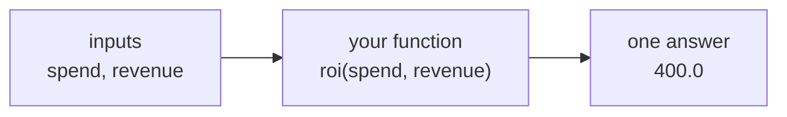

# Session 4 — Functions on tables — your own formulas

⬅ [Practice home](README.md) · [Course home](../../README.md)

In Excel you can write a formula once and use it in a hundred cells. A **function** is the same idea in Python: you write the recipe once, give it a name, and use it as often as you like.



```python
def roi(spend, revenue):                      # def + a name + the inputs
    return (revenue - spend) / spend * 100    # return = hand the answer back
```

### Three rules for good functions

| Rule | Why |
|------|-----|
| **One job per function.** | A function called `roi` should only calculate ROI. Small functions are easy to check. |
| **`return` the answer, do not `print` it.** | A returned value can be used again: stored, added up, put in a table. A printed value is gone. |
| **Protect against zero.** | Dividing by zero crashes the program. Real data contains zeros (an ad with 0 orders). |

### Testing with `assert`

`assert` is a tiny test. It says nothing when the statement is true and **stops the program loudly** when it is false:

```python
assert roi(500, 2500) == 400.0     # silent: all good
assert roi(500, 2500) == 999.0     # AssertionError: this is wrong!
```

Most solutions in this session end with a few `assert` lines. Add your own. It takes 10 seconds and tells you whether you can trust the function.

Remember the marketing words from [Session 3](03-excel-moves.md): *conversion rate* is `orders / clicks * 100`, and *cost per order* is `spend / orders`.

## The exercises at a glance

| # | Exercise | Level | Time |
|---|----------|-------|------|
| 4.1 | Your first formula | ⭐ easy | 3 min |
| 4.2 | Conversion rate | ⭐⭐ medium | 5 min |
| 4.3 | Return on investment | ⭐⭐ medium | 5 min |
| 4.4 | A function that takes a row | ⭐ easy | 3 min |
| 4.5 | Get a column | ⭐⭐ medium | 4 min |
| 4.6 | A safe average | ⭐⭐ medium | 4 min |
| 4.7 | The best row | ⭐⭐⭐ stretch | 6 min |
| 4.8 | Keep only some rows | ⭐⭐ medium | 4 min |
| 4.9 | Add a calculated column | ⭐⭐⭐ stretch | 8 min |
| 4.10 | A reusable table printer | ⭐⭐⭐ stretch | 8 min |

About **50 minutes** in total. Work top to bottom: each exercise leans on the one before it.

> **How to work:** read the task, type the data yourself, try it, open the **hint** only if you are stuck, and open the **solution** only after you have something that runs. Then compare — a different working answer is fine.

---

## Exercise 4.1 — Your first formula

Level: ⭐ easy · about 3 min

**Your task.** Write a function `money(amount)` that turns a number into text with **2 decimals and the word EUR**. Test it with `12.5`, `0.1` and `1900`.

You should see:

```text
12.50 EUR
0.10 EUR
1900.00 EUR
```

<details>
<summary>Hint (try without it first)</summary>

Start with `def money(amount):`. Inside, build the text with an f-string: `f"{amount:.2f} EUR"`. The key word is **return**, not print.

</details>

<details>
<summary>Full solution</summary>

```python
def money(amount):
    return f"{amount:.2f} EUR"

print(money(12.5))
print(money(0.1))
print(money(1900))
```

**How it works**

- `def money(amount):` — "I am defining a function called `money` that takes one input, called `amount`".
- `return f"..."` — hands the finished text back to whoever called the function.
- `money(12.5)` is the *call*. It runs the recipe with `amount = 12.5`.

`{amount:.2f}` is the "2 decimals" format from Lesson 2. Now every report in your program can show money the same way, and if you ever want "€" instead of "EUR", you change it in **one place**.

</details>

---

## Exercise 4.2 — Conversion rate

Level: ⭐⭐ medium · about 5 min

**Your task.** Write `conversion_rate(clicks, orders)`: out of every 100 clicks, how many became an order? Round to 2 decimals. If there were **0 clicks**, return `0.0` instead of crashing. Test it.

You should see:

```text
2.0
5.0
0.0
```

<details>
<summary>Hint (try without it first)</summary>

The formula is `orders / clicks * 100`. But dividing by `0` crashes, so check for `clicks == 0` **first** and `return 0.0` straight away. Anything after a `return` is skipped.

</details>

<details>
<summary>Full solution</summary>

```python
def conversion_rate(clicks, orders):
    if clicks == 0:
        return 0.0
    return round(orders / clicks * 100, 2)

print(conversion_rate(5000, 100))
print(conversion_rate(2000, 100))
print(conversion_rate(0, 0))

assert conversion_rate(5000, 100) == 2.0
assert conversion_rate(0, 0) == 0.0
```

**How it works**

- If `clicks` is `0`, the function returns `0.0` at once and never reaches the division.
- Otherwise it calculates and rounds.
- 100 orders out of 5000 clicks is `2.0`: two buyers for every hundred visitors.

The two `assert` lines are silent, which means both passed.

**What happens without the guard**

```python
try:
    print(0 / 0)
except ZeroDivisionError as error:
    print("Crash:", error)
```

which prints:

```text
Crash: division by zero
```

</details>

---

## Exercise 4.3 — Return on investment

Level: ⭐⭐ medium · about 5 min

**Your task.** **ROI** (return on investment) tells you how much money an ad earned compared with what it cost: `(money earned - money spent) / money spent * 100`. Spend 100 and get back 300, and the ROI is **200%**. Write `roi(spend, revenue)`, rounded to 2 decimals, returning `0.0` when `spend` is 0. Test it with an ad that makes money and one that loses money.

You should see:

```text
400.0
-37.5
```

<details>
<summary>Hint (try without it first)</summary>

Profit is `revenue - spend`. ROI is the profit divided by the spend, times 100. Do not forget the brackets around `revenue - spend`, and guard `spend == 0` first.

</details>

<details>
<summary>Full solution</summary>

```python
def roi(spend, revenue):
    if spend == 0:
        return 0.0
    return round((revenue - spend) / spend * 100, 2)

print(roi(500, 2500))
print(roi(200, 125))

assert roi(100, 300) == 200.0
assert roi(500, 2500) == 400.0
assert roi(200, 125) == -37.5
```

**How it works**

- `roi(500, 2500)`: profit is 2000 on a spend of 500, which is `400.0`%.
- `roi(200, 125)`: we spent 200 and got back only 125, so the profit is **-75**. ROI is `-37.5`: a **negative ROI means the ad lost money**.

The brackets matter: `revenue - spend / spend * 100` would divide first and give a nonsense answer.

</details>

---

## Exercise 4.4 — A function that takes a row

Level: ⭐ easy · about 3 min

**Your task.** Write `row_total(row)` that adds up the numbers in one row of the sales table (skipping the product name). Use it in a loop to print every product's total.

Start with this data:

```python
sales = [
    ["Hoodie",   30,  45, 50],
    ["Cap",      20,  15, 25],
    ["Mug",      40,  35, 60],
    ["Sticker", 100, 120, 90],
]
```

You should see:

```text
Hoodie 125
Cap 60
Mug 135
Sticker 310
```

<details>
<summary>Hint (try without it first)</summary>

You already wrote this in Session 2 (exercise 2.4). Wrap `sum(row[1:])` in a function that takes **one row** as its input and returns the total.

</details>

<details>
<summary>Full solution</summary>

```python
sales = [
    ["Hoodie",   30,  45, 50],
    ["Cap",      20,  15, 25],
    ["Mug",      40,  35, 60],
    ["Sticker", 100, 120, 90],
]
def row_total(row):
    return sum(row[1:])

for row in sales:
    print(row[0], row_total(row))

assert row_total(["Hoodie", 30, 45, 50]) == 125
```

**How it works**

The input of this function is a whole **row** (a list). That is completely normal: functions can take lists, tables, numbers, text, anything.

Compare with Exercise 2.4: the maths is identical, but now it has a **name**. `row_total(row)` is much easier to read than `sum(row[1:])`.

</details>

---

## Exercise 4.5 — Get a column

Level: ⭐⭐ medium · about 4 min

**Your task.** Write `column(table, j)` that returns column number `j` of a table as a plain list. Use it to get the **January** column of the sales table, then print the column, its total and its biggest value.

Start with this data:

```python
sales = [
    ["Hoodie",   30,  45, 50],
    ["Cap",      20,  15, 25],
    ["Mug",      40,  35, 60],
    ["Sticker", 100, 120, 90],
]
```

You should see:

```text
January column: [30, 20, 40, 100]
January total: 190
Best January: 100
```

<details>
<summary>Hint (try without it first)</summary>

You met the trick in Session 2: `[row[j] for row in table]` builds a list from cell `j` of every row. Wrap it in a function so you can ask for *any* column by number.

</details>

<details>
<summary>Full solution</summary>

```python
sales = [
    ["Hoodie",   30,  45, 50],
    ["Cap",      20,  15, 25],
    ["Mug",      40,  35, 60],
    ["Sticker", 100, 120, 90],
]
def column(table, j):
    return [row[j] for row in table]

january = column(sales, 1)
print("January column:", january)
print("January total:", sum(january))
print("Best January:", max(january))

assert column(sales, 1) == [30, 20, 40, 100]
```

**How it works**

`column(sales, 1)` means "give me column 1 of `sales`". Once a column is a plain list, `sum`, `max`, `min`, `len` and `sorted` all work on it.

This is exactly what data-frame libraries give you with `df["Jan"]`: *one column*, ready to calculate with.

</details>

---

## Exercise 4.6 — A safe average

Level: ⭐⭐ medium · about 4 min

**Your task.** Write `average(numbers)`. If the list is **empty**, return `0.0` instead of crashing. Test it with `[30, 20, 40, 100]` and with `[]`.

You should see:

```text
47.5
0.0
```

<details>
<summary>Hint (try without it first)</summary>

An average is `sum(...) / len(...)`. If the list is empty, `len` is `0` and the division crashes. Check for an empty list **first** and `return 0.0` straight away.

</details>

<details>
<summary>Full solution</summary>

```python
def average(numbers):
    if len(numbers) == 0:
        return 0.0
    return sum(numbers) / len(numbers)

print(average([30, 20, 40, 100]))
print(average([]))

assert average([30, 20, 40, 100]) == 47.5
assert average([]) == 0.0
```

**How it works**

An empty list is not a strange case: a filter that matches nothing, a month with no sales, or an empty file all produce one. A function that crashes on empty input will crash on a Monday morning when nobody is watching.

A guard like this is **one line of safety** that you write once and then forget about.

**What happens without the guard**

```python
try:
    print(sum([]) / len([]))
except ZeroDivisionError as error:
    print("Crash:", error)
```

which prints:

```text
Crash: division by zero
```

</details>

---

## Exercise 4.7 — The best row

Level: ⭐⭐⭐ stretch · about 6 min

**Your task.** Write `best_row(table, j)` that returns the **whole row** with the biggest value in column `j`. Use it to find the channel with the most **orders** and the channel with the most **clicks**.

Start with this data:

```python
campaigns = [
    ["Instagram", 500, 5000, 100],
    ["TikTok",    300, 6000,  60],
    ["Email",     100, 2000, 100],
    ["Google",    800, 4000, 120],
    ["Flyers",    200,  500,   5],
]
```

You should see:

```text
Most orders: Google 120
Most clicks: TikTok
```

<details>
<summary>Hint (try without it first)</summary>

Keep a "champion so far" variable, like in Session 2 (the best seller). Start with the **first row** as the champion. Go through all the rows; whenever a row's cell `j` beats the champion's cell `j`, that row becomes the new champion. At the end, `return` it.

</details>

<details>
<summary>Full solution</summary>

```python
campaigns = [
    ["Instagram", 500, 5000, 100],
    ["TikTok",    300, 6000,  60],
    ["Email",     100, 2000, 100],
    ["Google",    800, 4000, 120],
    ["Flyers",    200,  500,   5],
]
def best_row(table, j):
    best = table[0]
    for row in table:
        if row[j] > best[j]:
            best = row
    return best

winner = best_row(campaigns, 3)
print("Most orders:", winner[0], winner[3])
print("Most clicks:", best_row(campaigns, 2)[0])

assert best_row(campaigns, 3)[0] == "Google"
assert best_row(campaigns, 2)[0] == "TikTok"
```

**How it works**

- `best = table[0]` — the first row is champion before the race starts.
- `row[j] > best[j]` — compare the same column of the challenger and the champion.
- It returns the **whole row**, so you can read any cell you like: the name with `[0]`, the orders with `[3]`.

We start from the first row instead of `0` so that it also works when all the numbers are negative. (An empty table would still crash: `table[0]` has nothing to give. Can you add a guard?)

</details>

---

## Exercise 4.8 — Keep only some rows

Level: ⭐⭐ medium · about 4 min

**Your task.** Write `filter_rows(table, j, minimum)` that returns only the rows where column `j` is **at least** `minimum`. Use it to list the channels with **4000 clicks or more**.

Start with this data:

```python
campaigns = [
    ["Instagram", 500, 5000, 100],
    ["TikTok",    300, 6000,  60],
    ["Email",     100, 2000, 100],
    ["Google",    800, 4000, 120],
    ["Flyers",    200,  500,   5],
]
```

You should see:

```text
['Instagram', 'TikTok', 'Google']
```

<details>
<summary>Hint (try without it first)</summary>

You did this in Session 3 (exercise 3.10) with the number written straight into the code. Now the **column** and the **minimum** become inputs of the function, so one function works for any column.

</details>

<details>
<summary>Full solution</summary>

```python
campaigns = [
    ["Instagram", 500, 5000, 100],
    ["TikTok",    300, 6000,  60],
    ["Email",     100, 2000, 100],
    ["Google",    800, 4000, 120],
    ["Flyers",    200,  500,   5],
]
def filter_rows(table, j, minimum):
    return [row for row in table if row[j] >= minimum]

busy = filter_rows(campaigns, 2, 4000)
print([row[0] for row in busy])

assert len(filter_rows(campaigns, 2, 4000)) == 3
assert filter_rows(campaigns, 2, 99999) == []
```

**How it works**

- `filter_rows(campaigns, 2, 4000)` means "from `campaigns`, keep rows whose column 2 is 4000 or more".
- The result is a smaller table (Instagram, TikTok, Google), and `[row[0] for row in busy]` picks just the names out of it.
- The second `assert` checks the boring case: nothing matches, so you get an empty table `[]`, not a crash.

In a data frame this is `df[df["Clicks"] >= 4000]`.

</details>

---

## Exercise 4.9 — Add a calculated column

Level: ⭐⭐⭐ stretch · about 8 min

**Your task.** Write `add_column(table, make_value)` that returns a **new table** where every row has one extra cell at the end. The extra cell is the answer of the function `make_value`, which is called with that row. Use it to add the **conversion rate** to the campaigns table. The original table must stay unchanged.

Start with this data:

```python
campaigns = [
    ["Instagram", 500, 5000, 100],
    ["TikTok",    300, 6000,  60],
    ["Email",     100, 2000, 100],
    ["Google",    800, 4000, 120],
    ["Flyers",    200,  500,   5],
]

def conversion_rate(clicks, orders):          # from exercise 4.2
    if clicks == 0:
        return 0.0
    return round(orders / clicks * 100, 2)
```

You should see:

```text
['Instagram', 500, 5000, 100, 2.0]
['TikTok', 300, 6000, 60, 1.0]
['Email', 100, 2000, 100, 5.0]
['Google', 800, 4000, 120, 3.0]
['Flyers', 200, 500, 5, 1.0]
The original still has 4 columns
```

<details>
<summary>Hint (try without it first)</summary>

Two ideas. **First:** a function can be given to another function as an input, just like a number. The function you pass in (`make_value`) is the *recipe* for the new cell, and `add_column` calls it once per row. **Second:** `row[:]` makes a *copy* of a list, so that appending to the copy does not touch the original.

</details>

<details>
<summary>Full solution</summary>

```python
campaigns = [
    ["Instagram", 500, 5000, 100],
    ["TikTok",    300, 6000,  60],
    ["Email",     100, 2000, 100],
    ["Google",    800, 4000, 120],
    ["Flyers",    200,  500,   5],
]

def conversion_rate(clicks, orders):          # from exercise 4.2
    if clicks == 0:
        return 0.0
    return round(orders / clicks * 100, 2)
def add_column(table, make_value):
    new_table = []
    for row in table:
        new_row = row[:]                   # a copy of the row
        new_row.append(make_value(row))    # the new cell
        new_table.append(new_row)
    return new_table

def conversion(row):
    return conversion_rate(row[2], row[3])

with_conversion = add_column(campaigns, conversion)
for row in with_conversion:
    print(row)
print("The original still has", len(campaigns[0]), "columns")
```

**How it works**

- `make_value(row)` is a call to whatever function was passed in. For us that is `conversion`, which picks the clicks and orders out of the row and calls `conversion_rate`.
- `row[:]` is a copy. Without it, `new_row.append(...)` would also change the row in `campaigns` (a list is shared, not duplicated, when you just write `new_row = row`).
- `add_column` works for **any** recipe: give it a different one and it adds a different column.

This is what data frames do all the time: `df["Conv"] = df.apply(...)`. You have just built the idea yourself.

</details>

---

## Exercise 4.10 — A reusable table printer

Level: ⭐⭐⭐ stretch · about 8 min

**Your task.** Write `print_table(header, rows)` that prints any table neatly: names on the left, numbers on the right, **decimal numbers with 2 decimals**, and a line under the header. Try it on the table below.

Start with this data:

```python
header = ["Channel", "Spend", "Clicks", "Orders", "Conv %"]
rows = [
    ["Instagram", 500, 5000, 100, 2.0],
    ["TikTok",    300, 6000,  60, 1.0],
    ["Email",     100, 2000, 100, 5.0],
    ["Google",    800, 4000, 120, 3.0],
    ["Flyers",    200,  500,   5, 1.0],
]
```

You should see:

```text
Channel          Spend    Clicks    Orders    Conv %
----------------------------------------------------
Instagram          500      5000       100      2.00
TikTok             300      6000        60      1.00
Email              100      2000       100      5.00
Google             800      4000       120      3.00
Flyers             200       500         5      1.00
```

<details>
<summary>Hint (try without it first)</summary>

Split the job in two. A small function `format_cell(cell)` decides how **one cell** looks: if it is a decimal number (`isinstance(cell, float)`) use `.2f`, otherwise print it as it is. Then `print_table` builds each line by adding the formatted cells together.

</details>

<details>
<summary>Full solution</summary>

```python
header = ["Channel", "Spend", "Clicks", "Orders", "Conv %"]
rows = [
    ["Instagram", 500, 5000, 100, 2.0],
    ["TikTok",    300, 6000,  60, 1.0],
    ["Email",     100, 2000, 100, 5.0],
    ["Google",    800, 4000, 120, 3.0],
    ["Flyers",    200,  500,   5, 1.0],
]
def format_cell(cell):
    if isinstance(cell, float):
        return f"{cell:>10.2f}"
    return f"{cell:>10}"

def print_table(header, rows):
    line = f"{header[0]:<12}"
    for name in header[1:]:
        line += f"{name:>10}"
    print(line)
    print("-" * len(line))
    for row in rows:
        line = f"{row[0]:<12}"
        for cell in row[1:]:
            line += format_cell(cell)
        print(line)

print_table(header, rows)
```

**How it works**

- `isinstance(cell, float)` asks "is this cell a decimal number?". Whole numbers (`500`) are `int`, decimals (`2.0`) are `float`.
- `line += ...` glues text onto the line, cell by cell.
- `"-" * len(line)` draws a line exactly as long as the header.
- `print_table` **calls** `format_cell`: functions can use other functions, which is how big programs are built from small, checkable pieces.

Keep this function. You will use it in the next session's project, and it works for any table with a name in the first column.

</details>

---

All the solutions of this session in one runnable file: [`exercise-bank/practice/practice_04_functions.py`](../../exercise-bank/practice/practice_04_functions.py)

⬅ [Session 3: Excel moves in Python](03-excel-moves.md) · ➡ [Session 5: The weekly campaign report](05-campaign-report.md)
