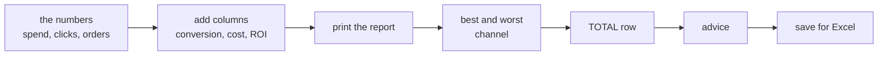

# Session 5 — The weekly campaign report (project)

⬅ [Practice home](README.md) · [Course home](../../README.md)

Time to put it all together. Your boss asks: *"Which of our ads are worth the money?"* You will answer with a proper report, built step by step from the pieces you already know.



### How to work

1. Create a file called `campaign_report.py`.
2. Copy the **toolbox** below to the top of it. It is nothing new: every function in it is one you wrote in [Session 4](04-functions-on-tables.md), except `cost_per_order`, which is a twin of `conversion_rate` (spend divided by orders instead of orders divided by clicks).
3. Add each step **below** the previous one, and run the file after every step.

<details>
<summary>The toolbox (click to open)</summary>

```python
def conversion_rate(clicks, orders):
    if clicks == 0:
        return 0.0
    return round(orders / clicks * 100, 2)


def cost_per_order(spend, orders):
    if orders == 0:
        return 0.0
    return round(spend / orders, 2)


def roi(spend, revenue):
    if spend == 0:
        return 0.0
    return round((revenue - spend) / spend * 100, 2)


def column(table, j):
    return [row[j] for row in table]


def add_column(table, make_value):
    new_table = []
    for row in table:
        new_row = row[:]
        new_row.append(make_value(row))
        new_table.append(new_row)
    return new_table


def format_cell(cell):
    if isinstance(cell, float):
        return f"{cell:>10.2f}"
    return f"{cell:>10}"


def print_table(header, rows):
    line = f"{header[0]:<12}"
    for name in header[1:]:
        line += f"{name:>10}"
    print(line)
    print("-" * len(line))
    for row in rows:
        line = f"{row[0]:<12}"
        for cell in row[1:]:
            line += format_cell(cell)
        print(line)
```

</details>

The toolbox gives you: `conversion_rate`, `cost_per_order`, `roi`, `column`, `add_column`, `format_cell` and `print_table`.

Every order brings in **25 EUR**. That is all we need to work out the revenue and the ROI.

## The exercises at a glance

| # | Exercise | Level | Time |
|---|----------|-------|------|
| 5.1 | The numbers and four new columns | ⭐⭐ medium | 8 min |
| 5.2 | Print the report | ⭐ easy | 3 min |
| 5.3 | Best and worst channel | ⭐⭐ medium | 5 min |
| 5.4 | A TOTAL row | ⭐⭐⭐ stretch | 8 min |
| 5.5 | Advice for the boss | ⭐⭐⭐ stretch | 6 min |
| 5.6 | Send it to Excel | ⭐⭐⭐ stretch | 8 min |

About **38 minutes** in total. Work top to bottom: each exercise leans on the one before it.

> **How to work:** read the task, type the data yourself, try it, open the **hint** only if you are stuck, and open the **solution** only after you have something that runs. Then compare — a different working answer is fine.

---

## Exercise 5.1 — The numbers and four new columns

Level: ⭐⭐ medium · about 8 min

**Your task.** Put the campaign numbers into a table. Then add four columns: **conversion rate**, **cost per order**, **revenue** (orders times 25 EUR) and **ROI**. Print the header and the first row to check.

You should see:

```text
['Channel', 'Spend', 'Clicks', 'Orders', 'Conv %', 'Per order', 'Revenue', 'ROI %']
['Instagram', 500, 5000, 100, 2.0, 5.0, 2500, 400.0]
```

<details>
<summary>Hint (try without it first)</summary>

For each new column, write a tiny function that takes **one row** and returns the new cell, then hand it to `add_column`. The order matters: the ROI needs the revenue, so the revenue column must already exist (it will be column 6).

</details>

<details>
<summary>Full solution</summary>

```python
header = ["Channel", "Spend", "Clicks", "Orders"]
rows = [
    ["Instagram", 500, 5000, 100],
    ["TikTok",    300, 6000,  60],
    ["Email",     100, 2000, 100],
    ["Google",    800, 4000, 120],
    ["Flyers",    200,  500,   5],
]
REVENUE_PER_ORDER = 25


def get_conversion(row):
    return conversion_rate(row[2], row[3])


def get_cost_per_order(row):
    return cost_per_order(row[1], row[3])


def get_revenue(row):
    return row[3] * REVENUE_PER_ORDER


def get_roi(row):
    return roi(row[1], row[6])      # spend and revenue (column 6)


rows = add_column(rows, get_conversion)        # becomes column 4
rows = add_column(rows, get_cost_per_order)    # column 5
rows = add_column(rows, get_revenue)           # column 6
rows = add_column(rows, get_roi)               # column 7
header = header + ["Conv %", "Per order", "Revenue", "ROI %"]

print(header)
print(rows[0])
```

**How it works**

Each `get_...` function is a recipe for **one cell**, and `add_column` applies it to every row. This is exactly Session 4, exercise 4.9.

Check the first row by hand: Instagram has 100 orders from 5000 clicks (2.0%), pays 500 EUR for 100 orders (5.0 EUR each), earns 100 × 25 = 2500 EUR, and so makes `(2500 - 500) / 500 * 100` = 400% ROI.

</details>

---

## Exercise 5.2 — Print the report

Level: ⭐ easy · about 3 min

**Your task.** Print the finished table with `print_table`.

You should see:

```text
Channel          Spend    Clicks    Orders    Conv % Per order   Revenue     ROI %
----------------------------------------------------------------------------------
Instagram          500      5000       100      2.00      5.00      2500    400.00
TikTok             300      6000        60      1.00      5.00      1500    400.00
Email              100      2000       100      5.00      1.00      2500   2400.00
Google             800      4000       120      3.00      6.67      3000    275.00
Flyers             200       500         5      1.00     40.00       125    -37.50
```

<details>
<summary>Hint (try without it first)</summary>

One line, and it is the reward for building the toolbox.

</details>

<details>
<summary>Full solution</summary>

```python
print_table(header, rows)
```

**How it works**

`print_table` uses `format_cell` to show whole numbers as they are and decimals with 2 places. Because it was written to work for **any** table, it needed no changes for the new columns.

</details>

---

## Exercise 5.3 — Best and worst channel

Level: ⭐⭐ medium · about 5 min

**Your task.** Which channel has the **best ROI** and which has the **worst**? Print both with their ROI.

You should see:

```text
Best:  Email (ROI 2400.0%)
Worst: Flyers (ROI -37.5%)
```

<details>
<summary>Hint (try without it first)</summary>

Sort the rows by their ROI cell, **biggest first** (Session 3, exercise 3.9). Then the best channel is the first row `[0]` and the worst is the last row `[-1]`.

</details>

<details>
<summary>Full solution</summary>

```python
def get_roi_cell(row):
    return row[7]


ranked = sorted(rows, key=get_roi_cell, reverse=True)
best = ranked[0]
worst = ranked[-1]
print(f"Best:  {best[0]} (ROI {best[7]}%)")
print(f"Worst: {worst[0]} (ROI {worst[7]}%)")
```

**How it works**

After sorting from biggest to smallest ROI, the winner is at the top and the loser at the bottom. `[-1]` is the last item of a list, whatever the length.

Email makes a **profit** of 24 EUR for every 1 EUR spent (it brings back 25 EUR, so 24 of it is profit). Flyers lose money: a **negative** ROI.

</details>

---

## Exercise 5.4 — A TOTAL row

Level: ⭐⭐⭐ stretch · about 8 min

**Your task.** Add a **TOTAL** row at the bottom with the total spend, clicks, orders and revenue. The conversion rate, the cost per order and the ROI of that row must be calculated from the **totals**. Print the table again with the new row.

You should see:

```text
Channel          Spend    Clicks    Orders    Conv % Per order   Revenue     ROI %
----------------------------------------------------------------------------------
Instagram          500      5000       100      2.00      5.00      2500    400.00
TikTok             300      6000        60      1.00      5.00      1500    400.00
Email              100      2000       100      5.00      1.00      2500   2400.00
Google             800      4000       120      3.00      6.67      3000    275.00
Flyers             200       500         5      1.00     40.00       125    -37.50
TOTAL             1900     17500       385      2.20      4.94      9625    406.58
```

<details>
<summary>Hint (try without it first)</summary>

`column(rows, 1)` gives the whole spend column as a list, so `sum(column(rows, 1))` is the total spend. Do the same for clicks, orders and revenue. Then **recalculate** the percentage columns from those totals, using the same functions as before. Finally, `rows + [total_row]` is a new table with one more row.

</details>

<details>
<summary>Full solution</summary>

```python
total_spend = sum(column(rows, 1))
total_clicks = sum(column(rows, 2))
total_orders = sum(column(rows, 3))
total_revenue = sum(column(rows, 6))

total_row = [
    "TOTAL", total_spend, total_clicks, total_orders,
    conversion_rate(total_clicks, total_orders),
    cost_per_order(total_spend, total_orders),
    total_revenue,
    roi(total_spend, total_revenue),
]
print_table(header, rows + [total_row])
```

**How it works**

`rows + [total_row]` glues the TOTAL row onto the end **without changing** `rows`, so `rows` is still clean if you need it later.

**Why not just average the Conv % column?** Look at the extra below. The average of the five percentages (2.4) is **wrong**: a channel with 500 clicks should count for much less than one with 6000. The honest overall rate comes from the totals: 385 orders out of 17500 clicks is 2.2%.

This is one of the most common mistakes in reports: never average percentages, recalculate them from the totals.

**The wrong way: averaging the percentages**

```python
simple_average = sum(column(rows, 4)) / len(rows)
print("Average of the five percentages:", simple_average)
print("Real overall conversion rate:   ", conversion_rate(total_clicks, total_orders))
```

which prints:

```text
Average of the five percentages: 2.4
Real overall conversion rate:    2.2
```

</details>

---

## Exercise 5.5 — Advice for the boss

Level: ⭐⭐⭐ stretch · about 6 min

**Your task.** Print a short recommendation. For every channel with a **negative ROI**, print "Stop or rethink". If there is at least one, also suggest moving the freed-up money to the best channel. If every channel makes money, say so.

You should see:

```text
Stop or rethink: Flyers (ROI -37.5%)
Idea: move 200 EUR to Email
```

<details>
<summary>Hint (try without it first)</summary>

First build a smaller table `losers` with the filter pattern (`[row for row in rows if ...]`). A loser is a row whose ROI cell (column 7) is below 0. Loop over `losers` to print the warnings. Then `if len(losers) > 0:` decides which final message to print. `best` already exists from Step 5.3.

</details>

<details>
<summary>Full solution</summary>

```python
losers = [row for row in rows if row[7] < 0]

for row in losers:
    print(f"Stop or rethink: {row[0]} (ROI {row[7]}%)")

if len(losers) > 0:
    freed_money = sum([row[1] for row in losers])
    print(f"Idea: move {freed_money} EUR to {best[0]}")
else:
    print("Every channel makes money. No changes needed.")
```

**How it works**

- `losers` is a filtered table (Session 3, exercise 3.10).
- The `if` / `else` at the end makes the program say something sensible in both cases. A report that only works when there is a loser would be a broken report the day every ad is profitable.
- `freed_money` adds up the spend of all losers. Today that is just Flyers: 200 EUR.

</details>

---

## Exercise 5.6 — Send it to Excel

Level: ⭐⭐⭐ stretch · about 8 min

**Your task.** Save the report, including the TOTAL row, as a file `out/campaign_report.csv` that opens in Excel. Then print the first three lines of the file to check it.

You should see:

```text
Saved out/campaign_report.csv - open it in Excel!
Channel;Spend;Clicks;Orders;Conv %;Per order;Revenue;ROI %
Instagram;500;5000;100;2.0;5.0;2500;400.0
TikTok;300;6000;60;1.0;5.0;1500;400.0
```

<details>
<summary>Hint (try without it first)</summary>

This is the `csv` module from Lesson 11. Open the file with `"w"`, then `csv.writer(f, delimiter=";")`. `writerow(header)` writes one line; `writerows(table)` writes all rows at once. Create the `out` folder first, because writing a file does not create its folder.

</details>

<details>
<summary>Full solution</summary>

```python
import csv
from pathlib import Path

Path("out").mkdir(exist_ok=True)
with open("out/campaign_report.csv", "w", newline="", encoding="utf-8") as f:
    writer = csv.writer(f, delimiter=";")
    writer.writerow(header)
    writer.writerows(rows + [total_row])
print("Saved out/campaign_report.csv - open it in Excel!")

with open("out/campaign_report.csv", encoding="utf-8") as f:
    for line in list(f)[:3]:
        print(line.strip())
```

**How it works**

- `newline=""` and `encoding="utf-8"` are the safe settings from Lesson 11.
- `delimiter=";"` is the separator that European Excel expects.
- Always **read your own output back** to make sure it is what you meant.

**If Excel shows odd values:** an Excel with a *decimal comma* may show `2.0` as text or even as a date. Do not double-click the file. Use **Data, From Text/CSV** and set the decimal separator to `.`. Lesson 11 explains why CSV and Excel disagree like this.

</details>

---

All the solutions of this session in one runnable file: [`exercise-bank/practice/practice_05_campaign_report.py`](../../exercise-bank/practice/practice_05_campaign_report.py)

⬅ [Session 4: Functions on tables](04-functions-on-tables.md)
