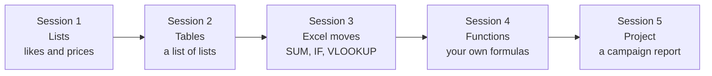

# Practice sessions — lists, tables and functions

⬅ [Course home](../../README.md)

**50 short exercises, about 4 hours in total, split into five sessions of 40 to 50 minutes.** They continue where [Meeting 2](../meeting-2/README.md) stops and prepare you for working with Excel files and data frames.

Everything is about one pretend business, **Pixel Shop**, an online shop that sells hoodies, caps, mugs and stickers. You work with likes, followers, prices, sales and advertising campaigns. No maths beyond percentages, and every word is explained.

## The path



| Session | Topic | Exercises | Time | You will be able to... |
|---------|-------|-----------|------|------------------------|
| [1. Lists](01-lists.md) | lists, `sum`, `max`, `sorted`, one-line filters | 11 | 37 min | work with a column of numbers |
| [2. Tables](02-tables.md) | nested lists, loops inside loops | 12 | 51 min | read, print, total and extend a table |
| [3. Excel moves](03-excel-moves.md) | SUM, IF, COUNTIF, VLOOKUP, sort, filter, pivot | 11 | 50 min | do in Python what you do in Excel |
| [4. Functions](04-functions-on-tables.md) | `def`, `return`, guards, `assert` | 10 | 50 min | build your own reusable formulas |
| [5. Project](05-campaign-report.md) | everything together | 6 | 38 min | produce a finished report and a CSV |

If you are starting from zero, do them in order. If lists are easy for you, start at Session 2.

## How every exercise is laid out

Each one has the same five parts, so you always know where to look:

| Part | What it is |
|------|-----------|
| **Your task** | one or two sentences, in plain words |
| **Start with this data** | the numbers to type in |
| **You should see** | the exact output to aim for. This is your target, so you can check yourself |
| **Hint** | a nudge, not the answer. Only open it if you are stuck |
| **Full solution** | the complete code, plus a short "how it works". Open it after you have tried |

The **level** next to each title tells you how hard it is: ⭐ easy, ⭐⭐ medium, ⭐⭐⭐ stretch.

### The way to learn from them

1. **Read the task, then type the data yourself.** Do not copy and paste.
2. **Try first.** Being wrong for five minutes teaches more than reading the answer.
3. **Stuck? Open the hint, not the solution.**
4. **Got it running? Compare with the solution.** A different working answer is fine. Ask yourself *why* it differs.
5. **Change one number and predict the result before you run it.** This is the fastest way to find out whether you really understood.

## Marketing words in 30 seconds

You do not need any marketing background. These are all the words used:

| Word | Meaning |
|------|---------|
| **follower** | someone who subscribed to our social media account |
| **like** | one person pressing the heart on a post |
| **viral** | a post that got far more attention than usual (here: more than 100 likes) |
| **channel** | a place where we advertise: Instagram, TikTok, Email, Google, flyers |
| **spend** | the money we paid for the ads |
| **click** | one visit to the shop that came from an ad |
| **order** | one purchase |
| **conversion rate** | out of every 100 clicks, how many became an order: `orders / clicks * 100` |
| **cost per order** | what we paid to get one order: `spend / orders` |
| **revenue** | the money the orders brought in |
| **ROI** | return on investment: `(revenue - spend) / spend * 100`. Positive means the ad made money, negative means it lost money |

## Running the solutions

Every session has one runnable file with all of its solutions. Run them from the repository root:

```bash
python3 exercise-bank/practice/practice_02_tables.py        # all of session 2
python3 exercise-bank/practice/practice_02_tables.py 2.6    # just exercise 2.6
```

| Session | File |
|---------|------|
| 1 | [`practice_01_lists.py`](../../exercise-bank/practice/practice_01_lists.py) (exercise 1.11 asks you to type answers) |
| 2 | [`practice_02_tables.py`](../../exercise-bank/practice/practice_02_tables.py) |
| 3 | [`practice_03_excel_moves.py`](../../exercise-bank/practice/practice_03_excel_moves.py) |
| 4 | [`practice_04_functions.py`](../../exercise-bank/practice/practice_04_functions.py) |
| 5 | [`practice_05_campaign_report.py`](../../exercise-bank/practice/practice_05_campaign_report.py) (also writes `out/campaign_report.csv`) |

Each exercise inside these files is wrapped in its own function, so one exercise can never change the data of another.

## Why tables and functions?

Most real data work is tables: an Excel sheet, a CSV export, a database query. Once you can loop over a list of rows, pull out a column, calculate a new one and wrap the calculation in a function, you already understand what a **data frame** library such as pandas or Polars does. At the end of [Session 3](03-excel-moves.md) there is a side-by-side table that shows each of your loops as a one-line data frame command.

You are not learning a different thing. You are learning the same thing twice: slowly and visibly now, quickly and automatically later.

## For the presenter

These sessions work as a second hour after [Meeting 2](../meeting-2/README.md), as homework between meetings, or as a self-study track for people who want more. Suggested use:

- **Session 1** is a warm-up that the quickest people can do alone in 20 minutes.
- **Sessions 2 and 3** are the heart of it. Pair people up for these.
- **Session 4** is where "I can copy code" becomes "I can build tools".
- **Session 5** works well as the last hour of a meeting: everyone builds the same report and compares the advice at the end.
